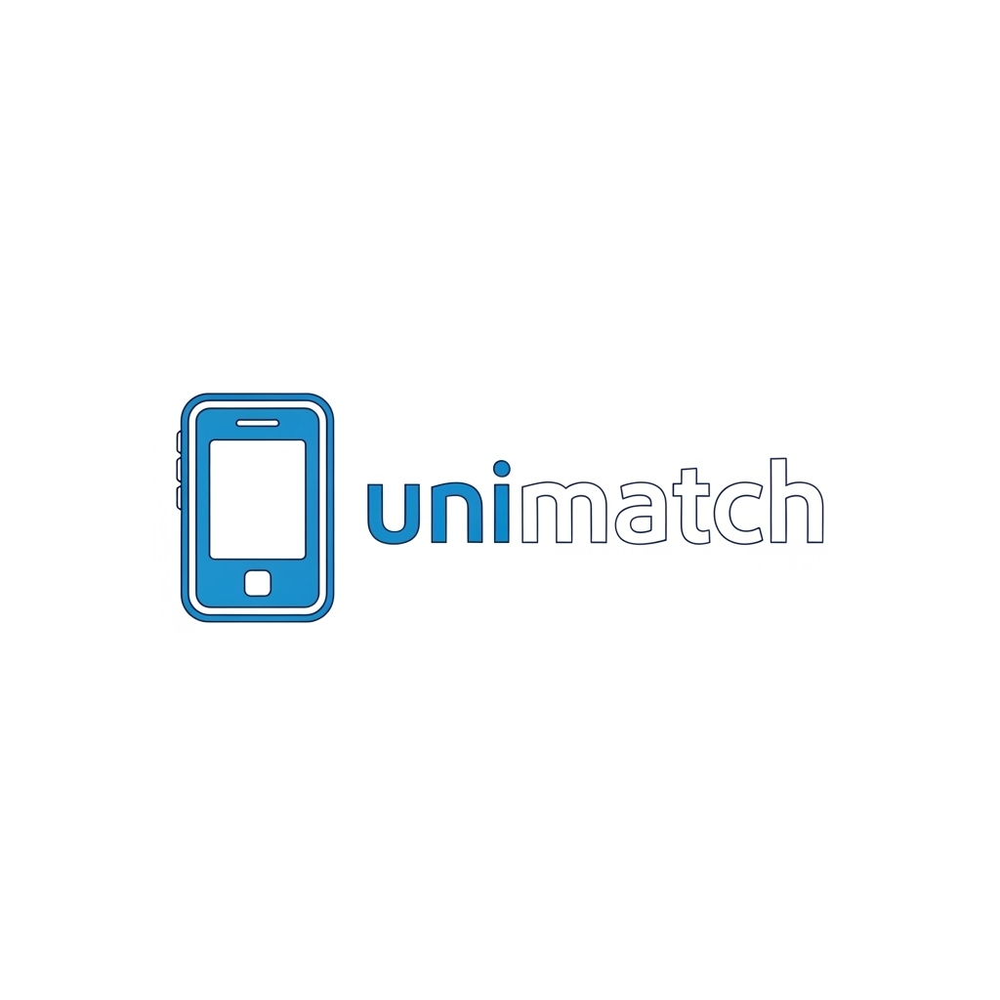
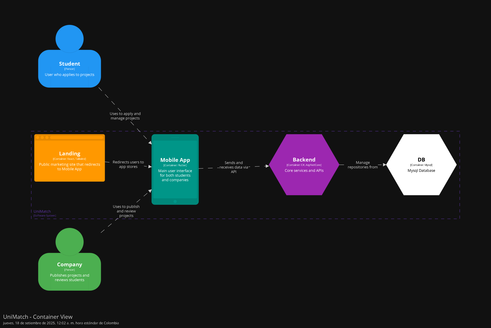
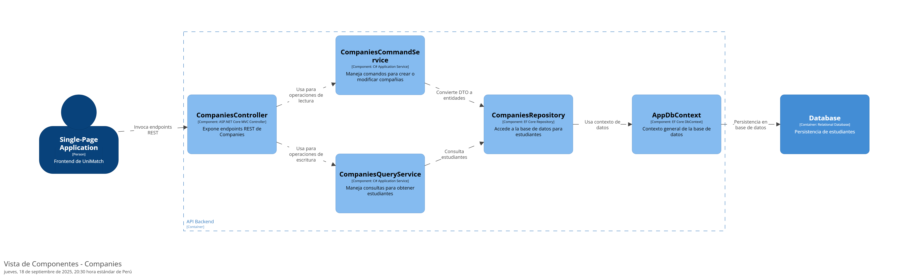
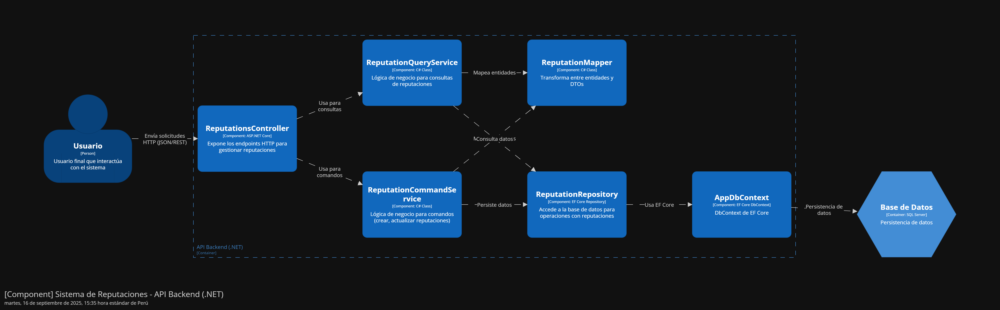

  <h1>Universidad Peruana de Ciencias Aplicadas</h1>
   
  

  
  

   
  <h2 >Carrera: de Ingeniería de Software</h2>
  <h2 >Ciclo: 2025-02</h2>
   
  <h2 >Curso: Desarrollo de Aplicaciones Móviles </h2>
  <h2 >Sección: 1813</h2>
   
  <h2 >Informe del TB1</h2>
  <h2 >Startup: UniMatch </h2>
  <h2 >Producto:  </h2>
   
  <h2 >Integrantes:</h2>
  <ul style="list-style: none; padding: 0;">
      <li><h3>Josue Gonzalo Paiva Quispe</h3></li>
      <li><h3>Javier Sebastian Gonzales Alvarado</h3></li>
      <li><h3>Alessandra Nicole Becerra Tejeda</h3></li>
      <li><h3>Loli Ruiz Renzo Javier</h3></li>

  </ul>
   
  <h4>Setiembre del 2025</h4>

| Versión | Fecha | Autor                      | Descripción de modificación       |
|---------|-------|----------------------------|-----------------------------------|
| 0.1     | 6/9   | Todos los integrantes      | Primera entrega del informe (TB1) |
| 1.0     | 9/10  | Todos los integrantes      | Entrega de Trabajo Parcial        |

## Project Report Collaboration Insights

| URL de la organización del proyecto |    URL del repositorio del reporte     |
|:-----------------------------------:|:--------------------------------------:|
|   https://github.com/Apps-Moviles   | https://github.com/Apps-Moviles/Report |

Insights TP:

- [Student Outcome](#student-outcome)
- [Capítulo I: Introducción](#cap1)
    - [1.1. Startup Profile](#11-startup-profile)
        - [1.1.1. Descripción de la Startup](#111-descripción-de-la-startup)
        - [1.1.2. Perfiles de integrantes del equipo](#112-perfiles-de-integrantes-del-equipo)
    - [1.2. Solution Profile](#12-solution-profile)
        - [1.2.1 Antecedentes y problemática](#121-antecedentes-y-problemática)
        - [1.2.2 Lean UX Process](#122-lean-ux-process)
            - [1.2.2.1. Lean UX Problem Statements](#1221-lean-ux-problem-statements)
            - [1.2.2.2. Lean UX Assumptions](#1222-lean-ux-assumptions)
            - [1.2.2.3. Lean UX Hypothesis Statements](#1223-lean-ux-hypothesis-statements)
            - [1.2.2.4. Lean UX Canvas](#1224-lean-ux-canvas)
    - [1.3. Segmentos objetivos](#13-segmentos-objetivo)

- [Capítulo II: Requirements Elicitation & Analysis](#cap2)
    - [2.1. Competidores](#21-competidores)
        - [2.1.1. Análisis competitivo](#211-análisis-competitivo)
        - [2.1.2. Estrategias y tácticas frente a competidores](#212-estrategias-y-tácticas-frente-a-competidores)
    - [2.2. Entrevistas](#22-entrevistas)
        - [2.2.1. Diseño de entrevistas](#221-diseño-de-entrevistas)
        - [2.2.2. Registro de entrevistas](#222-registro-de-entrevistas)
        - [2.2.3. Análisis de entrevistas](#223-análisis-de-entrevistas)
    - [2.3. Needfinding](#23-needfinding)
        - [2.3.1. User Personas](#231-user-personas)
        - [2.3.2. User Task Matrix](#232-user-task-matrix)
        - [2.3.3. User Journey Mapping](#233-user-journey-mapping)
        - [2.3.4. Empathy Mapping](#234-empathy-mapping)
        - [2.3.5 Ubiquitous Language](#235-ubiquitous-language)
    - [2.4. Requirements Specification](#24-requirements-specification)
        - [2.4.1. User Stories](#241-user-stories)
        - [2.4.2. Impact Mapping](#242-impact-mapping)
        - [2.4.3. Product Backlog](#243-product-backlog)
    - [2.5 Strategic-Level Domain-Driven Design](#25-strategic-level-domain-driven-design)
        - [2.5.1. EventStorming](#251-eventstorming)
            - [2.5.1.1. Candidate Context Discovery](#2511-candidate-context-discovery)
            - [2.5.1.2. Domain Message Flows Modeling](#2512-domain-message-flows-modeling)
            - [2.5.1.3. Bounded Context Canvases](#2513-bounded-context-canvases)
        - [2.5.2. Context Mapping](#252-context-mapping)
        - [2.5.3. Software Architecture](#253-software-architecture)
            - [2.5.3.1. Software Architecture Context Level Diagrams](#2531-software-architecture-context-level-diagrams)
            - [2.5.3.2. Software Architecture Container Level Diagrams](#2532-software-architecture-container-level-diagrams)
            - [2.5.3.3. Software Architecture Deployment Diagrams](#2533-software-architecture-deployment-diagrams)
    - [2.6 Tactical-Level Domain-Driven Design](#26-tactical-level-domain-driven-design)
        - [2.6.1 Bounded Context: Users](#261-bounded-context-users)
            - [2.6.1.1 Domain Layer](#2611-domain-layer)
            - [2.6.1.2 Interface Layer](#2612-interface-layer)
            - [2.6.1.3 Application Layer](#2613-application-layer)
            - [2.6.1.4 Infrastructure Layer](#2614-infrastructure-layer)
            - [2.6.1.5 Bounded Context Software Architecture Component Level Diagrams](#2615-bounded-context-software-architecture-component-level-diagrams)
            - [2.6.1.6 Bounded Context Software Architecture Code Level Diagrams](#2616-bounded-context-software-architecture-code-level-diagrams)
                - [2.6.1.6.1. Bounded Context Domain Layer Class Diagrams](#26161-bounded-context-domain-layer-class-diagrams)
                - [2.6.1.6.2. Bounded Context Database Design Diagram](#26161-bounded-context-database-design-diagram)
        - [2.6.2 Bounded Context: Students](#262-bounded-context-students)
            - [2.6.2.1 Domain Layer](#2621-domain-layer)
            - [2.6.2.2 Interface Layer](#2622-interface-layer)
            - [2.6.2.3 Application Layer](#2623-application-layer)
            - [2.6.2.4 Infrastructure Layer](#2624-infrastructure-layer)
            - [2.6.2.5 Bounded Context Software Architecture Component Level Diagrams](#2625-bounded-context-software-architecture-component-level-diagrams)
            - [2.6.2.6 Bounded Context Software Architecture Code Level Diagrams](#2626-bounded-context-software-architecture-code-level-diagrams)
                - [2.6.2.6.1. Bounded Context Domain Layer Class Diagrams](#26261-bounded-context-domain-layer-class-diagrams)
                - [2.6.2.6.2. Bounded Context Database Design Diagram](#26261-bounded-context-database-design-diagram)
        - [2.6.3 Bounded Context: Companies](#263-bounded-context-companies)
            - [2.6.3.1 Domain Layer](#2631-domain-layer)
            - [2.6.3.2 Interface Layer](#2632-interface-layer)
            - [2.6.3.3 Application Layer](#2633-application-layer)
            - [2.6.3.4 Infrastructure Layer](#2634-infrastructure-layer)
            - [2.6.3.5 Bounded Context Software Architecture Component Level Diagrams](#2635-bounded-context-software-architecture-component-level-diagrams)
            - [2.6.3.6 Bounded Context Software Architecture Code Level Diagrams](#2636-bounded-context-software-architecture-code-level-diagrams)
                - [2.6.3.6.1. Bounded Context Domain Layer Class Diagrams](#26361-bounded-context-domain-layer-class-diagrams)
                - [2.6.3.6.2. Bounded Context Database Design Diagram](#26361-bounded-context-database-design-diagram)
        - [2.6.4 Bounded Context: Projects](#261-bounded-context-projects)
            - [2.6.4.1 Domain Layer](#2611-domain-layer)
            - [2.6.4.2 Interface Layer](#2612-interface-layer)
            - [2.6.4.3 Application Layer](#2613-application-layer)
            - [2.6.4.4 Infrastructure Layer](#2614-infrastructure-layer)
            - [2.6.4.5 Bounded Context Software Architecture Component Level Diagrams](#2615-bounded-context-software-architecture-component-level-diagrams)
            - [2.6.4.6 Bounded Context Software Architecture Code Level Diagrams](#2616-bounded-context-software-architecture-code-level-diagrams)
                - [2.6.4.6.1. Bounded Context Domain Layer Class Diagrams](#26161-bounded-context-domain-layer-class-diagrams)
                - [2.6.4.6.2. Bounded Context Database Design Diagram](#26161-bounded-context-database-design-diagram)
        - [2.6.5 Bounded Context: StudentPostulations](#261-bounded-context-projects)
            - [2.6.5.1 Domain Layer](#2611-domain-layer)
            - [2.6.5.2 Interface Layer](#2612-interface-layer)
            - [2.6.5.3 Application Layer](#2613-application-layer)
            - [2.6.5.4 Infrastructure Layer](#2614-infrastructure-layer)
            - [2.6.5.5 Bounded Context Software Architecture Component Level Diagrams](#2615-bounded-context-software-architecture-component-level-diagrams)
            - [2.6.5.6 Bounded Context Software Architecture Code Level Diagrams](#2616-bounded-context-software-architecture-code-level-diagrams)
                - [2.6.5.6.1. Bounded Context Domain Layer Class Diagrams](#26161-bounded-context-domain-layer-class-diagrams)
                - [2.6.5.6.2. Bounded Context Database Design Diagram](#26161-bounded-context-database-design-diagram)
        - [2.6.6 Bounded Context: Reputations](#261-bounded-context-projects)
            - [2.6.6.1 Domain Layer](#2611-domain-layer)
            - [2.6.6.2 Interface Layer](#2612-interface-layer)
            - [2.6.6.3 Application Layer](#2613-application-layer)
            - [2.6.6.4 Infrastructure Layer](#2614-infrastructure-layer)
            - [2.6.6.5 Bounded Context Software Architecture Component Level Diagrams](#2615-bounded-context-software-architecture-component-level-diagrams)
            - [2.6.6.6 Bounded Context Software Architecture Code Level Diagrams](#2616-bounded-context-software-architecture-code-level-diagrams)
                - [2.6.6.6.1. Bounded Context Domain Layer Class Diagrams](#26161-bounded-context-domain-layer-class-diagrams)
                - [2.6.6.6.2. Bounded Context Database Design Diagram](#26161-bounded-context-database-design-diagram)

- [Capítulo III: Solution UI/UX Design](#cap3)
    - [3.1. Product design](#31-product-design)
        - [3.1.1. Style Guidelines](#311-style-guidelines)
            - [3.1.1.1. General Style Guidelines](#3111-general-style-guidelines)
        - [3.1.2. Information Architecture](#312-information-architecture)
            - [3.1.2.1. Organization Systems](#3121-organization-systems)
            - [3.1.2.2. Labelling Systems](#3122-labelling-systems)
            - [3.1.2.3. SEO Tags and Meta Tags](#3123-seo-tags-and-meta-tags)
            - [3.1.2.4. Searching Systems](#3124-searching-systems)
            - [3.1.2.5. Navigation Systems](#3125-navigation-systems)
        - [3.1.3. Landing Page UI Design](#313-landing-page-ui-design)
            - [3.1.3.1. Landing Page Wireframe](#3131-landing-page-wireframe)
            - [3.1.3.2. Landing Page Mock-up](#3132-landing-page-mock-up)
        - [3.1.4. Mobile Applications UX/UI Design](#314-mobile-applications-ux/ui-design)
            - [3.1.4.1. Mobile Applications Wireframes](#3141-mobile-application-wireframes)
            - [3.1.4.2. Mobile Applications Wireflow Diagrams](#3142-mobile-application-wireflow-diagrams)
            - [3.1.4.3. Mobile Applications Mock-ups](#3143-mobile-application-mock-ups)
            - [3.1.4.4. Mobile Applications User Flow Diagrams](#3144-mobile-application-user-flow-diagrams)
            - [3.1.4.5. Mobile Applications Prototyping](#3145-mobile-application-prototyping)

- [Capítulo IV: Product Implementation & Validation](#cap4)
    - [4.1. Software Configuration Management](#41-software-configuration-management)
        - [4.1.1. Software Development Environment Configuration](#411-software-development-environment-configuration)
        - [4.1.2. Source Code Management](#412-source-code-management)
        - [4.1.3. Source Code Style Guide & Conventions](#413-source-code-style-guide-&-conventions)
        - [4.1.4. Software Deployment Configuration](#414-software-deployment-configuration)
    - [4.2. Landing Page & Mobile Application Implementation](#42-landing-page-&-mobile-application-implementation)
        - [4.2.1. Sprint n](#421-sprint-n)
            - [4.2.1.1. Sprint Planning n](#4211-sprint-planning-n)  
            - [4.2.1.2. Sprint Backlog n](#4212-sprint-backlog-n)
            - [4.2.1.3. Development Evidence for Sprint Review](#4213-development-evidence-for-sprint-review)
            - [4.2.1.4. Testing Suite Evidence for Sprint Review](#4214-testing-suite-evidence-for-sprint-review)
            - [4.2.1.5. Execution Evidence for Sprint Review](#4215-execution-evidence-for-sprint-review)
            - [4.2.1.6. Services Documentation Evidence for Sprint Review](#4216-services-documentation-evidence-for-sprint-review)
            - [4.2.1.7. Software Deployment Evidence for Sprint Review](#4217-software-deployment-evidence-for-sprint-review)
            - [4.2.1.8. Team Collaboration Insights during Sprint](#4218-team-collaboration-insights-during-sprint)
    - [4.3. Validation Interviews](#43-validation-interviews)
        - [4.3.1. Diseño de Entrevistas](#431-diseño-de-entrevistas)
        - [4.3.2. Registro de Entrevistas](#432-registro-de-entrevistas)
        - [4.3.3. Evaluaciones según heurísticas](#433-evaluaciones-según-heurísticas)

## Student Outcome

El curso contribuye al cumplimiento del Student Outcome ABET:

**ABET – EAC - Student Outcome 7**

Criterio: *La capacidad de adquirir y aplicar nuevos conocimientos según sea
necesario, utilizando estrategias de aprendizaje apropiadas.*

<table>
  <thead>
    <tr>
      <th style="text-align: left;">Criterio específico</th>
      <th style="text-align: left;">Acciones realizadas</th>
      <th style="text-align: left;">Conclusiones</th>
    </tr>
  </thead>
  <tbody>
    <tr>
      <td>
        1. Actualiza conceptos y conocimientos necesarios para su desarrollo profesional y en especial para su proyecto en soluciones de software.
      </td>
      <td> Josue Paiva <ul>TB1: Desarrollo de la documentación de los bounded context companies y students postulations</ul>
<ul>TP: Desarrollo de las vistas inicio de sesión y dashboard del frontend, documentación del sprint1</ul>
           Renzo Loli  <ul>TB1: Desarrollo y organización del event storming y el Software Architecture</ul>
                  <ul>TP: Reorganizacion del c4 y desarrollo de los style guidelines</ul>
           Alessandra Becerra <ul>TB1: Desarrollo de la documentación de los bounded context users y students</ul>
                  <ul>TP: Desarrollo de Software Development Environment Configuration y entrevistas de validación</ul>
           Javier Gonzales <ul>TB1: Aplicó conceptos de Bounded Context y Lean UX en la documentación del dominio, elaboración del canvas y entrevistas a usuarios.</ul>
           <ul>TP1: Aplicó conocimientos de UX y diseño móvil para elaborar wireframes, mockups y wireflows funcionales para la app UniMatch.</ul>
      </td>
      <td> TB1: Para este primer entregable repasamos conocimientos previos adquiridos en IHC y patrones de diseño, con el fin de crear una propuesta robusta y bien estructurada, con la cual trabajar el resto del curso.
TP: El entregable parcial nos exigió mas, al necesitar levantar todos los servicios y empezar de lleno con el desarrollo frontend aplicando el conocimiento adquirido en clase.
      </td>
    </tr>
    <tr>
      <td>
        2. Reconoce la necesidad del aprendizaje permanente para el desempeño profesional y el desarrollo de proyectos en soluciones de software.
      </td>
      <td> Josue Paiva <ul>TB1: Planificación de reuniones grupales, asignación de las tareas al resto del equipo</ul>
<ul>TP:Planificación y asignación de tareas, con plazos fijos, coordinación de reuniones grupales</ul>
           Renzo Loli  <ul>TB1: Planificación del event storming y rediseño de la arquitectura base</ul>
                  <ul>TP: Planificacion de pestañas y guidelines</ul>
        Alessandra Becerra <ul>TB1: Disposición para una buena comunicación entre los miembros del equipo para mantener un flujo de trabajo ordenado</ul>
        <ul>TP: Disposición y cumplimiento de tareas dentro de los plazos establecidos coordinados en las reuniones grupales.</ul>
        Javier Gonzales <ul>TB1: Investigó y adaptó enfoques de diseño centrado en el usuario, aplicando buenas prácticas para mejorar el desarrollo del proyecto.</ul>
        <ul>TP1: Realizó entrevistas de validación a usuarios reales e integró su retroalimentación en el prototipo, reconociendo oportunidades de mejora continua.</ul>
      </td>
      <td> TB1: La participación de todos los integrantes del equipo fue activa y continua, con buena comunicación y con apoyo continuo de todos los integrantes antes las necesidades y dificultades que se presentaron
TP: Este entregable demandó más tiempo y compromiso, ya que se tuvo que empezar a desarrollar el proyecto y cumplir con los plazos establecidos, sin embargo la participación de todos los integrantes fue constante y satisfactoria.
      </td>
    </tr>
  </tbody>
</table>

## Objetivos SMART

### 1.1 Startup Profile

#### 1.1.1. Descripción de la Startup

 

  + **Descripción de la Startup**

  Nuestra startup, UniMatch, nace con el propósito de impulsar la empleabilidad de estudiantes universitarios y recién egresados en Perú, generando un puente confiable entre la educación y el mercado laboral. Apostamos por el uso de la tecnología y la innovación para reducir la brecha entre la formación académica y las competencias requeridas por las empresas, fomentando la validación del talento joven a través de experiencias prácticas, proyectos y oportunidades de inserción laboral.

 

  + **Misión:**

  Brindar a los estudiantes universitarios una aplicación móvil que facilite su inserción al mercado laboral a través de proyectos, prácticas y experiencias profesionales significativas, conectándolos con empresas y organizaciones que buscan talento joven y creativo.

 

  + **Visión:**

  Ser la aplicación móvil líder en Latinoamérica que revolucione la forma en que estudiantes y empresas se conectan, convirtiéndose en el puente más confiable entre la educación y el empleo, impulsando así la innovación y el crecimiento profesional de las nuevas generaciones.

 

  + **Alcance del proyecto:**

  UniMatch busca crear una aplicación móvil que conecta estudiantes universitarios de últimos ciclos con empresas mediante proyectos reales de corta duración, gestionando postulaciones, portafolios, evaluaciones y certificaciones para impulsar la empleabilidad joven y fortalecer la relación entre academia y sector productivo.

 

#### 1.1.2. Perfiles de integrantes del equipo
<table>
  <tr>
    <th colspan="2"> </th>
  </tr>
  <tr>
    <td> </td>
    <td> </td>
  </tr>
  <tr>
    <th colspan="2"> </th>
  </tr>
  <tr>
    <td> Hola mi nombre es Javier Gonzales soy un estudiante de la carrera de Ingeniería de Software en el 6to ciclo con código u202312966. Tengo conocimientos en C++, Python, SQL, HTML, CSS, JavaScript y Vue, además de experiencia en el desarrollo de aplicaciones web aplicando arquitecturas modernas como DDD, uso de APIs y manejo de bases de datos tanto relacionales como no relacionales. También manejo metodologías ágiles, control de versiones con GitHub y despliegue en la nube con Azure, lo que me permite tener una visión integral del ciclo de desarrollo de software. Me considero una persona analítica, perseverante y de rápido aprendizaje, con la capacidad de adaptarme a nuevos entornos y tecnologías, fomentando siempre un buen ambiente en el equipo y aportando responsabilidad, iniciativa y liderazgo colaborativo en cada proyecto. </td>
    <td> 
      

        
      

    </td>
  </tr>
  <tr>
    <th colspan="2"> </th>
  </tr>
  <tr>
    <td> Soy Renzo Loli, tengo 26 años y soy de la carrera de Ingeniería de Software. Curso el 8vo ciclo. Tengo conocimientos en lenguages como javascript y python y base en arquitecturas cloud como aws. Me desemboco mejor en el ambito de identificar y resolver problemas.  </td>
    <td></td>
  </tr>
  <tr>
    <th colspan="2"> </th>
  </tr>
  <tr>
    <td>Soy Josue Paiva, tengo 22 años y soy de la carrera de Ingeniería de Software, tengo conocimiento de desarrollo web, base de datos en SQL y análisis de datos, me gusta mantener buena comunicación con mis compañeros de equipo, cumplir con mis tareas y apoyar al resto cuando se requiera. </td>
    <td></td>
  </tr>
  <tr>
    <th colspan="2"> </th>
  </tr>
  <tr>
    <td> </td>
    <td> </td>
  </tr>
  <tr>
    <th colspan="2"> </th>
  </tr>
  <tr>
    <td>Mi nombre es Alessandra Becerra, tengo 19 años y actualmente curso el 5to ciclo de la carrera de Ingeniería de Software. Cuento con conocimientos en lenguajes como C++, Python, HTML, CSS, JavaScript y SQL, además en desarrollo web. Me gusta trabajar en equipo y fomentar una buena relación con mis compañeros para alcanzar resultados de calidad. Me considero una persona comprometida, proactiva y con gran disposición para aprender nuevas tecnologías. Además, me motiva aportar creatividad y organización en cada proyecto en el que participo. </td>
    <td>
      

        
      

    </td>
  </tr>
  <tr>
    <th colspan="2"> </th>
  </tr>
</table>

### 1.2 Solution Profile

#### 1.2.1 Antecedentes y problemática

 

  + **What (Qué)**

  *¿Cuál es el problema?*

  El problema central es el alto desempleo juvenil y la falta de oportunidades formativas que afecten el acceso al mercado laboral para estudiantes y recién egresados en el Perú. Según el INEI, la tasa de desempleo juvenil (18 a 24 años) fue del 12.5 % en el primer trimestre de 2024. Además, otra fuente reporta un aumento de la tasa de desempleo juvenil del 13.8 % en 2023 al 14.3 % en 2024.

 

  + **When (Cuando)**

  *¿Cuándo sucede el problema?*

  Este problema se presenta principalmente en los últimos ciclos universitarios y al finalizar los estudios, al ingresar al mercado laboral. Es una situación persistente desde antes de la pandemia, pero se ha acentuado entre 2023 y 2024 con un aumento de la tasa de desempleo juvenil.

 

  + **Where (Donde)**

  *¿Dónde surge el problema?*

  El desempleo juvenil en Perú se concentra mayormente en las transiciones académicas hacia el ámbito laboral y en las zonas urbanas, particularmente en Lima Metropolitana, donde las oportunidades formales son limitadas. Según el IPE, el empleo juvenil decreció continuamente entre 2019 y 2024, resultando en aproximadamente 160 000 jóvenes menos trabajando. Además, el INEI reporta que la informalidad laboral afecta al 85.6 % de los trabajadores menores de 25 años, lo que complica aún más el acceso a empleos de calidad y estabilidad.

 

  + **Who (Quién)**

  *¿Quiénes son los afectados?*

  Estudiantes universitarios, recién egresados y jóvenes en general (rango de 18 a 24 años), especialmente en zonas urbanas del país. También se ve afectada la economía regional y nacional, al perderse capital humano joven valioso.

 

  + **Why (Por qué)**

  *¿Cuál es la causa del problema?*

  Existen varias causas, entre ellas falta de experiencia laboral, déficit de oportunidades de capacitación, escasa oferta alineada al mercado y alta informalidad laboral. Según Ayuda en Acción, hay una cifra récord de 130,000 jóvenes sin trabajo, con una tasa de desempleo del 14.4 % en Lima, y un promedio de espera de 3.2 semanas para encontrar empleo, el más alto en cinco años.

 

  + **How (Cómo)**

  *¿Cómo se utilizará el producto?*

  UniMatch será una aplicación móvil que conectará estudiantes universitarios y recién egresados con empresas mediante proyectos reales de corta duración. Esta gestionará postulaciones, portafolios, evaluaciones y calificaciones para fortalecer la empleabilidad joven.

 

  + **How Much (Cuánto)**

  *¿Cuánto costará implementar la solución?*

  En el Perú, la pérdida de empleos juveniles sigue siendo una preocupación, ya que en regiones como Ica se reportaron 11,220 empleos menos en 2024, lo que refleja el alto costo económico y social del desempleo juvenil (ComexPerú, 2024). Frente a esta problemática, implementar una aplicación móvil como UniMatch representa una inversión estratégica y de impacto social, al ofrecer una solución digital que conecta estudiantes con empresas para impulsar la empleabilidad. A continuación, se presenta un presupuesto estimado:

  + **Desarrollo de Software:**

    - Diseño y desarrollo móvil: S/ 1,250 – S/ 2,250
    - Backend y API RESTful: S/ 800 – S/ 1,000
    - Dominio y hosting (anual): S/ 450 – S/ 750
    
  + **Marketing y Lanzamiento:**

     - Campañas de marketing digital: S/ 500 – S/ 1,000

  + **Mantenimiento y Soporte:**

    - Soporte y actualizaciones (anual): S/ 1,000 – S/ 2,000
    
  + **Total Estimado: S/ 4,000 – S/ 7,000**

 

#### 1.2.2 Lean UX Process

##### 1.2.2.1 Lean UX Problem Statements

 

El propósito de UniMatch es ofrecer a los estudiantes universitarios y recién egresados una solución digital que les permita conectar con empresas mediante proyectos reales de corta duración, prácticas preprofesionales y vacantes, gestionando portafolios, postulaciones, evaluaciones y calificaciones que impulsen su empleabilidad. Esta solución está dirigida a jóvenes en etapa de transición académica hacia el mercado laboral, quienes desean ganar experiencia práctica, pero muchas veces carecen de oportunidades o de los medios adecuados para demostrar sus capacidades.

El problema se presenta en el momento en que los estudiantes intentan acceder a un empleo formal o práctica profesional, pero no cuentan con experiencia previa validada, ni con un portafolio que respalde sus competencias. Esta falta de visibilidad genera que las empresas opten por candidatos con mayor trayectoria, dejando en desventaja a los jóvenes talentos. Actualmente, gran parte de los estudiantes depende de redes informales, convocatorias limitadas en universidades o aplicaciones laborales no especializadas en perfiles sin experiencia, lo que dificulta aún más su inserción laboral.

Hemos identificado que esta brecha de acceso genera frustración, desmotivación y prolonga los tiempos de espera para que los jóvenes consigan su primer empleo, afectando su desarrollo profesional y económico. Esta problemática se intensifica en contextos como el peruano, donde el desempleo juvenil, según Infobae, alcanzó el 14.3 % en 2024 y 7 de cada 10 jóvenes trabajan en empleos no relacionados con su carrera(2024).

A todo esto nos surge la pregunta: ¿Cómo podríamos brindar a los estudiantes una solución confiable y accesible que les permita ganar experiencia práctica, construir un portafolio validado y conectar con empresas interesadas en talento joven?

 

+ **Domain:** Empleabilidad juvenil y aplicaciones digitales de conexión entre estudiantes y empresas.

+ **Customer Segments:** Estudiantes universitarios, recién egresados, universidades y empresas en búsqueda de talento joven.

+ **Pain Points:** Falta de experiencia validada, baja visibilidad ante las empresas, exceso de informalidad laboral, y desmotivación frente a procesos tradicionales de inserción laboral.

+ **Gap:** No existen en Perú aplicaciones móviles especializadas en conectar talento joven sin experiencia con empresas mediante proyectos cortos y prácticas que validen competencias.

+ **Vision/Strategy:** Crear una aplicación móvil digital accesible y confiable que gestione proyectos, postulaciones, portafolios y evaluaciones, para impulsar la empleabilidad juvenil y reducir la brecha entre formación académica y mercado laboral.

+ **Initial Segment:** Estudiantes universitarios de últimos ciclos y recién egresados en Perú que buscan construir experiencia y visibilidad ante empresas locales.

 

##### 1.2.2.2 Lean UX Assumptions 

 

**Business Assumptions:**

 

1. **Creo nuestros usuarios tienen la necesidad** de acceder a oportunidades laborales y proyectos prácticos que les permitan ganar experiencia y construir un portafolio profesional.

2. **Estas necesidades se pueden satisfacer** con una aplicación móvil que conecte a estudiantes y recién egresados con empresas mediante proyectos cortos, prácticas y vacantes validadas.

3. **Nuestros clientes iniciales serán** estudiantes universitarios de últimos ciclos y recién egresados en Perú, junto con empresas pequeñas y medianas que buscan talento joven.

4. **El valor más importante que un cliente quiere de nuestros servicios es** visibilidad y experiencia validada para mejorar sus oportunidades de empleabilidad.

5. **El cliente también va a obtener** beneficios adicionales como la creación de portafolio digital, certificaciones de participación, retroalimentación de empresas y networking profesional.

6. **Vamos a obtener la mayoría de los clientes mediante** alianzas con universidades, marketing digital en redes sociales y recomendaciones de boca a boca entre estudiantes.

7. **Vamos a obtener ingresos mediante** suscripciones de empresas para publicar proyectos y vacantes, además de un porcentaje no mayor al 15% del pago a los estudiantes, todo bajo términos y condiciones.

8. **Nuestra competencia en el mercado serán** portales de empleo generalistas como Bumeran, Workana y LinkedIn, aunque no están especializados en jóvenes sin experiencia.

9. **Vamos a tener ventaja frente a nuestra competencia debido a** nuestro enfoque especializado en estudiantes y recién egresados, con una propuesta práctica basada en proyectos cortos y validación de habilidades.

10. **El mayor riesgo del servicio es** la falta de confianza de las empresas en apostar por estudiantes sin experiencia o la baja adopción inicial por parte de los usuarios.

11. **Lo resolveremos realizando** la construcción de casos de éxito, alianzas con universidades, programas piloto con empresas y validaciones tempranas de estudiantes destacados.

12. **Otro riesgo que debemos considerar** y que, si resultan falsas, harían fracasar el proyecto son: que los estudiantes realmente desean una aplicación móvil para mostrar su talento, que las empresas estarán dispuestas a invertir en jóvenes sin experiencia y que las universidades apoyarán la integración de la solución.

 

**User Assumptions:**

 

1. **¿Quién es el usuario?**

Nuestro usuario principal son estudiantes universitarios de últimos ciclos y recién egresados en Perú que buscan oportunidades para ganar experiencia laboral, construir un portafolio y aumentar su visibilidad frente a empresas. También se incluyen empresas que necesitan validar talento joven de manera ágil y económica.

2. **¿Dónde encaja nuestro producto en su vida?**

Encaja en la etapa de transición entre la vida académica y el mercado laboral, donde los jóvenes necesitan adquirir experiencia práctica y demostrar sus competencias, mientras las empresas requieren talento fresco para proyectos de corta duración.

3. **¿Qué problemas resuelve nuestro producto?**

Resuelve la falta de oportunidades de prácticas y empleos relacionados con la carrera, la ausencia de experiencia validada, la dificultad para conectar con empresas interesadas en jóvenes sin experiencia y la falta de portafolios profesionales.

4. **¿Cuándo y cómo se usa nuestro producto?**

Se utiliza cuando los estudiantes buscan prácticas, proyectos académicos aplicados o su primer empleo formal. El uso será principalmente a través de una aplicación móvil donde los usuarios se registran, postulan a proyectos, reciben retroalimentación, gestionan entregables y construyen su portafolio.

5. **¿Qué características son importantes?**

  + Registro de perfiles completos (estudiantes y empresas).
  + Gestión de proyectos, postulaciones y estados.
  + Portafolio digital validado con entregables.
  + Certificaciones automáticas al finalizar proyectos.
  + Sistema de retroalimentación y calificación.
  + Interfaz sencilla, confiable y accesible.

6. **¿Cómo debería lucir y comportarse el producto?**

El producto debe lucir moderno, simple y amigable, con un diseño centrado en el usuario y adaptado a dispositivos móviles. Debe comportarse de forma intuitiva, rápida y segura, priorizando la facilidad de navegación, la transparencia en los procesos de postulación y la confiabilidad de la información entre estudiantes y empresas.

 

**Feature Assumptions:**

 

+ Creemos que los estudiantes necesitan crear un perfil profesional digital donde puedan mostrar sus datos, habilidades, especializaciones y logros.

+ Creemos que los usuarios valorarán un portafolio validado con proyectos reales, porque les permitirá demostrar experiencia aunque no tengan un empleo previo.

+ Creemos que las empresas estarán dispuestas a publicar proyectos y vacantes en la aplicación móvil porque podrán acceder a talento joven de forma rápida y a bajo costo.

+ Creemos que un sistema de retroalimentación y calificación motivará a los estudiantes a mejorar sus entregables y ayudará a las empresas a identificar perfiles destacados.

+ Creemos que un proceso de postulación simple e intuitivo aumentará la adopción de la aplicación móvil y reducirá la frustración de los usuarios.

+ Creemos que un diseño moderno, accesible y responsive (adaptado a móviles) es fundamental para que los estudiantes usen la aplicación móvil con frecuencia.

 

##### 1.2.2.3 Lean UX Hypothesis Statements

 

1. Hypothesis Statement 01

  **Creemos que** los estudiantes universitarios y recién egresados utilizarán la aplicación móvil UniMatch como su principal medio para acceder a oportunidades prácticas y de desarrollo profesional temprano.

  **Sabremos** que hemos tenido éxito.
  
  **Cuando** al menos un 65 % de los usuarios registrados participen en un proceso de postulación durante el primer mes de uso.

 

2. Hypothesis Statement 02

  **Creemos que** UniMatch facilitará a las pequeñas y medianas empresas identificar talento joven de forma ágil y económica, reduciendo sus tiempos de búsqueda de candidatos.

  **Sabremos** que hemos tenido éxito.
  
  **Cuando** al menos un 50 % de las empresas registradas logren contratar o colaborar con un estudiante en los primeros tres meses.

 

3. Hypothesis Statement 03

  **Creemos que** los estudiantes valorarán la posibilidad de obtener certificaciones digitales y retroalimentación de las empresas, lo que incrementará su motivación para usar UniMatch de forma continua.

  **Sabremos** que hemos tenido éxito.
  
  **Cuando** al menos un 50 % de los usuarios activos completen más de un proyecto en un periodo de tres meses y descarguen o compartan sus certificaciones.

 

##### 1.2.2.4 Lean UX Canvas

 

  

 

### 1.3 Segmentos objetivos

**Estudiantes universitarios y recién egresados**
---
 

+ **Descripción:**
 
Jóvenes en etapa de transición entre la vida académica y el mercado laboral, que buscan oportunidades prácticas, validación de habilidades y construcción de un portafolio profesional que les permita mejorar su empleabilidad.
  

+ **Características demográficas y comportamiento:**
 
Edad entre 18 y 25 años, estudiantes de últimos ciclos y recién egresados de universidades e institutos del Perú. Se caracterizan por un alto nivel de uso de aplicaciones digitales y redes sociales, además de interés en proyectos que les permitan ganar experiencia práctica. Suelen tener poca o nula experiencia laboral formal y enfrentan dificultades para insertarse en empleos relacionados con su carrera.
  

+ **Sustento estadístico:**
 
Según Infobae (2024), 7 de cada 10 jóvenes peruanos trabajan en empleos no relacionados con su carrera, lo que evidencia una fuerte desconexión entre educación y empleo. Además, la tasa de desempleo juvenil en Perú alcanzó el 14.3 % en 2024, la más alta en los últimos tres años (IPE, 2024).
  

**Pequeñas y medianas empresas en búsqueda de talento joven**
---

+ **Descripción:**
 
Empresas que requieren talento joven para proyectos de corta duración, innovación y soporte operativo, pero que enfrentan limitaciones en presupuesto y tiempo para procesos de reclutamiento.
  

+ **Características demográficas y comportamiento:**
 
Incluye pymes y startups con equipos de entre 10 y 200 trabajadores, pertenecientes a sectores como servicios, comercio y manufactura ligera. Estas empresas buscan soluciones ágiles y económicas para identificar talento, valorando la flexibilidad y la validación de competencias en proyectos específicos.
  

+ **Sustento estadístico:**
 
Las pymes representan más del 99.5 % de las empresas en el Perú y generan alrededor del 60 % del empleo formal (Produce, 2024). Sin embargo, en 2024 reportaron dificultades para cubrir vacantes técnicas y profesionales por la falta de experiencia práctica en los postulantes (Produce, 2024).
  

## Capítulo II: Requirements Elicitation & Analysis

### 2.1. Competidores

#### 2.1.1. Análisis competitivo

<table border ="1" >
  <thead>
    <tr>
      <th colspan="6">Competitive Analysis Landscape</th>
    </tr>
  </thead>
  <tbody>
    <tr>
      <td rowspan="3">PERFIL</td>
      <td rowspan="2">Overview</td>
      <td> 
        UniMatch
        
      </td>
      <td>
        Workana
        
      </td>
      <td>
        Freelancer.com
        
      </td>
      <td>
        LinkedIn 
        
      </td>
    </tr>
    <tr>
      <td>Aplicación móvil que conecta a estudiantes universitarios de ciclos avanzados con personas o pequeñas empresas que necesitan servicios puntuales (como diseño redacción, programación, etc.). Promueve el trabajo freelance como una vía para adquirir experiencia real, flexible y útil para su desarrollo profesional.</td>
      <td>Plataforma líder en Latinoamérica para contratar freelancers en áreas como programación, diseño, traducción y marketing.</td>
      <td>Plataforma global que conecta freelancers con proyectos en diversas categorías: desarrollo, escritura, arte, etc. </td>
      <td> Red social profesional que conecta empleadores con talento, usada también para promocionar servicios y encontrar oportunidades de empleo.</td>
    </tr>
    <tr>
      <td>Ventaja competitiva
      ¿Que valor ofrece a los clientes?</td>
      <td>Se enfoca exclusivamente en estudiantes, lo que permite personalizar la experiencia: horarios flexibles, oportunidades acordes a su formación académica, sin requerir experiencia previa.</td>
      <td>Amplia base de usuarios, reputación consolidada, y herramientas avanzadas para gestión de proyectos.</td>
      <td>Cobertura internacional, variedad de categorías, concursos públicos para contratación.</td>
      <td>Reputación global, red de contactos, integración con empresas.</td>
    </tr>
    <tr>
      <td rowspan="2">PERFIL DEL MARKETING</td>
      <td>Mercado Objetivo</td>
      <td>Estudiantes universitarios, también personas naturales y pequeños emprendedores que buscan servicios digitales puntuales</td>
      <td>Profesionales freelancers de habla hispana y empresas medianas que buscan reducir costos.</td>
      <td>Freelancers de todos los niveles y empresas de todos los tamaños.</td>
      <td>Profesionales y estudiantes en búsqueda de empleo, también empresas de todos los tamaños</td>
    </tr>
    <tr>
      <td>Estrategias de Marketing</td>
      <td>
        + Alianzas con universidades.
        + Programas de referidos para estudiantes
        + Marketing de contenido en TikTok e Instagram (tips laborales, historias de éxito)
      </td>
      <td>Google Ads, blog con contenido educativo y certificaciones de habilidades</td>
      <td>Alianzas corporativas y certificaciones.</td>
      <td>Integración con universidades y contenido compartido por usuarios, ademas de usar anuncios por internet exclusivos</td>
    </tr>
    <tr>
      <td rowspan="3">PERFIL DEL PRODUCTO</td>
      <td>Productos & Servicios</td>
      <td>
        - Listado de perfiles de estudiantes por habilidad 
        - Postulación a proyectos freelance.
      </td>
      <td> 
        + Publicación y postulación de proyectos. 
        - Contratos, seguimiento y pagos seguros.
      </td>
      <td>
        + Publicación de proyectos, concursos, gestión y pago.
      </td>
      <td>
        - Perfil profesional, buscador de empleo, recomendaciones, networking.
      </td>
    </tr>
    <tr>
      <td>Precios & Costos</td>
      <td>Ofrecemos los planes Basico ($2.99/mes), Premium ($5.99/mes) y PRO ($9.99/mes) para los empresarios y estudiantes.</td>
      <td>Comisión de 15–20% para freelancers y Clientes publican gratis.</td>
      <td>Opciones premium para destacar perfiles y comisión del 10–20%.</td>
      <td>Gratuito con funciones premium, ademas de suscripciones para empresas y usuarios.</td>
    </tr>
    <tr>
      <td>Canales de distribución (web/móvil)</td>
      <td>Aplicación móvil</td>
      <td>Móvil y Web</td>
      <td>Móvil y Web</td>
      <td>Móvil y Web</td>
    </tr>
    <tr>
      <td rowspan="4">ANÁLISIS SWOT</td>
      <td>Fortalezas</td>
      <td>
        - Público segmentado y claro. 
        - Precios bajos y acceso rápido a talento. 
        - Beneficio educativo: experiencia laboral para el CV.
      </td>
      <td> 
        - Gran comunidad. 
        - Confianza por trayectoria.
      </td>
      <td>
        - Alcance global. 
        - Multilingüe y multisectorial.
      </td>
      <td>
        - Amplia base de usuarios profesionales. 
        - Confianza en el entorno profesional.
      </td>
    </tr>
    <tr>
      <td>Debilidades</td>
      <td>
        - Puede haber estudiantes poco responsables. 
        - Difícil asegurar calidad de entregables al inicio.
      </td>
      <td>
        + Alta competencia interna 
        - Dificultad para principiantes.
      </td>
      <td>
        + Menor enfoque en estudiantes. 
        + Costos ocultos y alta comisión.
      </td>
      <td>
        - No está centrado en freelancers. 
        - No permite gestión de proyectos.
      </td>
    </tr>
    <tr>
      <td>Oportunidades</td>
      <td>
        + Aumento de freelancing post-pandemia. 
        - Universidades apoyan prácticas no tradicionales.
      </td>
      <td>
        + Expansión a nichos educativos o junior. 
        - Expansión a plataformas web
      </td>
      <td>
        + Subdividir en micromercados (como estudiantes).
      </td>
      <td>
        + Crecimiento de features para estudiantes y freelancers.
      </td>
    </tr>
    <tr>
      <td>Amenazas</td>
      <td>
        - Plataformas grandes que podrían crear secciones para estudiantes 
        - Dificultad para escalar sin inversión.
      </td>
      <td>
        + Saturación del mercado freelance. 
        - Nuevas plataformas especializadas.
      </td>
      <td>
        + Usuarios migran a plataformas especializadas.
      </td>
      <td>
        - Otras redes con mejor UX.
      </td>
    </tr>
  </tbody>
</table>

#### 2.1.2. Estrategias y tácticas frente a competidores

Para destacar sobre nuestros competidores, identificaremos las ventajas de nuestros competidores y como nuestra propuesta se diferencia y aporta valor único a nuestros usuarios.

**Afrontando las fortalezas de nuestros competidores:**

- Workana y Freelancer tienen una comunidad amplia y consolidada.

- LinkedIn tiene una reputación fuerte y respaldo de empresas grandes.

- Sistemas avanzados de evaluación, reputación y pago seguro.

**Comprendemos que nuestras fortalezas son:**

- Enfoque específico en estudiantes universitarios.

- Flexibilidad horaria, ideal para quienes estudian y trabajan.

- Sistema de verificación académica para validar habilidades.

**Entonces, podemos aplicar las siguientes estrategias y tácticas:**

**Estrategias:**

- Especializarnos como aplicación móvil nicho para universitarios con talentos emergentes.

- Generar confianza en los contratistas validando las credenciales académicas.

**Tácticas:**
- Crear convenios con universidades para validar perfiles de estudiantes.

- Implementar un sistema de recomendaciones entre pares o docentes.

- Destacar la categoría "Proyectos Académicos o de Innovación" como ventaja frente a aplicaciones más generales

**Afrontando las debilidades de nuestros competidores:**

- Workana y Freelancer no se enfocan en perfiles sin experiencia.

- LinkedIn está más orientado a empleo formal o networking profesional, no tanto a proyectos puntuales.

- Muchas aplicaciones cobran altas comisiones a los freelancers.

**Comprendemos que nuestras debilidades son:**

- Menor número inicial de usuarios y proyectos disponibles.

- Ausencia de marca reconocida en el mercado.

- Requiere alcanzar masa crítica para lograr tracción.

**Entonces, podemos aplicar las siguientes estrategias y tácticas:**

**Estrategias:**
- Facilitar el primer contacto entre estudiantes y contratistas con beneficios de entrada.

- Incentivar la participación activa a través de una comunidad educativa.

**Tácticas:**
- Ofrecer los primeros tres proyectos sin comisión para estudiantes nuevos.

- Crear un programa de embajadores en universidades para atraer talentos y proyectos.

- Realizar campañas en redes sociales donde se muestren “casos de éxito” de estudiantes.

**Afrontando las oportunidades de nuestros competidores:**
- Aumento del trabajo remoto y freelance.

- Más personas buscando talento accesible y flexible.

- Interés creciente en el desarrollo profesional desde la etapa universitaria.

**Comprendemos que nuestras oportunidades son:**

- Convertirnos en el puente entre el conocimiento académico y la experiencia práctica.

- Aprovechar la necesidad de empresas de reducir costos sin sacrificar calidad.

- Crear una comunidad educativa y de networking para universitarios.

**Entonces, podemos aplicar las siguientes estrategias y tácticas:**

**Estrategias:**
- Posicionarnos como una solución “ganar-ganar” entre jóvenes con talento y pequeños negocios.

- Apostar por contenido educativo, guías y formación paralela a los proyectos.

**Tácticas:**
- Ofrecer webinars, cursos gratuitos y microcredenciales por participación en proyectos.

- Implementar un “ranking de habilidades” que aumente el valor de perfil del estudiante.

### 2.2. Entrevistas

#### 2.2.1. Diseño de entrevistas    

*Preguntas dirigidas al segmento 1*
---
**Preguntas Directas:**

1. ¿Podrías compartirnos tu nombre completo y tu edad?

2. ¿Actualmente estás buscando trabajo o alguna forma de generar ingresos mientras estudias? ¿Cuál es tu motivación principal?

3. ¿Has tenido alguna experiencia laboral o encargos vinculados a tu carrera? Si es así, ¿cómo fue esa experiencia?

4. ¿Qué obstáculos has encontrado al intentar conseguir prácticas o experiencia relacionada con tu área de estudios?

5. ¿Qué requisitos en las ofertas laborales que revisaste te desanimaron a postular?

6. ¿Has sentido que la falta de experiencia laboral previa te ha limitado para acceder a oportunidades?

7. ¿Qué tipo de tareas o actividades relacionadas con tu carrera estarías dispuesto(a) a realizar para ganar dinero y sumar experiencia?

8. ¿Qué conocimientos o habilidades crees que podrías aportar hoy a una empresa o emprendedor?

9. ¿Qué aplicaciones, herramientas o redes utilizas actualmente para buscar oportunidades laborales o académicas?

10. Si existiera una app móvil donde pudieras ofrecer tus habilidades a empresas o personas que requieran apoyo en proyectos específicos, ¿la usarías? ¿Por qué sí o por qué no?  

**Preguntas Complementarias:**

11. ¿Qué competencias te gustaría aprender o reforzar participando en proyectos reales mientras continúas estudiando?

12. ¿Qué tan relevante es para ti recibir validación o reconocimiento por el trabajo que realices en proyectos o encargos?   

*Preguntas dirigidas al segmento 2*
---
**Preguntas Directas:**

1. ¿Podría indicarnos el nombre de su empresa, su cargo y cuántos colaboradores conforman su equipo?

2. ¿Actualmente su empresa se encuentra buscando talento joven o personal en prácticas? ¿Por qué motivo?

3. ¿Han contratado anteriormente estudiantes universitarios o recién egresados? ¿Cómo ha sido esa experiencia?

4. Cuando surge una necesidad puntual, como crear una pieza gráfica o actualizar una aplicación móvil, ¿Suele contratar apoyo externo para realizar estas tareas?

5. ¿Qué requisitos suelen incluir en sus ofertas laborales que los postulantes muchas veces no cumplen?

6. ¿Considera que la falta de experiencia de los jóvenes es un impedimento para contratarlos en ciertos puestos?

7. ¿Qué tipo de tareas o proyectos sí estarían dispuestos a asignar a estudiantes o recién egresados?

8. ¿Qué habilidades o competencias valoran más en un joven que postula a su empresa?

9. ¿Qué medios, aplicaciones o canales utilizan actualmente para publicar ofertas y captar candidatos?

10. Si existiera una app móvil que conecte directamente a empresas con estudiantes para colaborar en proyectos específicos, ¿la utilizarían? ¿Por qué sí o por qué no?  

**Preguntas Complementarias:**

11. ¿Qué espera obtener su empresa al incorporar estudiantes en proyectos reales?

12. ¿Qué tan importante sería para usted contar con un sistema que valide y certifique el trabajo realizado por los estudiantes?   

#### 2.2.2. Registro de entrevistas

*Entrevistas a Segmento 1*
---

<table align="center">
  <tr>
    <th colspan="2" style="text-align:center">Entrevista 1</th>
  </tr>
  <tr>
    <td><strong>Entrevistado</strong></td>
    <td>Jesus Abraham Polo</td>
  </tr>
  <tr>
    <td><strong>Edad</strong></td>
    <td>19</td>
  </tr>
  <tr>
    <td><strong>Distrito</strong></td>
    <td>Los Olivos</td>
  </tr>
  <tr>
    <td><strong>Timing</strong></td>
    <td>00:00</td>
  </tr>
  <tr>
    <td><strong>URL</strong></td>
    <td>
  `https://upcedupe-my.sharepoint.com/:v:/g/personal/u202312966_upc_edu_pe/EaLWEriiCW5KpQ7FnRzwSywBVmqHWbKJ6lyDq10uR2sY0w?e=GWjtkv&nav=eyJyZWZlcnJhbEluZm8iOnsicmVmZXJyYWxBcHAiOiJTdHJlYW1XZWJBcHAiLCJyZWZlcnJhbFZpZXciOiJTaGFyZURpYWxvZy1MaW5rIiwicmVmZXJyYWxBcHBQbGF0Zm9ybSI6IldlYiIsInJlZmVycmFsTW9kZSI6InZpZXcifX0%3D`
  </td>
  </tr>
  <tr>
    <td colspan="2" style="text-align:justify">
      Resumen:  
      Jesus es estudiante de Ingeniería Mecatrónica y busca insertarse en el mercado laboral principalmente por motivos económicos y personales. Aunque ya cuenta con experiencia previa, esta no ha estado directamente relacionada con su carrera. Reconoce que ingresar a un empleo en su rubro es complejo, debido a la alta exigencia de conocimientos técnicos que demandan las empresas. Señala que las organizaciones suelen priorizar candidatos con experiencia, jóvenes con alta disponibilidad, habilidades blandas bien desarrolladas y competencias técnicas específicas. Ha enfrentado limitaciones para acceder a ciertos puestos justamente por no contar con experiencia previa, aunque considera que esto varía según el tipo de trabajo. Jesus destaca sentirse cómodo en actividades vinculadas a la mecánica, el soporte técnico, servicios y el área automotriz. Además, resalta su proactividad y capacidad para desenvolverse con soltura en entornos laborales, señalando que ha fortalecido sus habilidades blandas gracias a trabajos anteriores. Actualmente, utiliza aplicaciones como LinkedIn y redes sociales para buscar oportunidades. Finalmente, considera que UniMatch representa una propuesta atractiva y necesaria, ya que percibe valor en contar con una app móvil que conecte a empresas con jóvenes de alta disponibilidad para colaborar en proyectos y tareas específicas.
    </td>
  </tr>
  <tr>
    <td colspan="2"> 
      

        
      

    </td>
  </tr>
</table>

<table align="center">
  <tr>
    <th colspan="2" style="text-align:center">Entrevista 2</th>
  </tr>
  <tr>
    <td><strong>Entrevistado</strong></td>
    <td>Xavier Hager</td>
  </tr>
  <tr>
    <td><strong>Edad</strong></td>
    <td>22</td>
  </tr>
  <tr>
    <td><strong>Distrito</strong></td>
    <td>Santiago de Surco</td>
  </tr>
  <tr>
    <td><strong>Timing</strong></td>
    <td>05:35</td>
  </tr>
  <tr>
    <td><strong>URL</strong></td>
    <td>
`https://upcedupe-my.sharepoint.com/:v:/g/personal/u202312966_upc_edu_pe/EaLWEriiCW5KpQ7FnRzwSywBVmqHWbKJ6lyDq10uR2sY0w?e=GWjtkv&nav=eyJyZWZlcnJhbEluZm8iOnsicmVmZXJyYWxBcHAiOiJTdHJlYW1XZWJBcHAiLCJyZWZlcnJhbFZpZXciOiJTaGFyZURpYWxvZy1MaW5rIiwicmVmZXJyYWxBcHBQbGF0Zm9ybSI6IldlYiIsInJlZmVycmFsTW9kZSI6InZpZXcifX0%3D`
  </td>
  </tr>
  <tr>
    <td colspan="2" style="text-align:justify">
      Resumen:  
Xavier es un estudiante de Audiovisuales, si bien se encuentra trabajando de manera remota, no es un trabajo afín a su carrera y si bien le gustaría empezar a practicar para obtener experiencia, le cuesta mantenerse informado sobre las oportunidades existentes para su carrera, por lo que considera que seria una excelente idea una aplicacion movil que le permita estar enterados de trabajos relacionados con su carrera y que le permita ganar experiencia.
    </td>
  </tr>
  <tr>
    <td colspan="2"> 
      
 
    </td>
  </tr>
</table>
<table align="center">
  <tr>
    <th colspan="2" style="text-align:center">Entrevista 3</th>
  </tr>
  <tr>
    <td><strong>Entrevistado</strong></td>
    <td>Milagros Atalaya</td>
  </tr>
  <tr>
    <td><strong>Edad</strong></td>
    <td>21</td>
  </tr>
  <tr>
    <td><strong>Distrito</strong></td>
    <td>San Martin de Porres</td>
  </tr>
  <tr>
    <td><strong>Timing</strong></td>
    <td>03:23</td>
  </tr>
  <tr>
    <td><strong>URL</strong></td>
    <td>
      `https://upcedupe-my.sharepoint.com/:v:/g/personal/u202318947_upc_edu_pe/EQjp6d1Ol1pJuraIzyBEtfgBgNT3CeG6BxMuajasEBBn_Q?e=ywyuo3`

  </td>
  </tr>
  <tr>
    <td colspan="2" style="text-align:justify">
      Resumen:  
      La entrevistada, Milagros Alcántara, está buscando activamente trabajo para costear sus gastos mientras estudia, ya que su experiencia actual se limita a prácticas no remuneradas de su internado. Se enfrenta a una barrera significativa en el sector laboral, donde las ofertas a menudo exigen un mínimo de cinco años de experiencia y muchas oportunidades se le cierran por ser considerada "principiante", lo que la lleva a sentir que no la toman en serio a pesar de trabajar con personas. Está dispuesta a utilizar plataformas para ofrecer sus habilidades de trabajo en equipo y adaptabilidad con el objetivo de ganar más experiencia y destreza profesional.
  </tr>
  <tr>
    <td colspan="2"> 
       
    </td>
  </tr>
</table>
*Entrevistas a Segmento 2*
---

<table align="center">
  <tr>
    <th colspan="2" style="text-align:center">Entrevista 1</th>
  </tr>
  <tr>
    <td><strong>Entrevistado</strong></td>
    <td>Javier Sandoval</td>
  </tr>
  <tr>
    <td><strong>Edad</strong></td>
    <td>59</td>
  </tr>
  <tr>
    <td><strong>Distrito</strong></td>
    <td>San Miguel</td>
  </tr>
  <tr>
    <td><strong>Timing</strong></td>
    <td>12:46</td>
  </tr>
  <tr>
    <td><strong>URL</strong></td>
    <td>      
  `https://upcedupe-my.sharepoint.com/:v:/g/personal/u202312966_upc_edu_pe/EaLWEriiCW5KpQ7FnRzwSywBVmqHWbKJ6lyDq10uR2sY0w?e=GWjtkv&nav=eyJyZWZlcnJhbEluZm8iOnsicmVmZXJyYWxBcHAiOiJTdHJlYW1XZWJBcHAiLCJyZWZlcnJhbFZpZXciOiJTaGFyZURpYWxvZy1MaW5rIiwicmVmZXJyYWxBcHBQbGF0Zm9ybSI6IldlYiIsInJlZmVycmFsTW9kZSI6InZpZXcifX0%3D`
  </td>
  </tr>
  <tr>
    <td colspan="2" style="text-align:justify">
      Resumen:  
      Javier Sandoval es director de una empresa tecnológica peruana que ofrece servicios en varias líneas estratégicas. Su organización cuenta con un equipo interno que cubre las áreas técnicas, de desarrollo y marketing, atendiendo la mayoría de las necesidades operativas. No obstante, en momentos de alta demanda sobre todo en el desarrollo de software recurren a contratar apoyo externo. Explica que, en promedio, llegan a perder entre una y dos oportunidades de negocio al mes debido a la falta de disponibilidad de profesionales externos confiables para asumir tareas específicas. Señala que una de las principales dificultades al contratar talento joven o externo es la falta de confianza, más allá de las competencias técnicas: preocupa que los colaboradores no cumplan con los plazos o con los estándares de calidad requeridos. Entre las cualidades más valoradas en los perfiles que contratan menciona la responsabilidad, la proactividad, la capacidad de trabajo en equipo, contar con un portafolio sólido y referencias verificables. Finalmente, al presentarle la propuesta de UniMatch como una app móvil que conecta empresas con estudiantes y recién egresados, consideró la iniciativa pertinente y con potencial para ayudar a su empresa a encontrar talento joven disponible y confiable, especialmente en proyectos específicos de corta duración.
    </td>
  </tr>
  <tr>
    <td colspan="2"> 
      

        
      

    </td>
  </tr>
</table>

<table align="center">
  <tr>
    <th colspan="2" style="text-align:center">Entrevista 2</th>
  </tr>
  <tr>
    <td><strong>Entrevistado</strong></td>
    <td>Mery Ojeda</td>
  </tr>
  <tr>
    <td><strong>Edad</strong></td>
    <td>38</td>
  </tr>
  <tr>
    <td><strong>Distrito</strong></td>
    <td>San Miguel</td>
  </tr>
  <tr>
    <td><strong>Timing</strong></td>
    <td>17:48</td>
  </tr>
  <tr>
    <td><strong>URL</strong></td>
    <td>
 `https://upcedupe-my.sharepoint.com/personal/u202318947_upc_edu_pe/_layouts/15/stream.aspx?id=%2Fpersonal%2Fu202318947%5Fupc%5Fedu%5Fpe%2FDocuments%2FentrevistaS2Mery%2Emp4&referrer=StreamWebApp%2EWeb&referrerScenario=AddressBarCopied%2Eview%2Ef9fd6518%2D4be5%2D4b1e%2Db795%2D0877d3d20468`

  </td>
  </tr>
  <tr>
    <td colspan="2" style="text-align:justify">
      Resumen:  
      La entrevistada, Mary, co-directora de la empresa de impresiones 3D Thinking 3D, está buscando activamente talento joven con conocimientos en Office, computación y el sector de impresiones. Su experiencia previa con estudiantes fue positiva, ya que valora la actitud positiva, el compromiso y la disposición a aprender por encima de la falta de experiencia. Los roles que asignaría a jóvenes con perfiles de diseño o marketing incluirían actualizar la página web, mover las redes sociales (Instagram, TikTok, Facebook) y generar proyectos innovadores. Actualmente contratan a través de redes sociales y recomendaciones, pero la entrevistada afirma que sí usaría una app móvil que conecte a su empresa con estudiantes, especialmente si esta plataforma permitiera a los candidatos subir un video corto para evaluar mejor su actitud, que es el requisito más importante para la empresa.
  </tr>
  <tr>
    <td colspan="2"> 
       
    </td>
  </tr>
</table>

<table align="center">
  <tr>
    <th colspan="2" style="text-align:center">Entrevista 3</th>
  </tr>
  <tr>
    <td><strong>Entrevistado</strong></td>
    <td>Diego Ramos</td>
  </tr>
  <tr>
    <td><strong>Edad</strong></td>
    <td>36</td>
  </tr>
  <tr>
    <td><strong>Distrito</strong></td>
    <td>Ate</td>
  </tr>
  <tr>
    <td><strong>Timing</strong></td>
    <td>04:36</td>
  </tr>
  <tr>
    <td><strong>URL</strong></td>
    <td>
    https://upcedupe-my.sharepoint.com/:v:/g/personal/u20161c993_upc_edu_pe/ERcsrLx9sy5IodU1cvugZksBcFrXGly_pGdFjYFXUbJJnQ?e=kVRFE6
  </td>
  </tr>
  <tr>
    <td colspan="2" style="text-align:justify">
      Resumen:  
      Diego es gerente de la empresa Piamonte Consulting. La empresa brinda consultoria basada en la nube a distintas empresas. Diego normalmente recluta personal en base a diferidos. A pesar de esto tambien brinda oportunidad y esta abierto a abrir convocatorias para estudiantes y egresados pero que tengan un perfil de ganas de aprender y mejorar. Internamente la empresa brinda capacitaciones y certificaciones para crecer profesionalmente.
    </td>
  </tr>
  <tr>
    <td colspan="2"> 
       
    </td>
  </tr>
</table>

#### 2.2.3. Análisis de entrevistas

### 2.3 Needfinding

#### 2.3.1. User Personas

Para el segmento de estudiante universitario y basados en las entrevistas realizadas escogimos a un joven que estudia Informatica y que busca ganar experiencia laboral mientras estudia.

Para el segmento de empresario escogimos a un ingeniero de sistemas que busca talento joven que trabajen bajo contrato.

#### 2.3.2. User Task Matrix
En este segmento se detallan las tareas que los usuarios (estudiantes y empresarios) deben realizar en la aplicación móvil UniMatch, junto con la frecuencia y prioridad de cada tarea.

<table border ="1">
  <thead>
    <tr>
      <th></th>
      <th colspan="2">Estudiante</th>
      <th colspan="2">Gerente</th>
    </tr>
  </thead>
  <tbody>
    <tr>
      <td>TASK</td>
      <td>FREQUENCY (Estudiante)</td>
      <td>IMPORTANCE (Estudiante)</td>
      <td>FREQUENCY (Gerente)</td>
      <td>IMPORTANCE (Geremte)</td>
    </tr>
    <tr>
      <td>Buscar proyectos disponibles</td>
      <td>Often</td>
      <td>High</td>
      <td>Sometimes</td>
      <td>Low</td>
    </tr>
    <tr>
      <td>Postular a ofertas</td>
      <td>Sometimes</td>
      <td>High</td>
      <td>Never</td>
      <td>Low</td>
    </tr>
    <tr>
      <td>Editar o actualizar su perfil profesional</td>
      <td>Rarely</td>
      <td>High</td>
      <td>Sometimes</td>
      <td>Medium</td>
    </tr>
    <tr>
      <td>Consultar el estado de sus postulaciones</td>
      <td>Sometimes</td>
      <td>High</td>
      <td>Never</td>
      <td>Low</td>
    </tr>
    <tr>
      <td>Asistir a entrevistas</td>
      <td>Rarely</td>
      <td>High</td>
      <td>Sometimes</td>
      <td>High</td>
    </tr>
    <tr>
      <td>Asistir al daily scrum</td>
      <td>Always</td>
      <td>High</td>
      <td>Rarely</td>
      <td>Medium</td>
    </tr>
    <tr>
      <td>
      Registrar requerimientos de proyecto</td>
      <td>Never</td>
      <td>Low</td>
      <td>Sometimes</td>
      <td>Medium</td>
    </tr>
    <tr>
      <td>Publicar convocatorias de proyecto</td>
      <td>Never</td>
      <td>Low</td>
      <td>Sometimes</td>
      <td>Medium</td>
    </tr>
    <tr>
      <td>Chatear con miembros del equipo</td>
      <td>Sometimes</td>
      <td>Medium</td>
      <td>Sometimes</td>
      <td>Medium</td>
    </tr>
    <tr>
      <td>Ver postulaciones recibidas</td>
      <td>Never</td>
      <td>Low</td>
      <td>Sometimes</td>
      <td>Medium</td>
    </tr>
    <tr>
      <td>Validar postulantes</td>
      <td>Never</td>
      <td>Low</td>
      <td>Rarely</td>
      <td>High</td>
    </tr>
    <tr>
      <td>Aprobar entregables</td>
      <td>Never</td>
      <td>Low</td>
      <td>Often</td>
      <td>High</td>
    </tr>
    <tr>
      <td>Planificación del sprint</td>
      <td>Often</td>
      <td>High</td>
      <td>Often</td>
      <td>High</td>
    </tr>
  </tbody>
</table>

Teniendo en cuenta el análisis de los User Personas, podemos resumir sus actividades y enfoques de la siguiente manera:

**Puntos en común**:
- Tanto los gerentes como los estudiantes, al formar parte de un equipo, participan en reuniones SCRUM, como el sprint planning y el daily scrum. Estas reuniones son de gran importancia para ambos roles.

**Diferencias clave**:
- Los estudiantes invierten una parte de su tiempo en actualizar sus perfiles y buscar oportunidades laborales.
- Los gerentes, por otro lado, dedican su tiempo a otras responsabilidades, dado que ya tienen experiencia y un empleo estable.
- Además, los gerentes se encargan de actividades de gestión y management, como la creación de proyectos o la aprobación de entregables. 
- Estas responsabilidades de gestión no son parte del rol de los estudiantes.

#### 2.3.3. User Journey Mapping  
A continuación se presentan los journey maps para los dos segmentos de usuarios: estudiantes y gerentes.

- #### User Journey Map Jair Quijada:
Como podemos observar el proceso para Jair es frustrante, al no encontrar oportunidades y sentirse desmotivado al no poder crecer profesionalmente.

- #### User Journey Map Alexander Dávila:

En cuanto a Alexander encuentra frustración al no encontrar personal serio y comprometido con su empresa.

#### 2.3.4. Empathy Mapping  

El empathy map de Jair Quijada nos muestra que es un estudiante universitario que busca ganar experiencia laboral mientras estudia. Se siente frustrado por la falta de oportunidades y la dificultad para encontrar trabajos relacionados con su carrera.

El empathy map de Alexander Dávila nos muestra que es un gerente de una pequeña empresa que busca talento joven para proyectos específicos. Se siente frustrado por la falta de confianza en los candidatos y la dificultad para encontrar personas comprometidas.

#### 2.3.5. Ubiquitous Language
A continuación se presenta el Ubiquitous Language, que define los términos clave y su significado dentro del contexto del proyecto.

-**Estudiante:** Usuario que está cursando estudios universitarios y busca oportunidades para ganar experiencia laboral.

-**Gerente:** Usuario que administra una empresa y busca talento joven para proyectos específicos.

-**Proyecto:** Tarea o conjunto de tareas que un estudiante puede realizar para una empresa a cambio de una compensación.

-**Postulación:** Acción de un estudiante para ofrecer sus servicios en un proyecto publicado por una empresa.

-**Portafolio:** Conjunto de trabajos y proyectos realizados por un estudiante que demuestran sus habilidades y experiencia.

-**Reclutamiento:** Proceso mediante el cual una empresa busca y selecciona candidatos para cubrir una vacante o proyecto.

### 2.4 Requirements Specification

#### 2.4.1. User Stories

<table border ="1" >
  <tbody>
    <tr>
      <td>Epic / Story ID</td>
      <td>Título</td>
      <td>Descripción</td>
      <td>Criterios de Aceptación</td>
      <td>Relación con Epic</td>
    </tr>
    <tr>
      <td>EP01</td>
      <td>Registro y Onboarding de Usuarios</td>
      <td>
        <strong>Como</strong> nuevo usuario de la aplicación, <strong>quiero</strong> registrarme y completar un perfil profesional guiado, <strong>para</strong> poder acceder a oportunidades o gestionar talento según mi rol.
      </td>
      <td>No corresponde</td>
      <td>No corresponde</td>
    </tr>
    <tr>
      <td>EP02</td>
      <td>Gestión de Oportunidades y Proyectos</td>
      <td>
        <strong>Como</strong> gerente de una empresa, <strong>quiero</strong> publicar proyectos con requisitos personalizados, <strong>para</strong> atraer a estudiantes con el perfil adecuado y resolver tareas específicas de mi organización.
      </td>
      <td>No corresponde</td>
      <td>No corresponde</td>
    </tr>
    <tr>
      <td>EP03</td>
      <td>Exploración y Postulación a Proyectos</td>
      <td>
        <strong>Como</strong> estudiante universitario, <strong>quiero</strong> explorar y postularme a proyectos compatibles con mis habilidades e intereses, <strong>para</strong> ganar experiencia práctica y construir un portafolio sólido.</td>
      <td>No corresponde</td>
      <td>No corresponde</td>
    </tr>
    <tr>
      <td>EP04</td>
      <td>Evaluación y Retroalimentación</td>
      <td>
        <strong>Como</strong> gerente, <strong>quiero</strong> evaluar el desempeño de los estudiantes durante y al finalizar el proyecto, <strong>para</strong> asegurar la calidad del trabajo y fomentar una cultura de mejora continua.</td>
      <td>No corresponde</td>
      <td>No corresponde</td>
    </tr>
    <tr>
      <td>EP05</td>
      <td>Creación y Visualización de Portafolio</td>
      <td>
        <strong>Como</strong> estudiante, <strong>quiero</strong> subir proyectos y evidencias de mis habilidades en un portafolio digital, <strong>para</strong> mostrar mi experiencia a futuras oportunidades laborales.</td>
      <td>No corresponde</td>
      <td>No corresponde</td>
    </tr>
    <tr>
      <td>EP06</td>
      <td>Validación y Reputación del Talento</td>
      <td>
        <strong>Como</strong> usuario de la aplicación, <strong>quiero</strong> consultar la reputación de otros usuarios (estudiantes o gerentes), <strong>para</strong> tomar decisiones informadas al aceptar postulaciones o colaborar en proyectos.</td>
      <td>No corresponde</td>
      <td>No corresponde</td>
    </tr>
    <tr>
      <td>EP07</td>
      <td>Búsqueda y Filtros Inteligentes</td>
      <td>
        <strong>Como</strong> usuario, <strong>quiero</strong> buscar proyectos o talentos aplicando filtros específicos como carrera, habilidades o disponibilidad, <strong>para</strong> encontrar rápidamente las opciones que mejor se adaptan a mis necesidades.</td>
      <td>No corresponde</td>
      <td>No corresponde</td>
    </tr>
    <tr>
      <td>EP08</td>
      <td>Presentación Clara del Valor de la aplicación móvil</td>
      <td>
        <strong>Como</strong> visitante nuevo en la aplicación móvil, <strong>quiero</strong> entender fácilmente qué ofrece UniMatch, <strong>para</strong> saber si se adapta a mis necesidades como estudiante o empresa.</td>
      <td>No corresponde</td>
      <td>No corresponde</td>
    </tr>
    <tr>
      <td>EP09</td>
      <td>Validación Social y Casos de Éxito</td>
      <td>
        <strong>Como</strong> potencial usuario, <strong>quiero</strong> ver testimonios y casos de éxito reales, <strong>para</strong> confiar en la aplicación móvil antes de registrarme.</td>
      <td>No corresponde</td>
      <td>No corresponde</td>
    </tr>
    <tr>
      <td>US01</td>
      <td>Comprender el propósito de la aplicación móvil desde la página de inicio</td>
      <td>
        <strong>Como</strong> usuario nuevo, <strong>quiero</strong> entender rápidamente de qué trata UniMatch, <strong>para</strong> decidir si me interesa registrarme como estudiante o gerente.</td>
      <td>
        <strong>Escenario 1: Primer contacto con la Landing Page</strong> 
        <strong>Dado</strong> que soy un usuario que visita la landing por primera vez, <strong>cuando</strong> accedo al sitio principal, <strong>entonces</strong> visualizo en los primeros 15 segundos un mensaje claro que explica qué es UniMatch y cómo funciona.
          
        <strong>Escenario 2: Perfilamiento por tipo de usuario</strong> 
        <strong>Dado</strong> que soy un visitante interesado en contratar talento, <strong>cuando</strong> hago scroll o clic en "¿Cómo funciona?", <strong>entonces</strong> puedo identificar fácilmente los beneficios dirigidos a empresas o gerentes sin confundirlos con los de estudiantes.
      </td>
      <td>Epic 08</td>
    </tr>
    <tr>
      <td>US02</td>
      <td>Registro inmediato desde la landing</td>
      <td>
        <strong>Como</strong> usuario nuevo, <strong>quiero</strong> acceder rápidamente al formulario de registro, <strong>para</strong> comenzar a usar la aplicación móvil sin perder tiempo.</td>
      <td>
        <strong>Escenario 1: Acceso directo desde el encabezado</strong> 
        <strong>Dado</strong> que soy un usuario que visita la landing por primera vez, <strong>cuando</strong> hago clic en el botón "Empieza" ubicado en el encabezado, <strong>entonces</strong> soy redirigido al formulario de registro correspondiente (estudiante o gerente).
      </td>
      <td>Epic 01</td>
    </tr>
    <tr>
      <td>US03</td>
      <td>Ver testimonios de usuarios reales</td>
      <td>
        <strong>Como</strong> usuario interesado, <strong>quiero</strong> ver experiencias de otras personas en la página, <strong>para</strong> sentir confianza antes de crear una cuenta.</td>
      <td>
        <strong>Escenario 1: Visualización básica de testimonios</strong> 
        <strong>Dado</strong> que llego a la sección de testimonios, <strong>cuando</strong> leo los testimonios, <strong>entonces</strong> puedo ver el nombre, rol (estudiante o gerente) y un mensaje real validado por el sistema.
      </td>
      <td>Epic 09</td>
    </tr>
    <tr>
      <td>US04</td>
      <td>Llamados a la acción claros en cada sección</td>
      <td>
        <strong>Como</strong> usuario, <strong>quiero</strong> encontrar botones de acción relevantes a lo largo de la landing, <strong>para</strong> tomar decisiones sin tener que regresar al inicio.
      </td>
      <td>
        <strong>Escenario 1: CTA visibles al finalizar cada bloque</strong> 
        <strong>Dado</strong> que estoy navegando por secciones como “¿Cómo funciona?” o “Casos de éxito”, <strong>cuando</strong> llego al final de una sección, <strong>entonces</strong> encuentro un botón como “Regístrate ahora” o “Publica tu primer proyecto” de forma clara y destacada.
      </td>
      <td>Epic 01</td>
    </tr>
    <tr>
      <td>US05</td>
      <td>Subir proyecto a mi portafolio</td>
      <td>
        <strong>Como</strong> estudiante, <strong>quiero</strong> poder subir una URL que dirija a un proyecto de mi portafolio, <strong>para</strong> que los gerentes o empresas puedan visualizar mi trabajo y evaluar mejor mi experiencia.
      </td>
      <td>
        <strong>Escenario 1: Registro exitoso del proyecto con URL</strong> 
        <strong>Dado</strong> que soy un estudiante autenticado y me encuentro en la sección "Configuración" <strong>cuando</strong> ingresa a "mi portafolio" e inserta una URL válida <strong>entonces</strong> la URL debe guardarse correctamente y debe aparecer como un enlace activo en la vista de portafolio.
      </td>
      <td>Epic 05</td>
    </tr>
    <tr>
      <td>US06</td>
      <td>Visualización del portafolio por gerentes</td>
      <td>
        <strong>Como</strong> gerente, <strong>quiero</strong> poder revisar el portafolio de un estudiante antes de seleccionarlo, <strong>para</strong> evaluar su experiencia previa.
      </td>
      <td>
        <strong>Escenario 1: Visualización del enlace por parte del gerente</strong> 
        <strong>Dado</strong> que soy un gerente autenticado y estoy revisando el perfil de un estudiante que esta postulando a uno de mis proyectos <strong>cuando</strong> clickeo en "ver portafolio" <strong>entonces</strong> debo ser redirigido a la página de su portafolio en una nueva pestaña.
      </td>
      <td>Epic 05</td>
    </tr>
    <tr>
      <td>US07</td>
      <td>Ver estado de mis postulaciones</td>
      <td>
        <strong>Como</strong> estudiante, <strong>quiero</strong> consultar el estado de mis postulaciones, <strong>para</strong> saber si fui considerado.
      </td>
      <td>
        <strong>Escenario 1: Vista general del estado de cada postulación</strong> 
        <strong>Dado</strong> que he postulado a varios proyectos, <strong>cuando</strong> accedo a la sección "Mis Postulaciones", <strong>entonces</strong> puedo ver el nombre del proyecto, la empresa, y su estado: En revisión, Aceptado o Rechazado.
          
        <strong>Escenario 2: Notificación de cambios en el estado</strong> 
        <strong>Dado</strong> que estoy esperando una respuesta, <strong>cuando</strong> el gerente cambia el estado de mi postulación, <strong>entonces</strong> recibo una notificación dentro de la aplicación móvil y/o por correo electrónico.
      </td>
      <td>Epic 04</td>
    </tr>
    <tr>
      <td>US08</td>
      <td>Ver reputación de un estudiante</td>
      <td>
        <strong>Como</strong> gerente, <strong>quiero</strong> ver el historial de evaluación de un estudiante, <strong>para</strong> decidir si confiarle un nuevo proyecto.
      </td>
      <td>
        <strong>Escenario 1: Acceso a evaluación desde el perfil del estudiante</strong> 
        <strong>Dado</strong> que estoy considerando un postulante, <strong>cuando</strong> entro a su perfil, <strong>entonces</strong> puedo visualizar su reputación con puntuaciones previas, feedback recibido y métricas como cumplimiento de plazos.
          
        <strong>Escenario 2: Información clara y filtrada</strong> 
        <strong>Dado</strong> que quiero una lectura rápida, <strong>cuando</strong> reviso la reputación, <strong>entonces</strong> puedo ver una visualización resumida con promedio de evaluación, número de proyectos completados y etiquetas destacadas.
      </td>
      <td>Epic 06</td>
    </tr>
    <tr>
      <td>US09</td>
      <td>Recuperar contraseña</td>
      <td>
        <strong>Como</strong> usuario, <strong>quiero</strong> poder recuperar mi contraseña, <strong>para</strong> acceder a mi cuenta si la olvido..
      </td>
      <td>
        <strong>Escenario 1: Solicitud de recuperación</strong> 
        <strong>Dado</strong> que olvidé mi contraseña, <strong>cuando</strong> selecciono la opción "¿Olvidaste tu contraseña?" en la pantalla de login, <strong>entonces</strong> puedo ingresar mi correo electrónico asociado a la cuenta.
          
        <strong>Escenario 2: Enlace de recuperación enviado</strong> 
        <strong>Dado</strong> que ingreso un correo válido, <strong>cuando</strong> envío la solicitud, <strong>entonces</strong> recibo un correo con un enlace temporal para establecer una nueva contraseña.
          
        <strong>Escenario 3: Contraseña restablecida correctamente</strong> 
        <strong>Dado</strong> que hago clic en el enlace recibido, <strong>cuando</strong> ingreso una nueva contraseña válida y la confirmo, <strong>entonces</strong> mi acceso se restablece y puedo ingresar normalmente a la aplicación.
      </td>
      <td>Epic 01</td>
    </tr>
    <tr>
      <td>US10</td>
      <td>Modificación de perfil de usuario</td>
      <td>
        <strong>Como</strong> usuario, <strong>quiero</strong> modificar la información de mi perfil <strong>para</strong> mantener mis datos actualizados en la aplicación.
      </td>
      <td>
        <strong>Escenario 1: Usuario modifica nombre y descripción</strong> 
        <strong>Dado</strong> que el usuario ha iniciado sesión <strong>Y</strong> se encuentra en la sección de perfil<strong>cuando</strong>  edita su nombre o descripción  <strong>entonces</strong>  los cambios deben guardarse correctamente y mostrarse en el perfil.
          
        <strong>Escenario 2:  Usuario cambia su foto de perfil</strong> 
        <strong>Dado</strong>  que el usuario accede a su perfil <strong>cuando</strong> sube una nueva imagen <strong>entonces</strong> la nueva foto debe reemplazar la anterior y visualizarse correctamente.
          
      </td>
      <td>Epic 01</td>
    </tr>
        <tr>
      <td>US11</td>
      <td>Calificación de estudiante freelance</td>
      <td>
        <strong>Como</strong> empresario, <strong>quiero</strong> calificar a un estudiante luego de un proyecto <strong>para</strong> reflejar su desempeño en la aplicación móvil.
      </td>
      <td>
        <strong>Escenario 1: Empresario deja una calificación</strong> 
        <strong>Dado</strong> que el proyecto ha finalizado <strong>cuando</strong> el empresario accede al perfil del estudiante <strong>Y</strong> completa una calificación con comentario <strong>entonces</strong> esta debe guardarse y reflejarse públicamente.
          
      </td>
      <td>Epic 04</td>
    </tr>
    <tr>
      <td>US12</td>
      <td>Actualización de URL del portafolio del estudiante</td>
      <td>
        <strong>Como</strong> estudiante, <strong>quiero</strong> modificar la URL de mi portafolio, <strong>para</strong>  mantener actualizado el enlace que visualizan los gerentes o empresas.
      </td>
      <td>
        <strong>Escenario 1: Actualización exitosa de URL del portafolio</strong> 
        <strong>Dado</strong> que el estudiante ha iniciado sesión y se encuentra en la sección de mi perfil <strong>cuando</strong> actualiza el campo de URL con un enlace válido y hace clic en “Guardar cambios” <strong>entonces</strong> el sistema debe almacenar la nueva URL y reflejarla correctamente en su perfil público.
          
        <strong>Escenario 2: Error al ingresar URL inválida</strong> 
        <strong>Dado</strong> que el estudiante desea actualizar su portafolio <strong>cuando</strong> ingresa una URL mal formada o vacía <strong>entonces</strong> el sistema debe mostrar un mensaje de error indicando que el enlace no es válido y no debe actualizar la URL anterior.
          
      </td>
      <td>Epic 05</td>
    </tr>
        <tr>
      <td>US13</td>
      <td>Calificación del contratador</td>
      <td>
        <strong>Como</strong> estudiante, <strong>quiero</strong> calificar al empresario luego del proyecto <strong>para</strong> compartir mi experiencia con futuros postulantes.
      </td>
      <td>
        <strong>Escenario 1:  Estudiante deja una calificación al empresario</strong> 
        <strong>Dado</strong> que el proyecto ha concluido <strong>cuando</strong> el estudiante selecciona puntuación y comentario <strong>entonces</strong> el sistema debe guardar y mostrar la evaluación.
          
      </td>
      <td>Epic 04</td>
    </tr>
        <tr>
      <td>US14</td>
      <td>Búsqueda de postulante</td>
      <td>
        <strong>Como</strong> empresario, <strong>quiero</strong> filtrar entre los postulantes a mis proyectos por carrera, habilidades y calificación previa, <strong>para</strong> encontrar más fácilmente al candidato ideal para colaborar.
      </td>
      <td>
        <strong>Escenario 1: Filtrado por carrera</strong> 
        <strong>Dado</strong> que el gerente visualiza las postulaciones a uno de sus proyectos <strong>cuando</strong> selecciona una carrera específica desde el panel de filtros <strong>entonces</strong> el sistema muestra solo a los postulantes que pertenecen a dicha carrera.
          
        <strong>Escenario 2: Filtrado por habilidades</strong> 
        <strong>Dado</strong> que el gerente accede a la lista de postulantes <strong>cuando</strong> ingresa una o más habilidades en el filtro correspondiente <strong>entonces</strong> el sistema filtra y muestra solo a los postulantes que tengan esas habilidades en su perfil.
          
        <strong>Escenario 3: Filtrado por calificación</strong> 
        <strong>Dado</strong> que el gerente desea evaluar postulantes previamente calificados <strong>cuando</strong> aplica el filtro de calificación mínima (por ejemplo, 4 estrellas o más) <strong>entonces</strong> el sistema solo muestra postulantes con calificaciones iguales o superiores.
      </td>
      <td>Epic 07</td>
    </tr>
    <tr>
      <td>US15</td>
      <td>Registrarse como usuario</td>
      <td>
        <strong>Como</strong> usuario nuevo, <strong>quiero</strong> crear una cuenta, <strong>para</strong> utilizar la aplicación.
      </td>
      <td>
        <strong>Escenario 1: Estudiante crea una cuenta</strong> 
        <strong>Dado</strong> que el estudiante se encuentra en la pantalla de registro
        <strong>Y</strong> selecciona la opción "Registrarse como estudiante". <strong>Cuando</strong> ingresa un nombre de usuario, un correo electronico y una contraseña válidos <strong>Y </strong> presiona el botón "Registrarse" <strong>
        Entonces</strong> la cuenta debe crearse correctamente.
          
        <strong>Escenario 2: Gerente crea una cuenta</strong> 
        <strong>Dado</strong> que el gerente se encuentra en la pantalla de registro
        <strong>Y</strong> selecciona la opción "Registrarse como gerente". <strong>Cuando</strong> ingresa un nombre de usuario, un correo electronico y una contraseña válidos <strong>Y </strong> presiona el botón "Registrarse" <strong>
        Entonces</strong> la cuenta debe crearse correctamente.
          
      </td>
      <td>Epic 01</td>
    </tr>
    <tr>
      <td>US16</td>
      <td>Iniciar sesión</td>
      <td>
        <strong>Como</strong> usuario, <strong>quiero</strong> iniciar sesión en la aplicación, <strong>para</strong> acceder a sus funcionalidades.
      </td>
      <td>
        <strong>Escenario 1: Usuario inicia sesión</strong> 
        <strong>Dado</strong> que el usuario se encuentra en la pantalla de inicio de sesión
        <strong>Cuando</strong> ingresa  un correo electronico y una contraseña válidos <strong>Y</strong> presiona el botón "Iniciar Sesión" <strong>
        Entonces</strong> el usuario debe acceder correctamente a la aplicación.
          
        <strong>Escenario 2: Fallo al iniciar sesión</strong> 
        <strong>Dado</strong> que el usuario se encuentra en la pantalla de inicio de sesión
        <strong>Cuando</strong> ingresa  un correo electronico o una contraseña inválidos <strong>Y</strong> presiona el botón "Iniciar Sesión" <strong>
        Entonces</strong> el sistema debe enviar un mensaje de error al usuario.
          
      </td>
      <td>Epic 01</td>
    </tr>
    <tr>
      <td>US17</td>
      <td>Crear Convocatoria</td>
      <td>
        <strong>Como</strong> gerente, <strong>quiero</strong> crear convocatorias en la aplicación, <strong>para</strong> recibir solicitudes de postulantes.
      </td>
      <td>
        <strong>Escenario 1: Gerente crea convocatoria</strong> 
        <strong>Dado</strong> que el usuario se encuentra en el apartado de proyectos
        <strong>Cuando</strong> hace click en "Nueva convocatoria" <strong>Y</strong> añade los datos requeridos (título, descripción, duración, sueldo, habilidades)
        <strong>Y</strong> le da click al botón "Publicar convocatoria" 
        <strong>Entonces</strong> la convocatoria será publicada en la aplicación.
          
        <strong>Escenario 2: Gerente crea convocatoria con información incompleta</strong> 
        <strong>Dado</strong> que el usuario se encuentra en el apartado de proyectos
        <strong>Cuando</strong> hace click en "Nueva convocatoria" <strong>Y</strong> solo añade algunos de los datos requeridos (título, descripción, duración, sueldo, habilidades) 
        <strong>Y</strong> le da click al botón "Publicar convocatoria" 
        <strong> Entonces</strong> el gerente recibirá un aviso de que su convocatoria no fue publicada.
          
      </td>
      <td>Epic 02</td>
    </tr>
    <tr>
      <td>US18</td>
      <td>Editar Convocatoria</td>
      <td>
        <strong>Como</strong> gerente, <strong>quiero</strong> editar convocatorias en la aplicación, <strong>para</strong>  corregir o actualizar la infromación cuando lo necesite.
      </td>
      <td>
        <strong>Escenario 1: Gerente edita convocatoria</strong> 
        <strong>Dado</strong> que el gerente haya creado una convocatoria
        <strong>Y</strong> se encuentre en el apartado de convocatorias  
        <strong>Cuando</strong> hace click en el botón "Editar información" de una convocatoria <strong>Y</strong> modifica los datos requeridos (título, descripción, duración, sueldo, habilidades) <strong>
        <strong>Y</strong> le da click al botón "Guardar cambios" 
        Entonces</strong> los cambios deben de guardarse y mostrarse correctamente en la aplicación.
          
      </td>
      <td>Epic 02</td>
    </tr>
    <tr>
      <td>US19</td>
      <td>Eliminar Convocatoria</td>
      <td>
        <strong>Como</strong> gerente, <strong>quiero</strong> eliminar una convocatoria publicada en la aplicación, <strong>para</strong> evitar recibir nuesvas postulaciones cuando el proyecto cierre.
      </td>
      <td>
        <strong>Escenario 1: Gerente borra convocatoria</strong> 
        <strong>Dado</strong> que el gerente haya creado una convocatoria
        <strong>Y</strong> se encuentre en el apartado de convocatorias  
        <strong>Cuando</strong> hace click en el botón "Eliminar" de una convocatoria
        <strong>Y</strong> da click en el botón "Sí" en el cuadro de confirmación. 
        <strong>Entonces</strong> la convocatoria será eliminada de la aplicación.
          
        <strong>Escenario 2: Gerente cancela la eliminación de convocatoria</strong> 
        <strong>Dado</strong> que el gerente haya creado una convocatoria
        <strong>Y</strong> se encuentre en el apartado de convocatorias  
        <strong>Cuando</strong> hace click en el botón "Eliminar" de una convocatoria
        <strong>Y</strong> da click en el botón "No" en el cuadro de confirmación. 
        <strong>Entonces</strong> la convocatoria se mantendrá disponible en la aplicación.
      </td>
      <td>Epic 02</td>
    </tr>
    <tr>
      <td>US20</td>
      <td>Cerrar sesión</td>
      <td>
        <strong>Como</strong> usuario, <strong>quiero</strong> poder cerrar sesión en cualquier momento, <strong>para</strong> asegurar la privacidad de mi cuenta.
      </td>
      <td>
        <strong>Escenario 1: Usuario cierra sesión</strong> 
        <strong>Dado</strong> que estoy en cualquier parte de la aplicación
        <strong>Cuando</strong> presiono el botón de “Cerrar sesión”
        <strong>Entonces</strong> la sesión finaliza y soy redirigido a la pantalla de inicio.
      </td>
      <td>Epic 01</td>
    </tr>
    <tr>
      <td>US21</td>
      <td>Actualizar tecnologias en el perfil del estudiante</td>
      <td>
        <strong>Como</strong> estudiante, <strong>quiero</strong> actualizar las tecnologías que domino, <strong>para</strong> que se muestren en mi perfil 
      </td>
      <td>
        <strong>Escenario 1: Estudiante añade una tecnología a su perfil
</strong> 
        <strong>Dado que </strong> el estudiante accede a su perfil y hace click en “Cambiar” junto a Tecnologías y Especializaciones
        <strong>Cuando</strong> escribe el nombre de la tecnología Y hace click en Agregar
        <strong>Entonces</strong>  la tecnología se añade al  perfil.
          
        <strong>Escenario 2: Estudiante elimina una tecnología de su perfil</strong> 
        <strong>Dado que</strong> el estudiante accede a la configuración y hace click en “Cambiar” junto a Tecnologías y Especializaciones 
        <strong>Cuando</strong> elimina una de las tecnologías agregadas  
        <strong>Entonces</strong>  la tecnología ya no se visualizará en su perfil.
      </td>
      <td>Epic 06</td>
    </tr>
    <tr>
      <td>US22</td>
      <td>Visualizar información de empresa</td>
      <td>
        <strong>Como</strong> estudiante, <strong>quiero</strong> ver la información de la empresa a la que estoy postulando, <strong>para</strong> mantenerme más informado.
      </td>
      <td>
        <strong>Escenario 1: Estudiante visualiza la información de empresa    </strong> 
        <strong>Dado que </strong> estoy viendo la información de una convocatoria
        <strong>Cuando</strong>  el usuario hace click en “Ver Empresa”
        <strong>Entonces</strong> se mostrará un apartado con información de la empresa como correo electrónico, número de contacto y calificación
      </td>
      <td>Epic 03</td>
    </tr>
    <tr>
      <td>US23</td>
      <td>Actualizar tecnologías en el perfil de la empresa</td>
      <td>
        <strong>Como</strong> gerente, <strong>quiero</strong> actualizar las tecnologías que se utilizan en mi empresa, <strong>para</strong> que se muestren en el perfil de la compañía. 
      </td>
      <td>
        <strong>Escenario 1: Gerente añade una tecnología a su perfil</strong> 
        <strong>Dado</strong> que el gerente accede a su perfil y hace click en “Cambiar” junto a Tecnologías y Especializaciones 
        <strong>Cuando</strong> escribe el nombre de la tecnología Y hace click en Agregar
        <strong>Entonces</strong> la tecnología se añade al  perfil de la compañía.
              
        <strong>Escenario 2: Gerente elimina una tecnología de su perfil</strong> 
        <strong>Dado que</strong> el gerente accede a la configuración y hace click en “Cambiar” junto a Tecnologías y Especializaciones 
        <strong>Cuando</strong> elimina una de las tecnologías agregadas  
        <strong>Entonces</strong>  la tecnología ya no se visualizará en el perfil de la empresa
      </td>
      <td>Epic 06</td>
    </tr>
    <tr>
      <td>US24</td>
      <td>Tener un encabezado fijo para navegar por la página</td>
      <td>
        <strong>Como</strong> visitante de la landing page, <strong>quiero</strong> contar con un encabezado visible en todo momento, <strong>para</strong> moverme fácilmente entre las secciones sin hacer scroll manualmente.
      </td>
      <td>
        <strong>Escenario 1: Encabezado permanece visible al hacer scroll</strong> 
        <strong>Dado</strong> que estoy navegando hacia abajo en la landing page,
        <strong>Cuando</strong> hago scroll,
        <strong>Entonces</strong> el encabezado permanece fijo en la parte superior con accesos visibles a las secciones principales.
          
        <strong>Escenario 2: Enlaces del encabezado con anclaje interno</strong> 
        <strong>Dado</strong> que deseo moverme a otra sección desde cualquier parte,
        <strong>Cuando</strong> hago clic en un ítem del encabezado (ej. “Planes”, “Casos de éxito”, “Registro”),
        <strong>Entonces</strong> la página se desplaza automáticamente hasta la sección correspondiente sin recargar.
      </td>
      <td>Epic 08</td>
    </tr>
    <tr>
      <td>US25</td>
      <td>Acceder a la sección de preguntas frecuentes (FAQs)</td>
      <td>
        <strong>Como</strong> visitante indeciso, <strong>quiero</strong> acceder fácilmente a una sección de preguntas frecuentes, <strong>para</strong> resolver mis dudas antes de registrarme en la aplicación.
      </td>
      <td>
        <strong>Escenario 1: Acceso directo desde el menú</strong> 
        <strong>Dado</strong> que estoy navegando en la landing page,
        <strong>Cuando</strong> hago clic en “FAQs” en el encabezado,
        <strong>Entonces</strong> soy llevado directamente a la sección de preguntas frecuentes sin salir de la página.
          
        <strong>Escenario 2: Visualización organizada de preguntas y respuestas</strong> 
        <strong>Dado</strong> que ya estoy en la sección FAQs,
        <strong>Cuando</strong> reviso las preguntas,
        <strong>Entonces</strong> estas aparecen con un formato desplegable que permite leer las respuestas una por una.
      </td>
      <td>Epic 08</td>
    </tr>
    <tr>
      <td>US26</td>
      <td>Visualizar la propuesta de valor con un diseño atractivo desde el inicio</td>
      <td>
        <strong>Como</strong> usuario nuevo, <strong>quiero</strong> ver de inmediato una propuesta visual clara y atractiva, <strong>para</strong> captar rápidamente la esencia de UniMatch sin necesidad de leer demasiado.
      </td>
      <td>
        <strong>Escenario 1: Mensaje central visible en el primer vistazo</strong> 
        <strong>Dado</strong> que ingreso a la landing page,
        <strong>Cuando</strong> visualizo el primer bloque superior,
        <strong>Entonces</strong> veo un mensaje corto, atractivo y centrado que transmite el valor principal de la aplicación móvil.
          
        <strong>Escenario 2: Imagen o ilustración complementaria al mensaje</strong> 
        <strong>Dado</strong> que leo el mensaje principal,
        <strong>Cuando</strong> observo el diseño,
        <strong>Entonces</strong> se acompaña de una imagen relevante, que refuerza visualmente la propuesta de valor.
      </td>
      <td>Epic 08</td>
    </tr>
    <tr>
      <td>US27</td>
      <td>Acceder a información de contacto o soporte desde la landing</td>
      <td>
        <strong>Como</strong> visitante que necesita ayuda, <strong>quiero</strong> poder acceder fácilmente a los datos de contacto o soporte, <strong>para</strong> resolver dudas antes de registrarme o publicar un proyecto.
      </td>
      <td>
        <strong>Escenario 1: Acceso al contacto desde el pie de página</strong> 
        <strong>Dado</strong> que estoy en la landing page,
        <strong>Cuando</strong> llego al final del sitio,
        <strong>Entonces</strong> visualizo una sección con enlaces a “Contáctanos”, correo de soporte, y redes sociales.
      </td>
      <td>Epic 08</td>
    </tr>
    <tr>
      <td>US28</td>
      <td>Visualizar oportunidades para estudiante</td>
      <td>
        <strong>Como</strong> estudiante que inicio sesión, <strong>quiero</strong> poder acceder a un apartado de oportunidades, <strong>para</strong> para postularme a uno.
      </td>
      <td>
        <strong>Escenario 1: Accedo a el apartado Oportunidades</strong> 
        <strong>Dado</strong> que estoy en el inicio de la aplicación,
        <strong>Cuando</strong> presiono en Oportunidades,
        <strong>Entonces</strong> visualizo diferentes proyectos para postularme.
      </td>
      <td>Epic 03</td>
    </tr>
    <tr>
      <td>US29</td>
      <td>Visualizar de portafolio para estudiante</td>
      <td>
        <strong>Como</strong> estudiante que inicio sesión, <strong>quiero</strong> poder acceder a un apartado de Portafolio, <strong>para</strong> para visualizar mis trabajos hechos.
      </td>
      <td>
        <strong>Escenario 1: Accedo a el apartado Portafolios</strong> 
        <strong>Dado</strong> que estoy en el inicio de la aplicación,
        <strong>Cuando</strong> presiono en Portafolios,
        <strong>Entonces</strong> visualizo diferentes trabajos hechos.
      </td>
      <td>Epic 05</td>
    </tr>
    <tr>
      <td>US30</td>
      <td>Visualizar de postulaciones para gerentes</td>
      <td>
        <strong>Como</strong> gerente que inicio sesión, <strong>quiero</strong> poder acceder a un apartado de Postulaciones, <strong>para</strong> para visualizar las diferentes postulaciones hechas a mi proyecto.
      </td>
      <td>
        <strong>Escenario 1: Accedo a el apartado Postulaciones</strong> 
        <strong>Dado</strong> que estoy en el inicio de la aplicación,
        <strong>Cuando</strong> presiono en Postulaciones,
        <strong>Entonces</strong> visualizo diferentes postulaciones hechas en mis proyectos.
      </td>
      <td>Epic 02</td>
    </tr>
    <tr>
      <td>TS01</td>
      <td>Endpoint para registro de usuarios</td>
      <td>
        <strong>Como</strong> developer, <strong>quiero</strong> crear un endpoint para registrar nuevos usuarios diferenciando su rol (estudiante o gerente), <strong>para</strong> permitir su autenticación y posterior personalización de la aplicación.
      </td>
      <td>
        <strong>Escenario 1: Registro exitoso</strong> 
        <strong>Dado</strong> que el usuario ingresa datos válidos (nombre, correo, contraseña, rol),
        <strong>Cuando</strong> envía una solicitud POST al endpoint,
        <strong>Entonces</strong> el sistema crea la cuenta y responde con código 201 Created.
          
        <strong>Escenario 2: Error en validación de campos</strong> 
        <strong>Dado</strong> que el usuario omite campos requeridos o envía datos inválidos,
        <strong>Cuando</strong> envía la solicitud,
        <strong>Entonces</strong> el sistema responde con código 400 Bad Request y un mensaje de error claro.
      </td>
      <td></td>
    </tr>
    <tr>
      <td>TS02</td>
      <td>Endpoint para creación de proyectos</td>
      <td>
        <strong>Como</strong> developer, <strong>quiero</strong> crear un endpoint para que los gerentes puedan publicar nuevos proyectos, <strong>para</strong> que los estudiantes puedan visualizar y postular.
      </td>
      <td>
        <strong>Escenario 1: Proyecto creado correctamente</strong> 
        <strong>Dado</strong> que el gerente envía todos los datos requeridos (nombre, descripción, habilidades, plazos),
        <strong>Cuando</strong> realiza un POST a /api/projects,
        <strong>Entonces</strong> el sistema guarda el proyecto y responde con código 201 Created.
          
        <strong>Escenario 2: Falta de autorización</strong> 
        <strong>Dado</strong> que un usuario no autenticado intenta crear un proyecto,
        <strong>Cuando</strong> envía la solicitud,
        <strong>Entonces</strong> el sistema responde con código 401 Unauthorized.
      </td>
      <td></td>
    </tr>
    <tr>
      <td>TS03</td>
      <td>Endpoint para postulación a proyectos</td>
      <td>
        <strong>Como</strong> developer, <strong>quiero</strong> desarrollar un endpoint para que los estudiantes puedan postular a proyectos, <strong>para</strong> registrar su interés formal en una oportunidad.
      </td>
      <td>
        <strong>Escenario 1: Postulación registrada correctamente</strong> 
        <strong>Dado</strong> que el estudiante está autenticado y el proyecto existe,
        <strong>Cuando</strong> envía un POST a /api/applications,
        <strong>Entonces</strong> el sistema registra su postulación y responde con código 201 Created.
          
        <strong>Escenario 2: Postulación duplicada</strong> 
        <strong>Dado</strong> que el estudiante ya postuló antes al mismo proyecto,
        <strong>Cuando</strong> intenta enviar otra solicitud,
        <strong>Entonces</strong> el sistema responde con código 409 Conflict.
      </td>
      <td></td>
    </tr>
    <tr>
      <td>TS04</td>
      <td>Endpoint para calificación de desempeño</td>
      <td>
        <strong>Como</strong> developer, <strong>quiero</strong> crear un endpoint que permita a los gerentes calificar el desempeño de un estudiante tras finalizar un proyecto, <strong>para</strong> actualizar su reputación en la aplicación móvil.
      </td>
      <td>
        <strong>Escenario 1: Evaluación registrada correctamente</strong> 
        <strong>Dado</strong> que el gerente finalizó el proyecto y el estudiante participó,
        <strong>Cuando</strong> envía un POST a /api/evaluations,
        <strong>Entonces</strong> la evaluación se guarda y se actualiza el perfil del estudiante.
          
        <strong>Escenario 2: Error por proyecto no finalizado</strong> 
        <strong>Dado</strong> que el proyecto aún no ha sido marcado como "finalizado",
        <strong>Cuando</strong> el gerente intenta evaluar,
        <strong>Entonces</strong> el sistema responde con código 403 Forbidden.
      </td>
      <td></td>
    </tr>
  </tbody>
</table>

 

#### 2.4.2. Impact Mapping

  

  Impact Mapping 1 - Elaboración propia

 

  

  Impact Mapping 2 - Elaboración propia

 

  

  Impact Mapping 3 - Elaboración propia

 

  

  Impact Mapping 4 - Elaboración propia

 

  

  Impact Mapping 5 - Elaboración propia

 

  

  Impact Mapping 6 - Elaboración propia

 

  

  Impact Mapping 7 - Elaboración propia

 

#### 2.4.3. Product Backlog   
 

<table border="1">
  <thead>
    <tr>
      <th># Orden</th>
      <th>User Story Id</th>
      <th>Título</th>
      <th>Descripción</th>
      <th>Story Points (1 / 2 / 3 / 5 / 8)</th>
    </tr>
  </thead>
  <tbody>
    <tr>
      <td>1</td>
      <td>US01</td>
      <td>Comprender el propósito de la aplicación móvil</td>
      <td>Como usuario nuevo, quiero entender rápidamente de qué trata UniMatch, para decidir si me interesa registrarme como estudiante o gerente.</td>
      <td>5</td>
    </tr>
    <tr>
      <td>2</td>
      <td>US26</td>
      <td>Visualizar la propuesta de valor</td>
      <td>Como usuario nuevo, quiero ver de inmediato una propuesta visual clara y atractiva, para captar rápidamente la esencia de UniMatch sin necesidad de leer demasiado.</td>
      <td>5</td>
    </tr>
    <tr>
      <td>3</td>
      <td>US04</td>
      <td>Llamados a la acción claros</td>
      <td>Como usuario, quiero encontrar botones de acción relevantes a lo largo de la landing, para tomar decisiones sin tener que regresar al inicio.</td>
      <td>3</td>
    </tr>
    <tr>
      <td>4</td>
      <td>US02</td>
      <td>Registro inmediato desde la landing</td>
      <td>Como usuario nuevo, quiero acceder rápidamente al formulario de registro, para comenzar a usar la aplicación sin perder tiempo.</td>
      <td>3</td>
    </tr>
    <tr>
      <td>5</td>
      <td>US03</td>
      <td>Ver testimonios de usuarios reales</td>
      <td>Como usuario interesado, quiero ver experiencias de otras personas en la aplicación, para sentir confianza antes de crear una cuenta.</td>
      <td>2</td>
    </tr>
    <tr>
      <td>6</td>
      <td>US24</td>
      <td>Encabezado fijo para navegar</td>
      <td>Como visitante de la landing page, quiero contar con un encabezado visible en todo momento, para moverme fácilmente entre las secciones sin hacer scroll manualmente.</td>
      <td>3</td>
    </tr>
    <tr>
      <td>7</td>
      <td>US25</td>
      <td>Acceder a la sección de FAQs</td>
      <td>Como visitante indeciso, quiero acceder fácilmente a una sección de preguntas frecuentes, para resolver mis dudas antes de registrarme en la aplicación.</td>
      <td>2</td>
    </tr>
    <tr>
      <td>8</td>
      <td>US27</td>
      <td>Acceder a información de contacto o soporte</td>
      <td>Como visitante que necesita ayuda, quiero poder acceder fácilmente a los datos de contacto o soporte, para resolver dudas antes de registrarme o publicar un proyecto.</td>
      <td>2</td>
    </tr>
    <tr>
      <td>9</td>
      <td>US05</td>
      <td>Subir proyecto a mi portafolio</td>
      <td>Como estudiante, quiero poder subir una URL que dirija a un proyecto de mi portafolio, para que los gerentes o empresas puedan visualizar mi trabajo y evaluar mejor mi experiencia.</td>
      <td>5</td>
    </tr>
    <tr>
      <td>10</td>
      <td>US06</td>
      <td>Visualización del portafolio por gerentes</td>
      <td>Como gerente, quiero poder revisar el portafolio de un estudiante antes de seleccionarlo, para evaluar su experiencia previa.</td>
      <td>3</td>
    </tr>
    <tr>
      <td>11</td>
      <td>US07</td>
      <td>Ver estado de mis postulaciones</td>
      <td>Como estudiante, quiero consultar el estado de mis postulaciones, para saber si fui considerado.</td>
      <td>3</td>
    </tr>
    <tr>
      <td>12</td>
      <td>US08</td>
      <td>Ver reputación de un estudiante</td>
      <td>Como gerente, quiero ver el historial de evaluación de un estudiante, para decidir si confiarle un nuevo proyecto.</td>
      <td>5</td>
    </tr>
    <tr>
      <td>13</td>
      <td>US09</td>
      <td>Recuperar contraseña</td>
      <td>Como usuario, quiero poder recuperar mi contraseña, para acceder a mi cuenta si la olvido.</td>
      <td>2</td>
    </tr>
    <tr>
      <td>14</td>
      <td>US10</td>
      <td>Modificación de perfil de usuario</td>
      <td>Como usuario, quiero modificar la información de mi perfil para mantener mis datos actualizados en la aplicación.</td>
      <td>3</td>
    </tr>
    <tr>
      <td>15</td>
      <td>US13</td>
      <td>Calificación del contratador</td>
      <td>Como estudiante, quiero calificar al empresario luego del proyecto para compartir mi experiencia con futuros postulantes.</td>
      <td>2</td>
    </tr>
    <tr>
      <td>16</td>
      <td>US12</td>
      <td>Actualizar URL del portafolio</td>
      <td>Como estudiante, quiero modificar la URL de mi portafolio, para mantener actualizado el enlace que visualizan los gerentes o empresas.</td>
      <td>2</td>
    </tr>
    <tr>
      <td>17</td>
      <td>US14</td>
      <td>Búsqueda de postulante</td>
      <td>Como empresario, quiero filtrar entre los postulantes a mis proyectos por carrera, habilidades y calificación previa, para encontrar más fácilmente al candidato ideal para colaborar.</td>
      <td>5</td>
    </tr>
    <tr>
      <td>18</td>
      <td>US15</td>
      <td>Registrarse como usuario</td>
      <td>Como usuario nuevo, quiero crear una cuenta, para utilizar la aplicación.</td>
      <td>3</td>
    </tr>
    <tr>
      <td>19</td>
      <td>US16</td>
      <td>Iniciar sesión</td>
      <td>Como usuario, quiero iniciar sesión en la aplicación, para acceder a sus funcionalidades.</td>
      <td>3</td>
    </tr>
    <tr>
      <td>20</td>
      <td>US17</td>
      <td>Crear convocatoria</td>
      <td>Como gerente, quiero crear convocatorias en la aplicación, para recibir solicitudes de postulantes.</td>
      <td>5</td>
    </tr>
    <tr>
      <td>21</td>
      <td>US18</td>
      <td>Editar convocatoria</td>
      <td>Como gerente, quiero editar convocatorias en la aplicación, para corregir o actualizar la información cuando lo necesite.</td>
      <td>3</td>
    </tr>
    <tr>
      <td>22</td>
      <td>US19</td>
      <td>Eliminar convocatoria</td>
      <td>Como gerente, quiero eliminar una convocatoria publicada, para evitar recibir nuevas postulaciones cuando el proyecto cierre.</td>
      <td>3</td>
    </tr>
    <tr>
      <td>23</td>
      <td>US20</td>
      <td>Cerrar sesión</td>
      <td>Como usuario, quiero poder cerrar sesión en cualquier momento, para asegurar la privacidad de mi cuenta.</td>
      <td>2</td>
    </tr>
    <tr>
      <td>24</td>
      <td>US21</td>
      <td>Actualizar tecnologias en el perfil del estudiante</td>
      <td>Como estudiante, quiero actualizar las tecnologías que domino, para que se muestren en mi perfil </td>
      <td>2</td>
    </tr>
    <tr>
      <td>25</td>
      <td>US22</td>
      <td>Visualizar información de empresa</td>
      <td>Como estudiante, quiero ver la información de la empresa a la que estoy postulando, para mantenerme más informado.</td>
      <td>3</td>
    </tr>
    <tr>
      <td>26</td>
      <td>US23</td>
      <td>Actualizar tecnologías en el perfil de la empresa</td>
      <td>Como gerente, quiero actualizar las tecnologías que se utilizan en mi empresa, para que se muestren en el perfil de la compañía. </td>
      <td>2</td>
    </tr>
    <tr>
      <td>27</td>
      <td>TS01</td>
      <td>Endpoint para registro de usuarios</td>
      <td>Como developer, quiero crear un endpoint para registrar nuevos usuarios diferenciando su rol (estudiante o gerente), para permitir su autenticación y posterior personalización de la aplicación móvil.</td>
      <td>3</td>
    </tr>
    <tr>
      <td>28</td>
      <td>TS02</td>
      <td>Endpoint para creación de proyectos</td>
      <td>Como developer, quiero crear un endpoint para que los gerentes puedan publicar nuevos proyectos, para que los estudiantes puedan visualizar y postular.</td>
      <td>3</td>
    </tr>
    <tr>
      <td>29</td>
      <td>TS03</td>
      <td>Endpoint para postulación a proyectos</td>
      <td>Como developer, quiero desarrollar un endpoint para que los estudiantes puedan postular a proyectos, para registrar su interés formal en una oportunidad.</td>
      <td>3</td>
    </tr>
    <tr>
      <td>30</td>
      <td>TS04</td>
      <td>Endpoint para calificación de desempeño</td>
      <td>Como developer, quiero crear un endpoint que permita a los gerentes calificar el desempeño de un estudiante tras finalizar un proyecto, para actualizar su reputación en la aplicación móvil.</td>
      <td>3</td>
    </tr>
    <tr>
      <td>31</td>
      <td>US28</td>
      <td>Visualizar oportunidades para estudiante</td>
      <td>Como estudiante que inicio sesión, quiero poder acceder a un apartado de oportunidades, para para postularme a uno.</td>
      <td>5</td>
    </tr>
    <tr>
      <td>32</td>
      <td>US29</td>
      <td>Visualizar de portafolio para estudiante</td>
      <td>Como estudiante que inicio sesión, quiero poder acceder a un apartado de Portafolio, para para visualizar mis trabajos hechos.</td>
      <td>3</td>
    </tr>
    <tr>
      <td>33</td>
      <td>US30</td>
      <td>Visualizar de postulaciones para gerentes</td>
      <td>Como gerente que inicio sesión, quiero poder acceder a un apartado de Postulaciones, para para visualizar las diferentes postulaciones hechas a mi proyecto.</td>
      <td>4</td>
    </tr>
  </tbody>
</table>

  

  

  Product Backlog - Elaboración propia

 

`https://trello.com/invite/b/68c75d5b2db29e2533cee3c9/ATTI7028490081012c55ce670107488b5dda32C8D323/product-backlog-unimatch`

---

### 2.5 Strategic-Level Domain-Driven Design
El diseño estratégico en Domain-Driven Design se centra en comprender el dominio desde una perspectiva amplia, identificando las áreas clave del negocio y sus interacciones. El objetivo principal es dividir el sistema en **bounded contexts** bien definidos, cada uno con un propósito claro, de manera que las decisiones técnicas se alineen directamente con los objetivos organizacionales.

Para lograrlo, se emplearon métodos como **EventStorming** para descubrir eventos y procesos relevantes, la elaboración de **Context Maps** para representar las relaciones entre contextos, y la definición de **Bounded Context Canvases** que documentan los objetivos, roles, reglas y lenguajes de cada área. Con esto se establecieron los cimientos estratégicos que guían el diseño táctico y la arquitectura del sistema.

#### 2.5.1. EventStorming
EventStorming es una técnica de modelado ágil que busca descubrir el dominio mediante la identificación de eventos clave que transforman el estado del sistema. Su valor radica en alinear a los participantes en torno a una visión compartida, facilitando la comprensión de procesos, reglas de negocio y decisiones estratégicas.

En este proyecto se aplicó mediante la identificación de actores y roles principales, el registro de los eventos más relevantes, y la validación iterativa de su coherencia con los objetivos del negocio. Para este fin, se realizaron sesiones colaborativas en Discord de aproximadamente 3 horas, en las que se discutieron y priorizaron los eventos más importantes del contexto.

- Se trabajo en miro y puml:
1. [Miro](https://miro.com/welcomeonboard/UUxyZnQxRjM4Tnh4Wkp1SmdiWWlXZ3lNYjhGUmVHZTBsVmpPanNpWmxJekRVQzg4NUdXZ3VyMzNXSFl1K3lJY1hkWFhvc2FLK3cyT3VOVkdwYXp2TXVJczZqVmh2TTRnN2ZjTmtla3QySmFvSS9rRjh2K2lqOEJrQnVXQVZvaGJ0R2lncW1vRmFBVnlLcVJzTmdFdlNRPT0hdjE=?share_link_id=641271968663)
2. [Puml](./assets/eventstorming/bounded_flows/aggregates.puml)

##### 2.5.1.1. Candidate Context Discovery

La fase de Candidate Context Discovery tiene como propósito transformar los eventos identificados en EventStorming en flujos de trabajo claros, que permitan visualizar cómo interactúan los actores con el sistema y qué pasos son necesarios para completar cada caso de uso.  

En este proyecto, los flujos encontrados reflejan procesos clave como el registro y autenticación de usuarios, la publicación y gestión de proyectos por parte de las compañías, la postulación de estudiantes, así como la aceptación o rechazo de postulaciones y la generación de reputaciones. Estos flujos describen de manera secuencial cómo la información se valida, almacena y comunica entre los distintos bounded contexts, sentando la base para un diseño estratégico coherente y alineado con los objetivos del negocio.  

Los **pivotal points** representan los momentos críticos del dominio, donde ocurren transiciones relevantes o decisiones clave que afectan al sistema y desencadenan interacciones entre bounded contexts. Según el análisis del código, los principales son:  

- **Registro de usuarios**  
  Punto inicial que habilita cualquier interacción dentro del sistema, ya sea como estudiante o como compañía.  

- **Autenticación de usuarios**  
  Permite validar identidad y controlar el acceso a funcionalidades específicas según el rol.  

- **Publicación de proyectos**  
  Acción central de las compañías, que abre la posibilidad de generar postulaciones de estudiantes.  

- **Postulación a proyectos**  
  Evento clave que conecta a los estudiantes con oportunidades ofrecidas por las compañías.  

- **Aceptación o rechazo de postulaciones**  
  Momento decisivo que define la participación de un estudiante en un proyecto y afecta su trayectoria en la aplicación móvil.  

- **Cierre de proyectos**  
  Marca el final de un ciclo, habilitando la generación de reputaciones.  

- **Generación de reputaciones**  
  Paso fundamental que impacta directamente la confiabilidad y la proyección de estudiantes y compañías en futuros procesos.  

Estos puntos ayudaron a encontrar los principales contextos:
- Users  
- Students  
- Companies  
- Projects  
- StudentPostulations  
- Reputations  

De aqui partimos a enfocar todos los distintos flujos necesarios para la implementacion

##### 2.5.1.2. Domain Message Flows Modeling
Luego de identificar los distintos contextos y eventos de nuestro ecosistema. Segmentamos los flujos que procederán en nuestra arquitectura y sus distintas interacciones internas. Gracias a esto podemos dar separacion a los principales agregados, queries/commands y entidades de nuestro ecosistema.

##### 2.5.1.3. Bounded Context Canvases

Para elaborarlos, seguimos un enfoque colaborativo: primero, realizamos un análisis de los dominios descubiertos en las sesiones de *Event Storming* y en la revisión de los flujos clave del sistema. Posteriormente, trabajamos en la identificación de los elementos esenciales de cada contexto, considerando sus inputs, outputs, stakeholders principales y los objetivos de negocio que satisfacen. Estas actividades se realizaron de forma grupal en sesiones virtuales, asegurando la validación conjunta de las ideas.  

En términos generales, los *Bounded Context Canvases* de nuestra aplicación se centran en los siguientes aspectos:  
- **Users**: administración y autenticación de usuarios generales.  
- **Students**: gestión de información específica de los estudiantes y su perfil académico.  
- **Companies**: registro y control de organizaciones que participan ofreciendo proyectos.  
- **Projects**: administración del ciclo de vida de los proyectos propuestos.  
- **StudentPostulations**: manejo de postulaciones de estudiantes a proyectos.  
- **Reputations**: evaluación y métricas asociadas al rendimiento de estudiantes y compañías.  

Con esta visión, conseguimos establecer un marco claro para cada contexto, facilitando las decisiones futuras sobre responsabilidades, integración y evolución de la arquitectura.  

#### 2.5.2. Context Mapping
La fase de **Context Mapping** nos permitió visualizar cómo interactúan los distintos bounded contexts del sistema y cuáles son las dependencias más relevantes entre ellos. Esta práctica se centra en identificar las relaciones upstream (origen) y downstream (destino), así como el tipo de colaboración que se establece entre los contextos, ya sea de tipo **Customer/Supplier**, **Partnership** u otros. Gracias a ello, obtuvimos una vista estratégica del ecosistema, entendiendo no solo las conexiones técnicas, sino también las implicancias de negocio y de coordinación entre equipos.

Para lograrlo, realizamos un análisis colaborativo a partir de los flujos funcionales previamente definidos. Utilizamos como base los bounded contexts identificados en la aplicación y discutimos en sesiones de trabajo cómo cada uno de ellos provee o consume información de los demás. Esta práctica nos sirvió para **alinear el lenguaje ubicuo**, **detectar dependencias críticas**, y **definir responsabilidades claras** en la arquitectura, asegurando que cada contexto pueda evolucionar de manera autónoma sin generar acoplamientos innecesarios.
| Destino (Downstream) | Origen (Upstream) | Tipo de Relación     | ¿OHS? | Comentario                                                                 |
|-----------------------|-------------------|----------------------|:-----:|----------------------------------------------------------------------------|
| Students              | Users             | Customer / Supplier  |  Sí   | Consume identidad y datos básicos de cuenta.                               |
| Companies             | Users             | Customer / Supplier  |  Sí   | Vincula perfil empresarial a la identidad.                                 |
| Projects              | Companies         | Customer / Supplier  |  Sí   | Companies crea/gestiona proyectos a través del servicio de Projects.       |
| StudentPostulations   | Projects          | Customer / Supplier  |  Sí   | Valida existencia/estado del proyecto antes de aceptar postulaciones.      |
| StudentPostulations   | Students          | Customer / Supplier  |  Sí   | Consulta datos del estudiante para crear/validar postulación.              |
| Companies             | StudentPostulations | Customer / Supplier |  Sí   | Lee postulaciones para decidir aceptar/rechazar.                           |
| Reputations           | Projects          | Customer / Supplier  |  Sí   | Trigger al cerrar proyectos para iniciar flujo de reputación.              |
| Reputations           | StudentPostulations | Customer / Supplier |  Sí   | Genera o solicita reputaciones tras aceptación/cierre de postulaciones.    |

#### 2.5.3. Software Architecture
La arquitectura de software de *UniMatch* se diseñó bajo un enfoque estructurado utilizando el modelo **C4** (Context, Container, Component, Deployment). Este enfoque permite representar diferentes niveles de abstracción del sistema y facilita la comunicación entre los stakeholders.  
La arquitectura define cómo los estudiantes y las compañías interactúan con la aplicación móvil, cómo se estructuran los componentes internos y dónde se despliegan. Esto ayuda a asegurar escalabilidad, mantenibilidad y claridad en el desarrollo futuro.

- Se trabajo con structurizr: 
1. [Codigo Contexto](./assets/software-architecture/c4/context-level.dsl)
1. [Codigo Deployment](./assets/software-architecture/c4/deployment.dsl)

##### 2.5.3.1. Software Architecture Context Level Diagrams
En este nivel se representó el sistema *UniMatch* como una caja negra, mostrando únicamente sus interacciones con actores externos (estudiantes y compañías) y los puntos de acceso al sistema (landing page, aplicación móvil y backend).  
El objetivo es comprender **qué actores interactúan con la aplicación móvil y para qué**, sin entrar en detalles técnicos internos. Esto permite que tanto perfiles técnicos como no técnicos comprendan el alcance global del sistema y sus principales flujos de interacción.  

##### 2.5.3.2. Software Architecture Container Level Diagrams
En este nivel se descompuso *UniMatch* en sus contenedores principales: **Landing**, **Mobile App** y **Backend**. Cada uno tiene responsabilidades específicas y se comunica de forma clara con los demás.  
Este diagrama sirve para visualizar cómo se estructuran los bloques principales de la solución y cómo colaboran entre sí, lo que facilita el diseño modular y la planificación de responsabilidades técnicas entre equipos de desarrollo.  

##### 2.5.3.3. Software Architecture Deployment Diagrams
Para representar la arquitectura de despliegue de UniMatch, se utilizó el lenguaje Structurizr DSL, que permite modelar sistemas de software de manera estructurada y visual. El objetivo fue detallar tanto los actores principales como los componentes de la aplicación, junto con su despliegue en el entorno de producción.

En el modelo se identificaron los usuarios principales: el estudiante, que aplica y gestiona proyectos, y la empresa, que publica convocatorias y revisa postulaciones. Ambos interactúan con la aplicación móvil (APK para Android), la cual constituye el principal punto de acceso al sistema.

El sistema UniMatch está conformado por tres contenedores:

Aplicación Móvil (APK): desarrollada en Kotlin, distribuida a dispositivos Android.

Backend: implementado en C# con ASP.NET Core, encargado de exponer las APIs y manejar la lógica de negocio.

Base de Datos (Azure Database for MySQL): servicio gestionado en la nube para el almacenamiento persistente de información.

Para el entorno de producción, se definió el despliegue de la siguiente forma:

La aplicación móvil se instala en el dispositivo Android de los usuarios.

El Backend se hospeda en Azure App Service, que proporciona escalabilidad y disponibilidad en la nube.

La base de datos se encuentra en Azure Database for MySQL, un servicio administrado que asegura respaldo y rendimiento.

Finalmente, se diseñó una vista de despliegue con estilos personalizados para diferenciar visualmente los elementos (usuarios, dispositivos, backend y base de datos). Esto facilita la comprensión del flujo de interacciones y la infraestructura que soporta el sistema.

### 2.6 Tactical-Level Domain-Driven Design

#### 2.6.1 Bounded Context: Users

##### 2.6.1.1 Domain Layer

 

El contexto de Users gestiona toda la lógica relacionada con la administración de usuarios dentro de UniMatch. Esto incluye su creación, autenticación, actualización de información y control de roles. Cada usuario puede representar a una empresa, un estudiante u otros actores del sistema, y constituye un elemento clave de seguridad y gestión de acceso.

Este dominio asegura que los usuarios se gestionen de manera consistente, aplicando reglas como que cada email debe ser único, el password se guarda como PasswordHash (no en texto plano) y los roles definen permisos y restricciones en el sistema.

 

+ **ENTITY: User**

La entidad User representa a un usuario registrado en UniMatch. Contiene información básica como nombre, email, credenciales y rol asignado.

 

**Atributos**

<table>
  <thead>
    <tr>
      <th>Atributo</th>
      <th>Tipo</th>
      <th>Visibilidad</th>
      <th>Descripción</th>
    </tr>
  </thead>
  <tbody>
    <tr>
      <td>Id</td>
      <td><code>int</code></td>
      <td><code>public</code></td>
      <td>Identificador único del usuario</td>
    </tr>
    <tr>
      <td>Name</td>
      <td><code>string</code></td>
      <td><code>public</code></td>
      <td>Nombre completo del usuario.</td>
    </tr>
    <tr>
      <td>Email</td>
      <td><code>string</code></td>
      <td><code>public</code></td>
      <td>Correo electrónico único para autenticación.</td>
    </tr>
    <tr>
      <td>PasswordHash</td>
      <td><code>string</code></td>
      <td><code>public</code></td>
      <td>Hash de la contraseña para seguridad.</td>
    </tr>
    <tr>
      <td>Role</td>
      <td><code>string</code></td>
      <td><code>public</code></td>
      <td>Rol del usuario dentro de la aplicación móvil (Student, Company).</td>
    </tr>
    <tr>
      <td>CreatedAt</td>
      <td><code>DateTime</code></td>
      <td><code>public</code></td>
      <td>Fecha de creación de la cuenta.</td>
    </tr>
    <tr>
      <td>UpdatedAt</td>
      <td><code>DateTime</code></td>
      <td><code>public</code></td>
      <td>Última fecha de actualización del usuario.</td>
    </tr>
  </tbody>
</table>

 

**Métodos**

<table>
  <thead>
    <tr>
      <th>Método</th>
      <th>Tipo de Retorno</th>
      <th>Visibilidad</th>
      <th>Descripción</th>
    </tr>
  </thead>
  <tbody>
    <tr>
      <td>User(string, string, string, string)</td>
      <td><code>void</code></td>
      <td><code>public</code></td>
      <td>Inicializa un nuevo usuario con datos clave.</td>
    </tr>
      <tr>
      <td>Update(string, string, string)</td>
      <td><code>void</code></td>
      <td><code>public</code></td>
      <td>Actualiza nombre, email y rol.</td>
    </tr>
     <tr>
      <td>UpdatePassword(string)</td>
      <td><code>void</code></td>
      <td><code>public</code></td>
      <td>Actualiza la contraseña encriptada.</td>
    </tr>
  </tbody>
</table>

 

+ **AGGREGATE ROOT: User**

La entidad User actúa como Aggregate Root del bounded context Users. Encapsula completamente su ciclo de vida (registro, actualización, cambio de rol, cambio de contraseña) y garantiza la consistencia del dominio.

 

+ **Repository: IUserRepository**

Interfaz que define el contrato de persistencia de usuarios, desacoplando la lógica de dominio de la infraestructura.

 

**Métodos**

<table>
  <thead>
    <tr>
      <th>Método</th>
      <th>Tipo de Retorno</th>
      <th>Visibilidad</th>
      <th>Descripción</th>
    </tr>
  </thead>
  <tbody>
    <tr>
      <td><code>GetAllAsync()</code></td>
      <td><code>Task&lt;IEnumerable&lt;User&gt;&gt;</code></td>
      <td><code>public</code></td>
      <td>Obtiene todos los usuarios.</td>
    </tr>
    <tr>
      <td><code>GetByIdAsync(int id)</code></td>
      <td><code>Task&lt;User&gt;</code></td>
      <td><code>public</code></td>
      <td>Busca un usuario por su email.</td>
    </tr>
      <tr>
      <td><code>GetByEmailAsync(string email)</code></td>
      <td><code>Task&lt;User&gt;</code></td>
      <td><code>public</code></td>
      <td>Busca un usuario por su ID.</td>
    </tr>
    <tr>
      <td><code>AddAsync(User)</code></td>
      <td><code>Task</code></td>
      <td><code>public</code></td>
      <td>Agrega un nuevo usuario.</td>
    </tr>
    <tr>
      <td><code>UpdateAsync(User)</code></td>
      <td><code>void</code></td>
      <td><code>public</code></td>
      <td>Actualiza un usuario existente.</td>
    </tr>
    <tr>
      <td><code>DeleteAsync(User)</code></td>
      <td><code>void</code></td>
      <td><code>public</code></td>
      <td>Elimina un usuario</td>
    </tr>
  </tbody>
</table>

 

##### 2.6.1.2 Interface Layer

 

En la Interface Layer del bounded context Users, se implementa la comunicación entre el cliente (frontend o consumidores externos) y la lógica de negocio relacionada con la gestión de usuarios.

 

+ **CONTROLLER: UsersController**

Clase controlador REST que maneja las operaciones CRUD de usuarios.

<h3>Tabla de Métodos</h3>
<table>
  <thead>
    <tr>
      <th>Método</th>
      <th>Tipo de Retorno</th>
      <th>Visibilidad</th>
      <th>Descripción corta</th>
    </tr>
  </thead>
  <tbody>
    <tr>
      <td><code>GetAll()</code></td>
      <td><code>Task&lt;IActionResult&gt;</code></td>
      <td>Pública</td>
      <td>Devuelve todos los usuarios.</td>
    </tr>
    <tr>
      <td><code>GetById(int id)</code></td>
      <td><code>Task&lt;IActionResult&gt;</code></td>
      <td>Pública</td>
      <td>Devuelve un usuario por su ID.</td>
    </tr>
    <tr>
      <td><code>Register(RegisterRequest)</code></td>
      <td><code>Task&lt;IActionResult&gt;</code></td>
      <td>Pública</td>
      <td>Registra un nuevo usuario.</td>
    </tr>
     <tr>
      <td><code>Login(LoginRequest)</code></td>
      <td><code>Task&lt;IActionResult&gt;</code></td>
      <td>Pública</td>
      <td>Autentica a un usuario y devuelve token/credenciales.</td>
    </tr>
    <tr>
      <td><code>Update(int id, UpdateUserRequest)</code></td>
      <td><code>Task&lt;IActionResult&gt;</code></td>
      <td>Pública</td>
      <td>Actualiza la información de un usuario existente.</td>
    </tr>
    <tr>
      <td><code>Delete(int id)</code></td>
      <td><code>Task&lt;IActionResult&gt;</code></td>
      <td>Pública</td>
      <td>Elimina un usuario por su ID.</td>
    </tr>
  </tbody>
</table>

 

+ **RESOURCE: RegisterRequest**

Clase que representa el cuerpo de la petición para registrar un nuevo usuario. Incluye los datos básicos de creación.

<h3>Tabla de Atributos</h3>
<table>
  <thead>
    <tr>
      <th>Atributo</th>
      <th>Tipo</th>
      <th>Visibilidad</th>
      <th>Descripción</th>
    </tr>
  </thead>
 <tbody>
    <tr>
      <td><code>Name</code></td>
      <td><code>string</code></td>
      <td>Pública</td>
      <td>Nombre completo del usuario.</td>
    </tr>
    <tr>
      <td><code>Email</code></td>
      <td><code>string</code></td>
      <td>Pública</td>
      <td>Correo electrónico único del usuario.</td>
    </tr>
    <tr>
      <td><code>Password</code></td>
      <td><code>string</code></td>
      <td>Pública</td>
      <td>Contraseña en texto plano (antes de ser hasheada).</td>
    </tr>
    <tr>
      <td><code>Role</code></td>
      <td><code>string</code></td>
      <td>Pública</td>
      <td>Rol asignado al usuario (ej. Admin, User).</td>
    </tr>
  </tbody>
</table>

 

+ **RESOURCE: LoginRequest**

Representa las credenciales de acceso del usuario.

<h3>Tabla de Atributos</h3>
<table>
  <thead>
    <tr>
      <th>Atributo</th>
      <th>Tipo</th>
      <th>Visibilidad</th>
      <th>Descripción</th>
    </tr>
  </thead>
  <tbody>
    <tr>
      <td><code>Email</code></td>
      <td><code>string</code></td>
      <td>Pública</td>
      <td>Correo electrónico de acceso.</td>
    </tr>
    <tr>
      <td><code>Password</code></td>
      <td><code>string</code></td>
      <td>Pública</td>
      <td>Contraseña en texto plano proporcionada para autenticación.</td>
    </tr>
  </tbody>
</table>

+ **RESOURCE: LoginResponse**

Representa la respuesta tras la autenticación del usuario.

<h3>Tabla de Atributos</h3>
<table>
  <thead>
    <tr>
      <th>Atributo</th>
      <th>Tipo</th>
      <th>Visibilidad</th>
      <th>Descripción</th>
    </tr>
  </thead>
  <tbody>
    <tr>
      <td><code>Token</code></td>
      <td><code>string</code></td>
      <td>Pública</td>
      <td>Token JWT generado para el usuario autenticado.</td>
    </tr>
    <tr>
      <td><code>User</code></td>
      <td><code>UserDto</code></td>
      <td>Pública</td>
      <td>Representación del usuario autenticado.</td>
    </tr>
  </tbody>
</table>

+ **RESOURCE: UpdateUserRequest**

Representa la respuesta tras la autenticación del usuario.

<h3>Tabla de Atributos</h3>
<table>
  <thead>
    <tr>
      <th>Atributo</th>
      <th>Tipo</th>
      <th>Visibilidad</th>
      <th>Descripción</th>
    </tr>
  </thead>
  <tbody>
    <tr>
      <td><code>Name</code></td>
      <td><code>string</code></td>
      <td>Pública</td>
      <td>Nuevo nombre del usuario.</td>
    </tr>
    <tr>
      <td><code>Email</code></td>
      <td><code>string</code></td>
      <td>Pública</td>
      <td>Nuevo correo electrónico del usuario.</td>
    </tr>
  </tbody>
</table>

+ **RESOURCE: UserDto**

Representa la respuesta tras la autenticación del usuario.

<h3>Tabla de Atributos</h3>
<table>
  <thead>
    <tr>
      <th>Atributo</th>
      <th>Tipo</th>
      <th>Visibilidad</th>
      <th>Descripción</th>
    </tr>
  </thead>
  <tbody>
    <tr>
      <td><code>Id</code></td>
      <td><code>int</code></td>
      <td>Pública</td>
      <td>Identificador único del usuario.</td>
    </tr>
    <tr>
      <td><code>Name</code></td>
      <td><code>string</code></td>
      <td>Pública</td>
      <td>Nombre del usuario.</td>
    </tr>
    <tr>
      <td><code>Email</code></td>
      <td><code>string</code></td>
      <td>Pública</td>
      <td>Email del usuario.</td>
    </tr>
     <tr>
      <td><code>Role</code></td>
      <td><code>string</code></td>
      <td>Pública</td>
      <td>Rol del usuario.</td>
    </tr>
  </tbody>
</table>
 

+ **Assembler: UserMapper**

Clase estática responsable de transformar entidades del dominio (User) a DTOs (UserDto).

<h3>Tabla de Métodos</h3>
<table>
  <thead>
    <tr>
      <th>Método</th>
      <th>Tipo de Retorno</th>
      <th>Visibilidad</th>
      <th>Descripción</th>
    </tr>
  </thead>
  <tbody>
    <tr>
      <td><code>ToDto(User user)</code></td>
      <td><code>UserDto</code></td>
      <td>Pública</td>
      <td>Convierte una entidad <code>User</code> a un <code>UserDto</code> de salida.</td>
    </tr>
  </tbody>
</table>

 

##### 2.6.1.3 Application Layer

 

La Application Layer en el contexto de Users gestiona los flujos de negocio relacionados con el ciclo de vida de los usuarios (registro, login, actualización, eliminación y consultas), coordinando las reglas de dominio con la infraestructura de seguridad (hash de contraseñas con BCrypt y generación de tokens JWT).

 

+ **SERVICE: UserCommandService**

Encargado de todos los comandos de modificación del estado del sistema. Por ejemplo: registrar usuarios con contraseña encriptada, iniciar sesión con validación de credenciales, actualizar datos de usuario y eliminar cuentas.

<h3>Tabla de Métodos</h3>
<table>
  <thead>
    <tr>
      <th>Método</th>
      <th>Tipo de Retorno</th>
      <th>Descripción</th>
    </tr>
  </thead>
  <tbody>
    <tr>
      <td><code>RegisterAsync</code></td>
      <td><code>Task&lt;UserDto&gt;</code></td>
      <td>Registra un nuevo usuario, encriptando la contraseña con BCrypt.</td>
    </tr>
     <tr>
      <td><code>LoginAsync</code></td>
      <td><code>Task&lt;LoginResponse&gt;</code></td>
      <td>Autentica al usuario, validando credenciales y generando un token JWT.</td>
    </tr>
    <tr>
      <td><code>UpdateAsync</code></td>
      <td><code>Task&lt;UserDto&gt;</code></td>
      <td>Actualiza los datos de un usuario existente.</td>
    </tr>
    <tr>
      <td><code>DeleteAsync</code></td>
      <td><code>Task</code></td>
      <td>Elimina un usuario de forma lógica o física según las reglas de negocio.</td>
    </tr>
  </tbody>
</table>

 

+ **SERVICE: UserQueryService**

Aactúa como un puente entre la capa de datos y la capa de presentación para todas las operaciones de lectura de usuarios, garantizando un acceso eficiente y seguro a la información.

<h3>Tabla de Métodos</h3>
<table>
  <thead>
    <tr>
      <th>Método</th>
      <th>Tipo de Retorno</th>
      <th>Descripción</th>
    </tr>
  </thead>
  <tbody>
    <tr>
      <td><code>GetAllAsync</code></td>
      <td><code>Task&lt;IEnumerable&lt;UserDto&gt;&gt;</code></td>
      <td>Devuelve la lista completa de usuarios registrados en el sistema.</td>
    </tr>
    <tr>
      <td><code>GetByIdAsync</code></td>
      <td><code>Task&lt;UserDto?&gt;</code></td>
      <td>Obtiene un usuario por su identificador único.</td>
    </tr>
   <tr>
      <td><code>GetByEmailAsync</code></td>
      <td><code>Task&lt;UserDto?&gt;</code></td>
      <td>Busca un usuario a partir de su dirección de correo electrónico.</td>
    </tr>
  </tbody>
</table>

 

+ **COMMAND HANDLERS:**

<table>
  <thead>
    <tr>
      <th>Capability de Negocio</th>
      <th>Implementado por</th>
    </tr>
  </thead>
  <tbody>
    <tr>
      <td>Registrar usuarios</td>
      <td><code>Registersync</code> (<code>CommandService</code>)</td>
    </tr>
    <tr>
      <td>Iniciar sesión</td>
      <td><code>LoginAsync</code></td>
    </tr>
    <tr>
      <td>Actualizar usuarios</td>
      <td><code>UpdateAsync</code></td>
    </tr>
    <tr>
      <td>Eliminar usuarios</td>
      <td><code>DeleteAsync</code></td>
    </tr>
  </tbody>
</table>

 

##### 2.6.1.4 Infrastructure Layer
 

En el bounded context Users, la infraestructura se centra en la persistencia de datos de usuarios, específicamente en la implementación del repositorio UserRepository, que accede a una base de datos mediante Entity Framework Core.

 

+ **REPOSITORY: UserRepository:**

Implementa la interfaz IUserRepository definida en el Domain Layer. Gestiona las operaciones de acceso y manipulación de datos para la entidad User en la base de datos.
 

<h3>Tabla de Atributos</h3>
<table>
  <thead>
    <tr>
      <th>Atributo</th>
      <th>Tipo</th>
      <th>Visibilidad</th>
      <th>Descripción</th>
    </tr>
  </thead>
  <tbody>
    <tr>
      <td><code>_context</code></td>
      <td><code>AppDbContext</code></td>
      <td><code>private</code></td>
      <td>Contexto de base de datos para ejecutar operaciones CRUD de usuarios.</td>
    </tr>
  </tbody>
</table>

 

<h3>Tabla de Métodos</h3>
<table>
  <thead>
    <tr>
      <th>Método</th>
      <th>Tipo de Retorno</th>
      <th>Visibilidad</th>
      <th>Descripción breve</th>
    </tr>
  </thead>
  <tbody>
    <tr>
      <td><code>AddAsync(User user)</code></td>
      <td><code>Task&lt;User&gt;</code></td>
      <td><code>public</code></td>
      <td>Agrega un nuevo usuario y guarda los cambios.</td>
    </tr>
     <tr>
      <td><code>GetAllAsync()</code></td>
      <td><code>Task&lt;IEnumerable&lt;User&gt;&gt;</code></td>
      <td><code>public</code></td>
      <td>Obtiene todos los usuarios registrados.</td>
    </tr>
    <tr>
      <td><code>GetByIdAsync(int id)</code></td>
      <td><code>Task&lt;User?&gt;</code></td>
      <td><code>public</code></td>
      <td>Recupera un usuario por su correo electrónico.</td>
    </tr>
    <tr>
      <td><code>GetByEmailAsync(string email)</code></td>
      <td><code>Task&lt;User?&gt;</code></td>
      <td><code>public</code></td>
      <td>Recupera un usuario por su ID.</td>
    </tr>
     <tr>
      <td><code>Update(User user)</code></td>
      <td><code>void</code></td>
      <td><code>public</code></td>
      <td>Actualiza la información de un usuario existente.</td>
    </tr>
    <tr>
      <td><code>DeleteAsync(User user)</code></td>
      <td><code>Task</code></td>
      <td><code>public</code></td>
      <td>Elimina un usuario de la base de datos.</td>
    </tr>
   
  </tbody>
</table>

 

##### 2.6.1.5 Bounded Context Software Architecture Component Level Diagrams
 

El bounded context Users representa la lógica y operaciones relacionadas a la gestión de usuarios dentro de la aplicación UniMatch. Esto incluye el registro, autenticación, actualización de datos, eliminación de cuentas y consultas de usuarios.
Este contexto forma parte del backend de la aplicación, construido en ASP.NET Core siguiendo una arquitectura DDD con estilo limpio y separación por capas (Domain, Application, Infrastructure, Interface).

 

<h3>Componentes del Contenedor</h3>
<table>
  <thead>
    <tr>
      <th>Componente</th>
      <th>Descripción</th>
      <th>Tecnología</th>
    </tr>
  </thead>
  <tbody>
    <tr>
      <td><code>UsersController</code></td>
      <td>Exposición de endpoints RESTful que manejan todas las operaciones sobre usuarios (registro, login, actualización, eliminación).</td>
      <td>ASP.NET Core MVC Controller</td>
    </tr>
    <tr>
      <td><code>UserCommandService</code></td>
      <td>Ejecuta comandos relacionados con el ciclo de vida del usuario: registrar, autenticar, actualizar y eliminar.</td>
      <td>C# Service Layer (Application)</td>
    </tr>
    <tr>
      <td><code>UserQueryService</code></td>
      <td>Ejecuta consultas para obtener uno o varios usuarios, aplicando filtros (por email, rol, estado, etc).</td>
      <td>C# Service Layer (Application)</td>
    </tr>
    <tr>
      <td><code>UserMapper</code></td>
      <td>Transforma datos entre la entidad de dominio (User) y los DTOs utilizados en la API.</td>
      <td>C# Static Mapper Class</td>
    </tr>
    <tr>
      <td><code>UserRepository</code></td>
      <td>Implementación del acceso a base de datos para usuarios, mediante Entity Framework Core.</td>
      <td>Entity Framework Core Repository</td>
    </tr>
    <tr>
      <td><code>AppDbContext</code></td>
      <td>Representa el contexto de base de datos, maneja <code>DbSet&lt;User&gt;</code>.</td>
      <td>EF Core DbContext</td>
    </tr>
  </tbody>
</table>

 

+ Relaciones e Interacciones

  - UsersController depende de UserCommandService y UserQueryService para manejar la lógica de negocio.

  - UserCommandService y UserQueryService interactúan con UserRepository para persistencia de datos.

  - UserRepository utiliza AppDbContext como gateway hacia la base de datos.

  - UserMapper se usa para transformar datos entre la entidad User y los recursos REST (p. ej. RegisterRequest, LoginRequest, UserDto).

 

  

 

##### 2.6.1.6 Bounded Context Software Architecture Code Level Diagrams

###### 2.6.1.6.1 Bounded Context Domain Layer Class Diagrams
 

### Diagrama de Clases UML (Users)

En esta sección se presenta el **Diagrama de Clases UML** correspondiente al **Domain Layer** del **Bounded Context User**. Este diagrama detalla la estructura lógica del dominio, representando las entidades, interfaces y sus relaciones clave.

El diagrama incluye:

  + **Clases principales** como `User`, la cual encapsula la lógica de negocio y atributos representativos del modelo del dominio. Esta clase gestiona operaciones como la actualización de correo, cambio de contraseña, activación y desactivación de usuarios.

  + **Interfaces** como `IUserRepository`, que definen contratos de acceso a datos respetando los principios de inversión de dependencias y separación de responsabilidades. Estas operaciones incluyen obtención de usuarios por ID o correo, así como creación, actualización y eliminación.

  + **Relaciones entre clases**, incluyendo:
    - Agregación entre `User` e `IUserRepository`, que refleja la persistencia de los objetos `User` mediante operaciones definidas en el repositorio.

  + **Visibilidad de los miembros** (públicos y privados) tanto en atributos como en métodos, alineados con las buenas prácticas de encapsulamiento y diseño orientado a objetos.  
    - Ejemplo: los atributos como `passwordHash` son privados, mientras que los métodos como `updateEmail()` o `deactivate()` son públicos.

  + **Atributos y métodos de cada clase**, con sus tipos de dato, parámetros, retornos y responsabilidades, conforme a la implementación real del sistema.  
    - Ejemplo: `updateEmail(newEmail: String): void`, `GetByIdAsync(id: int): Task<User?>`.

Este diagrama tiene como finalidad brindar una vista estructurada y detallada de la lógica del dominio del **Bounded Context User**, facilitando su comprensión y comunicación entre desarrolladores, arquitectos y evaluadores técnicos.

 

  

 

###### 2.6.1.6.2 Bounded Context Database Design Diagram
 

En esta sección se presenta el **Diagrama de Base de Datos Relacional (Entity-Relationship Diagram)** correspondiente al **Bounded Context User**.  
El objetivo de este diagrama es mostrar cómo los objetos del dominio son persistidos en la base de datos y cómo se estructuran las relaciones entre las distintas entidades persistentes.

El diagrama incluye:

  + **Tabla principal**: `Users`, que representa la entidad del dominio encargada de almacenar la información básica de los usuarios dentro del sistema.

  + **Columnas de la tabla `Users`**:  
    - `id` → `INT`, clave primaria que identifica de manera única a cada usuario.  
    - `created_at` → `DATETIME(6)`, fecha de creación del registro.  
    - `updated_at` → `DATETIME(6)`, última fecha de actualización del registro.  
    - `name` → `INT` *(probablemente deba ser `VARCHAR` en la implementación final)*.  
    - `email` → `INT` *(probablemente deba ser `VARCHAR` con restricción `UNIQUE`)*.  
    - `password_hash` → `LONGTEXT`, almacenamiento del hash de la contraseña.  
    - `role` → `LONGTEXT`, rol asignado al usuario dentro del sistema (e.g., `STUDENT`, `COMPANY`).  

  + **Clave primaria (PK)**:  
    - `id`, que asegura la unicidad de cada usuario en la tabla.

  + **Claves foráneas (FK)**:  
    - `Users.id` puede ser referenciado por otras tablas como `Students.user_id` o `Companies.user_id`, estableciendo así la relación entre la cuenta base de usuario y su perfil especializado.  

  + **Relaciones con otras tablas**:  
    - Un **User** puede estar asociado a un perfil de **Student**.  
    - Un **User** puede estar asociado a un perfil de **Company**.  
    - La relación es **cero a muchos** entre `users` y `reputations`).  

  + **Restricciones adicionales**:  
    - El campo `email` debería contar con una restricción de unicidad (`UNIQUE`).  
    - `password_hash` debe ser `NOT NULL`.  
    - Índices pueden definirse sobre `email` y `role` para mejorar la búsqueda y validación.  

Este diagrama representa fielmente cómo se implementa la persistencia de usuarios en un sistema de gestión de bases de datos relacional (como MySQL o PostgreSQL), permitiendo identificar la alineación entre el modelo lógico del dominio y su representación física.

 

  

 

#### 2.6.2 Bounded Context: Students

##### 2.6.2.1 Domain Layer

El contexto de Students gestiona toda la lógica relacionada con la administración de los estudiantes dentro de UniMatch. Esto incluye su creación, actualización de información personal, registro de especializaciones, historial de proyectos finalizados y la gestión de su perfil público. Cada estudiante está vinculado a un usuario del sistema y representa un actor central en la interacción con empresas y proyectos.

Este dominio asegura que los estudiantes se gestionen de manera consistente, aplicando reglas como que cada estudiante está asociado a un UserId válido, los datos personales (ciudad, país, teléfono, portafolio, “about me”) deben mantenerse actualizados, la valoración (Rating) refleja el promedio de evaluaciones recibidas, la lista de especializaciones y proyectos finalizados se administra en forma controlada y persistente.

 

+ **ENTITY: Student**

La entidad Student representa a un estudiante registrado en UniMatch. Contiene información personal, profesional y académica como ciudad, país, campo de especialización, portafolio, proyectos finalizados y valoración.

 

**Atributos**

<table>
  <thead>
    <tr>
      <th>Atributo</th>
      <th>Tipo</th>
      <th>Visibilidad</th>
      <th>Descripción</th>
    </tr>
  </thead>
  <tbody>
    <tr>
      <td>Id</td>
      <td><code>int</code></td>
      <td><code>public</code></td>
      <td>Identificador único del estudiante.</td>
    </tr>
    <tr>
      <td>UserId</td>
      <td><code>int</code></td>
      <td><code>public</code></td>
      <td>Referencia al usuario asociado.</td>
    </tr>
    <tr>
      <td>Birthdate</td>
      <td><code>DateTime</code></td>
      <td><code>public</code></td>
      <td>Fecha de nacimiento del estudiante.</td>
    </tr>
    <tr>
      <td>City</td>
      <td><code>string</code></td>
      <td><code>public</code></td>
      <td>Ciudad de residencia.</td>
    </tr>
    <tr>
      <td>Country</td>
      <td><code>string</code></td>
      <td><code>public</code></td>
      <td>País de residencia.</td>
    </tr>
    <tr>
      <td>Field</td>
      <td><code>string</code></td>
      <td><code>public</code></td>
      <td>Campo de especialización o área profesional.</td>
    </tr>
    <tr>
      <td>PhoneNumber</td>
      <td><code>string</code></td>
      <td><code>public</code></td>
      <td>Número de contacto del estudiante.</td>
    </tr>
    <tr>
      <td>PortfolioLink</td>
      <td><code>string</code></td>
      <td><code>public</code></td>
      <td>Enlace al portafolio del estudiante.</td>
    </tr>
    <tr>
      <td>AboutMe</td>
      <td><code>string</code></td>
      <td><code>public</code></td>
      <td>Descripción personal del estudiante.</td>
    </tr>
    <tr>
      <td>Rating</td>
      <td><code>double</code></td>
      <td><code>public</code></td>
      <td>Puntuación promedio basada en evaluaciones.</td>
    </tr>
    <tr>
      <td>Logo</td>
      <td><code>string</code></td>
      <td><code>public</code></td>
      <td>Imagen o logo de perfil del estudiante.</td>
    </tr>
    <tr>
      <td>Specializations</td>
      <td><code>List&lt;string&gt;</code></td>
      <td><code>public</code></td>
      <td>Lista de especializaciones del estudiante.</td>
    </tr>
    <tr>
      <td>EndedProjects</td>
      <td><code>List&lt;int&gt;</code></td>
      <td><code>public</code></td>
      <td>Proyectos finalizados en los que participó.</td>
    </tr>
    <tr>
      <td>CreatedAt</td>
      <td><code>DateTime</code></td>
      <td><code>public</code></td>
      <td>Fecha de creación del registro del estudiante.</td>
    </tr>
    <tr>
      <td>UpdatedAt</td>
      <td><code>DateTime</code></td>
      <td><code>public</code></td>
      <td>Última fecha de actualización de los datos.</td>
    </tr>
  </tbody>
</table>

 

**Métodos**

<table>
  <thead>
    <tr>
      <th>Método</th>
      <th>Tipo de Retorno</th>
      <th>Visibilidad</th>
      <th>Descripción</th>
    </tr>
  </thead>
  <tbody>
    <tr>
      <td>Student(int, DateTime, string, string, string, string, string, string, double, List&lt;string&gt;, string, List&lt;int&gt;)</td>
      <td><code>void</code></td>
      <td><code>public</code></td>
      <td>Inicializa un nuevo estudiante con sus datos clave.</td>
    </tr>
    <tr>
      <td>Update(string, string, string, string, string, string, List&lt;string&gt;)</td>
      <td><code>void</code></td>
      <td><code>public</code></td>
      <td>Actualiza datos del estudiante (ciudad, país, contacto, portafolio, descripción, logo, especializaciones).</td>
    </tr>
    <tr>
      <td>UpdateRating(int)</td>
      <td><code>void</code></td>
      <td><code>public</code></td>
      <td>Actualiza la valoración promedio del estudiante.</td>
    </tr>
    <tr>
      <td>AddEndedProject(int)</td>
      <td><code>void</code></td>
      <td><code>public</code></td>
      <td>Agrega un nuevo proyecto finalizado a la lista del estudiante.</td>
    </tr>
  </tbody>
</table>

 

+ **AGGREGATE ROOT: Student**

La entidad Student actúa como Aggregate Root del bounded context Students. Encapsula completamente su ciclo de vida (registro, actualización de datos, gestión de especializaciones, valoración y proyectos finalizados) y garantiza la consistencia del dominio.

 

+ **Repository: IStudentRepository**

Interfaz que define el contrato de persistencia de estudiantes, desacoplando la lógica de dominio de la infraestructura.

 

**Métodos**

<table>
  <thead>
    <tr>
      <th>Método</th>
      <th>Tipo de Retorno</th>
      <th>Visibilidad</th>
      <th>Descripción</th>
    </tr>
  </thead>
  <tbody>
    <tr>
      <td><code>GetAllAsync()</code></td>
      <td><code>Task&lt;IEnumerable&lt;Student&gt;&gt;</code></td>
      <td><code>public</code></td>
      <td>Obtiene todos los estudiantes registrados.</td>
    </tr>
    <tr>
      <td><code>GetByIdAsync(int id)</code></td>
      <td><code>Task&lt;Student?&gt;</code></td>
      <td><code>public</code></td>
      <td>Busca un estudiante por su ID.</td>
    </tr>
    <tr>
      <td><code>GetByUserIdAsync(int userId)</code></td>
      <td><code>Task&lt;Student?&gt;</code></td>
      <td><code>public</code></td>
      <td>Obtiene un estudiante a partir del ID de usuario asociado.</td>
    </tr>
    <tr>
      <td><code>AddAsync(Student)</code></td>
      <td><code>Task</code></td>
      <td><code>public</code></td>
      <td>Agrega un nuevo estudiante.</td>
    </tr>
    <tr>
      <td><code>Update(Student)</code></td>
      <td><code>void</code></td>
      <td><code>public</code></td>
      <td>Actualiza un estudiante existente.</td>
    </tr>
    <tr>
      <td><code>Delete(Student)</code></td>
      <td><code>void</code></td>
      <td><code>public</code></td>
      <td>Elimina un estudiante del sistema.</td>
    </tr>
  </tbody>
</table>

 

##### 2.6.2.2 Interface Layer

En la Interface Layer del bounded context Students, se implementa la comunicación entre el cliente (frontend o consumidores externos) y la lógica de negocio relacionada con la gestión de estudiantes.

 

+ **CONTROLLER: StudentsController**

Clase controlador REST que maneja las operaciones CRUD de estudiantes.

<h3>Tabla de Métodos</h3>
<table>
  <thead>
    <tr>
      <th>Método</th>
      <th>Tipo de Retorno</th>
      <th>Visibilidad</th>
      <th>Descripción corta</th>
    </tr>
  </thead>
  <tbody>
    <tr>
      <td><code>GetAll()</code></td>
      <td><code>Task&lt;IActionResult&gt;</code></td>
      <td>Pública</td>
      <td>Devuelve todos los estudiantes.</td>
    </tr>
    <tr>
      <td><code>GetById(int id)</code></td>
      <td><code>Task&lt;IActionResult&gt;</code></td>
      <td>Pública</td>
      <td>Devuelve un estudiante por su ID.</td>
    </tr>
    <tr>
      <td><code>Create(CreateStudentRequest)</code></td>
      <td><code>Task&lt;IActionResult&gt;</code></td>
      <td>Pública</td>
      <td>Registra un nuevo estudiante.</td>
    </tr>
    <tr>
      <td><code>Update(int id, UpdateStudentRequest)</code></td>
      <td><code>Task&lt;IActionResult&gt;</code></td>
      <td>Pública</td>
      <td>Actualiza la información de un estudiante existente.</td>
    </tr>
    <tr>
      <td><code>Delete(int id)</code></td>
      <td><code>Task&lt;IActionResult&gt;</code></td>
      <td>Pública</td>
      <td>Elimina un estudiante por su ID.</td>
    </tr>
  </tbody>
</table>

 

+ **RESOURCE: CreateStudentRequest**

Clase que representa el cuerpo de la petición para registrar un nuevo estudiante.

<h3>Tabla de Atributos</h3>
<table>
   <thead>
    <tr>
      <th>Atributo</th>
      <th>Tipo</th>
      <th>Visibilidad</th>
      <th>Descripción</th>
    </tr>
  </thead>
  <tbody>
    <tr>
      <td><code>UserId</code></td>
      <td><code>int</code></td>
      <td>Pública</td>
      <td>Identificador del usuario asociado.</td>
    </tr>
    <tr>
      <td><code>Birthdate</code></td>
      <td><code>DateTime</code></td>
      <td>Pública</td>
      <td>Fecha de nacimiento del estudiante.</td>
    </tr>
    <tr>
      <td><code>City</code></td>
      <td><code>string</code></td>
      <td>Pública</td>
      <td>Ciudad de residencia.</td>
    </tr>
    <tr>
      <td><code>Country</code></td>
      <td><code>string</code></td>
      <td>Pública</td>
      <td>País de residencia.</td>
    </tr>
    <tr>
      <td><code>Field</code></td>
      <td><code>string</code></td>
      <td>Pública</td>
      <td>Área de estudio o especialidad.</td>
    </tr>
    <tr>
      <td><code>PhoneNumber</code></td>
      <td><code>string</code></td>
      <td>Pública</td>
      <td>Número de contacto del estudiante.</td>
    </tr>
    <tr>
      <td><code>PortfolioLink</code></td>
      <td><code>string</code></td>
      <td>Pública</td>
      <td>Enlace al portafolio del estudiante.</td>
    </tr>
    <tr>
      <td><code>AboutMe</code></td>
      <td><code>string</code></td>
      <td>Pública</td>
      <td>Descripción personal del estudiante.</td>
    </tr>
    <tr>
      <td><code>Rating</code></td>
      <td><code>double</code></td>
      <td>Pública</td>
      <td>Calificación promedio del estudiante.</td>
    </tr>
    <tr>
      <td><code>Specializations</code></td>
      <td><code>List&lt;string&gt;</code></td>
      <td>Pública</td>
      <td>Lista de especializaciones del estudiante.</td>
    </tr>
    <tr>
      <td><code>Logo</code></td>
      <td><code>string</code></td>
      <td>Pública</td>
      <td>Imagen o logo de perfil.</td>
    </tr>
    <tr>
      <td><code>EndedProjects</code></td>
      <td><code>List&lt;int&gt;</code></td>
      <td>Pública</td>
      <td>Proyectos finalizados asociados.</td>
    </tr>
  </tbody>
</table>

 

+ **RESOURCE: UpdateStudentRequest**

Clase que representa los datos editables de un estudiante.

<h3>Tabla de Atributos</h3>
<table>
  <thead>
    <tr>
      <th>Atributo</th>
      <th>Tipo</th>
      <th>Visibilidad</th>
      <th>Descripción</th>
    </tr>
  </thead>
  <tbody>
    <tr>
      <td><code>City</code></td>
      <td><code>string?</code></td>
      <td>Pública</td>
      <td>Nueva ciudad de residencia.</td>
    </tr>
    <tr>
      <td><code>Country</code></td>
      <td><code>string?</code></td>
      <td>Pública</td>
      <td>Nuevo país de residencia.</td>
    </tr>
    <tr>
      <td><code>PhoneNumber</code></td>
      <td><code>string?</code></td>
      <td>Pública</td>
      <td>Nuevo número de contacto.</td>
    </tr>
    <tr>
      <td><code>PortfolioLink</code></td>
      <td><code>string?</code></td>
      <td>Pública</td>
      <td>Nuevo enlace al portafolio.</td>
    </tr>
    <tr>
      <td><code>AboutMe</code></td>
      <td><code>string?</code></td>
      <td>Pública</td>
      <td>Descripción personal actualizada.</td>
    </tr>
    <tr>
      <td><code>Logo</code></td>
      <td><code>string?</code></td>
      <td>Pública</td>
      <td>Nueva imagen o logo.</td>
    </tr>
    <tr>
      <td><code>Specializations</code></td>
      <td><code>List&lt;string&gt;?</code></td>
      <td>Pública</td>
      <td>Lista actualizada de especializaciones.</td>
    </tr>
  </tbody>
</table>

 

+ **RESOURCE: StudentDto**

Representación de salida de un estudiante.

<h3>Tabla de Atributos</h3>
<table>
  <thead>
    <tr>
      <th>Atributo</th>
      <th>Tipo</th>
      <th>Visibilidad</th>
      <th>Descripción</th>
    </tr>
  </thead>
  <tbody>
    <tr>
      <td><code>Id</code></td>
      <td><code>int</code></td>
      <td>Pública</td>
      <td>Identificador único del estudiante.</td>
    </tr>
    <tr>
      <td><code>UserId</code></td>
      <td><code>int</code></td>
      <td>Pública</td>
      <td>Identificador del usuario asociado.</td>
    </tr>
    <tr>
      <td><code>Birthdate</code></td>
      <td><code>DateTime</code></td>
      <td>Pública</td>
      <td>Fecha de nacimiento.</td>
    </tr>
    <tr>
      <td><code>City</code></td>
      <td><code>string</code></td>
      <td>Pública</td>
      <td>Ciudad de residencia.</td>
    </tr>
    <tr>
      <td><code>Country</code></td>
      <td><code>string</code></td>
      <td>Pública</td>
      <td>País de residencia.</td>
    </tr>
    <tr>
      <td><code>Field</code></td>
      <td><code>string</code></td>
      <td>Pública</td>
      <td>Área de estudio o especialidad.</td>
    </tr>
    <tr>
      <td><code>PhoneNumber</code></td>
      <td><code>string</code></td>
      <td>Pública</td>
      <td>Teléfono de contacto.</td>
    </tr>
    <tr>
      <td><code>PortfolioLink</code></td>
      <td><code>string</code></td>
      <td>Pública</td>
      <td>Enlace al portafolio.</td>
    </tr>
    <tr>
      <td><code>AboutMe</code></td>
      <td><code>string</code></td>
      <td>Pública</td>
      <td>Descripción personal.</td>
    </tr>
    <tr>
      <td><code>Rating</code></td>
      <td><code>double</code></td>
      <td>Pública</td>
      <td>Calificación promedio.</td>
    </tr>
    <tr>
      <td><code>Specializations</code></td>
      <td><code>List&lt;string&gt;</code></td>
      <td>Pública</td>
      <td>Especializaciones del estudiante.</td>
    </tr>
    <tr>
      <td><code>Logo</code></td>
      <td><code>string</code></td>
      <td>Pública</td>
      <td>Imagen o logo de perfil.</td>
    </tr>
    <tr>
      <td><code>EndedProjects</code></td>
      <td><code>List&lt;int&gt;</code></td>
      <td>Pública</td>
      <td>Proyectos finalizados asociados.</td>
    </tr>
  </tbody>
</table>

 

+ **Assembler: StudentMapper**

Clase estática responsable de transformar entidades del dominio (Student) a DTOs (StudentDto).

<h3>Tabla de Métodos</h3>
<table>
  <thead>
    <tr>
      <th>Método</th>
      <th>Tipo de Retorno</th>
      <th>Visibilidad</th>
      <th>Descripción</th>
    </tr>
  </thead>
  <tbody>
    <tr>
      <td><code>ToDto(Student student)</code></td>
      <td><code>StudentDto</code></td>
      <td>Pública</td>
      <td>Convierte una entidad <code>Student</code> a un <code>StudentDto</code> de salida.</td>
    </tr>
  </tbody>
</table>

 

##### 2.6.2.3 Application Layer
 

La Application Layer en el contexto de students gestiona los flujos de negocio relacionados con el ciclo de vida de los estudiantes (registro, actualización, eliminación y consultas), coordinando las reglas de dominio con la infraestructura de persistencia.

 

+ **SERVICE: StudentCommandService**

 Encargado de todos los comandos de modificación del estado del sistema. Por ejemplo: registrar estudiantes, actualizar sus datos y eliminarlos.

<h3>Tabla de Métodos</h3>
<table>
  <thead>
    <tr>
      <th>Método</th>
      <th>Tipo de Retorno</th>
      <th>Descripción</th>
    </tr>
  </thead>
  <tbody>
    <tr>
      <td><code>CreateAsync</code></td>
      <td><code>Task&lt;Student?&gt;</code></td>
      <td>Registra un nuevo estudiante en el sistema.</td>
    </tr>
    <tr>
      <td><code>UpdateAsync</code></td>
      <td><code>Task&lt;Student?&gt;</code></td>
      <td>Actualiza los datos de un estudiante existente.</td>
    </tr>
    <tr>
      <td><code>DeleteAsync</code></td>
      <td><code>Task&lt;bool&gt;</code></td>
      <td>Elimina un estudiante de acuerdo con las reglas de negocio.</td>
    </tr>
  </tbody>
</table>
 

+ **SERVICE: StudentQueryService**

Actúa como un puente entre la capa de datos y la capa de presentación para todas las operaciones de lectura de estudiantes, garantizando un acceso eficiente y seguro a la información.
<h3>Tabla de Métodos</h3>
<table>
  <thead>
    <tr>
      <th>Método</th>
      <th>Tipo de Retorno</th>
      <th>Descripción</th>
    </tr>
  </thead>
  <tbody>
    <tr>
      <td><code>GetAllAsync</code></td>
      <td><code>Task&lt;IEnumerable&lt;Student&gt;&gt;</code></td>
      <td>Devuelve la lista completa de estudiantes registrados en el sistema.</td>
    </tr>
    <tr>
      <td><code>GetByIdAsync</code></td>
      <td><code>Task&lt;Student?&gt;</code></td>
      <td>Obtiene un estudiante por su identificador único.</td>
    </tr>
    <tr>
      <td><code>GetByUserIdAsync</code></td>
      <td><code>Task&lt;Student?&gt;</code></td>
      <td>Busca un estudiante a partir de su ID de usuario asociado.</td>
    </tr>
  </tbody>
</table>

 

+ **COMMAND HANDLERS:**

<table>
  <thead>
    <tr>
      <th>Capability de Negocio</th>
      <th>Implementado por</th>
    </tr>
  </thead>
  <tbody>
    <tr>
      <td>Registrar estudiantes</td>
      <td><code>CreateAsync</code> (<code>StudentCommandService</code>)</td>
    </tr>
    <tr>
      <td>Actualizar estudiantes</td>
      <td><code>UpdateAsync</code> (<code>StudentCommandService</code>)</td>
    </tr>
    <tr>
      <td>Eliminar estudiantes</td>
      <td><code>DeleteAsync</code> (<code>StudentCommandService</code>)</td>
    </tr>
    <tr>
      <td>Consultar todos los estudiantes</td>
      <td><code>GetAllAsync</code> (<code>StudentQueryService</code>)</td>
    </tr>
    <tr>
      <td>Consultar por ID</td>
      <td><code>GetByIdAsync</code> (<code>StudentQueryService</code>)</td>
    </tr>
    <tr>
      <td>Consultar por UserId</td>
      <td><code>GetByUserIdAsync</code> (<code>StudentQueryService</code>)</td>
    </tr>
  </tbody>
</table>
 

##### 2.6.2.4 Infrastructure Layer
 

 En el bounded context Students, la infraestructura se centra en la persistencia de datos de estudiantes, específicamente en la implementación del repositorio StudentRepository, que accede a una base de datos mediante Entity Framework Core.

 

+ **REPOSITORY: StudentRepository:**

Implementa la interfaz <code>IStudentRepository</code> definida en el Domain Layer. Gestiona las operaciones de acceso y manipulación de datos para la entidad Student en la base de datos.
  
 

<h3>Tabla de Atributos</h3>
<table>
  <thead>
    <tr>
      <th>Atributo</th>
      <th>Tipo</th>
      <th>Visibilidad</th>
      <th>Descripción</th>
    </tr>
  </thead>
  <tbody>
    <tr>
      <td><code>_context</code></td>
      <td><code>AppDbContext</code></td>
      <td><code>private</code></td>
      <td>Contexto de base de datos para ejecutar operaciones CRUD de estudiantes.</td>
    </tr>
  </tbody>
</table>

<h3>Tabla de Métodos</h3>
<table>
  <thead>
    <tr>
      <th>Método</th>
      <th>Tipo de Retorno</th>
      <th>Visibilidad</th>
      <th>Descripción breve</th>
    </tr>
  </thead>
  <tbody>
    <tr>
      <td><code>AddAsync(Student student)</code></td>
      <td><code>Task</code></td>
      <td><code>public</code></td>
      <td>Agrega un nuevo estudiante y guarda los cambios.</td>
    </tr>
    <tr>
      <td><code>GetAllAsync()</code></td>
      <td><code>Task&lt;IEnumerable&lt;Student&gt;&gt;</code></td>
      <td><code>public</code></td>
      <td>Obtiene todos los estudiantes registrados.</td>
    </tr>
    <tr>
      <td><code>GetByIdAsync(int id)</code></td>
      <td><code>Task&lt;Student?&gt;</code></td>
      <td><code>public</code></td>
      <td>Recupera un estudiante por su ID.</td>
    </tr>
    <tr>
      <td><code>GetByUserIdAsync(int userId)</code></td>
      <td><code>Task&lt;Student?&gt;</code></td>
      <td><code>public</code></td>
      <td>Recupera un estudiante por su UserId asociado.</td>
    </tr>
    <tr>
      <td><code>Update(Student student)</code></td>
      <td><code>void</code></td>
      <td><code>public</code></td>
      <td>Actualiza la información de un estudiante existente.</td>
    </tr>
    <tr>
      <td><code>Delete(Student student)</code></td>
      <td><code>void</code></td>
      <td><code>public</code></td>
      <td>Elimina un estudiante de la base de datos.</td>
    </tr>
  </tbody>
</table>
 

##### 2.6.2.5 Bounded Context Software Architecture Component Level Diagrams
 

El bounded context Students representa la lógica y operaciones relacionadas a la gestión de estudiantes dentro de la aplicación UniMatch. Esto incluye el registro, edición de datos, consulta de perfiles, asignación a proyectos y eliminación.
Este contexto forma parte del backend de la aplicación, construido en ASP.NET Core siguiendo una arquitectura DDD con estilo limpio y separación por capas (Domain, Application, Infrastructure, Interface).

 

<h3>Componentes del Contenedor</h3>
<table>
  <thead>
    <tr>
      <th>Componente</th>
      <th>Descripción</th>
      <th>Tecnología</th>
    </tr>
  </thead>
  <tbody>
    <tr>
      <td><code>StudentsController</code></td>
      <td>Exposición de endpoints RESTful que manejan todas las operaciones sobre estudiantes (registro, actualización, consulta, asignación a proyectos y eliminación).</td>
      <td>ASP.NET Core MVC Controller</td>
    </tr>
    <tr>
      <td><code>StudentCommandService</code></td>
      <td>Ejecuta comandos relacionados con el ciclo de vida del estudiante: registrar, actualizar, asignar a proyectos y eliminar.</td>
      <td>C# Service Layer (Application)</td>
    </tr>
    <tr>
      <td><code>StudentQueryService</code></td>
      <td>Ejecuta consultas para obtener uno o varios estudiantes, aplicando filtros (por nombre, email, carrera, estado, etc).</td>
      <td>C# Service Layer (Application)</td>
    </tr>
    <tr>
      <td><code>StudentMapper</code></td>
      <td>Transforma datos entre la entidad de dominio (<code>Student</code>) y los DTOs utilizados en la API.</td>
      <td>C# Static Mapper Class</td>
    </tr>
    <tr>
      <td><code>StudentRepository</code></td>
      <td>Implementación del acceso a base de datos para estudiantes, mediante Entity Framework Core.</td>
      <td>Entity Framework Core Repository</td>
    </tr>
    <tr>
      <td><code>AppDbContext</code></td>
      <td>Representa el contexto de base de datos, maneja <code>DbSet&lt;Student&gt;</code>.</td>
      <td>EF Core DbContext</td>
    </tr>
  </tbody>
</table>

 

+ Relaciones e Interacciones

  - <code>StudentsController</code> depende de <code>StudentCommandService</code> y <code>StudentQueryService</code> para manejar la lógica de negocio.

  - <code>StudentCommandService</code> y <code>StudentQueryService</code> interactúan con <code>StudentRepository</code> para persistencia de datos.

  - <code>StudentRepository</code> utiliza <code>AppDbContext</code> como gateway hacia la base de datos.

  - <code>StudentMapper</code> se usa para transformar datos entre la entidad <code>Student</code> y los recursos REST (p. ej. <code>CreateStudentRequest</code>, <code>StudentDto</code>).

 

  

 

##### 2.6.2.6 Bounded Context Software Architecture Code Level Diagrams

###### 2.6.2.6.1 Bounded Context Domain Layer Class Diagrams
 

En esta sección se presenta el **Diagrama de Clases UML** correspondiente al **Domain Layer** del **Bounded Context Student**. Este diagrama detalla la estructura lógica del dominio, representando las entidades, interfaces y sus relaciones clave.

El diagrama incluye:

  + **Clases principales** como `Student`, las cuales encapsulan la lógica de negocio y atributos representativos del modelo del dominio, incluyendo información personal, académica y profesional del estudiante.

  + **Interfaces** como `IStudentRepository`, que definen contratos de acceso a datos respetando los principios de inversión de dependencias y separación de responsabilidades, permitiendo operaciones como obtención, creación, actualización y eliminación de estudiantes.

  + **Relaciones entre clases**, incluyendo:
    - Asociación entre `Student` y `User`, mediante el atributo `UserId`, que conecta el perfil académico con la identidad base del usuario en el sistema.  
    - Dependencia entre `Student` e `IStudentRepository`, que representa la persistencia de los objetos `Student` mediante las operaciones definidas en el repositorio.

  + **Visibilidad de los miembros** (públicos y privados) tanto en atributos como en métodos, alineado con las buenas prácticas de encapsulamiento y diseño orientado a objetos.

  + **Atributos y métodos de cada clase** con su tipo de dato, parámetros, retornos y responsabilidad, conforme a la implementación real del sistema.  
    - Ejemplo: `UpdateRating(newRating: double): void` para recalcular la calificación del estudiante y `AddEndedProject(): void` para incrementar el número de proyectos completados.

Este diagrama tiene como finalidad brindar una vista estructurada y detallada de la lógica del dominio del **Bounded Context Student**, facilitando su comprensión y comunicación entre desarrolladores, arquitectos y evaluadores técnicos.

 

  

 

###### 2.6.2.6.2 Bounded Context Database Design Diagram

## Diagrama de Base de Datos Relacional (Entity-Relationship Diagram) – Students

En esta sección se presenta el **Diagrama de Base de Datos Relacional (Entity-Relationship Diagram)** correspondiente al **Bounded Context Students**.  
El objetivo de este diagrama es mostrar cómo los objetos del dominio *Students* son persistidos en la base de datos y cómo se estructuran sus relaciones con las demás entidades persistentes.  

El diagrama incluye:  

- **Tablas principales**, como **Students**, que representan las entidades del dominio y contienen columnas equivalentes a sus atributos.  

- **Columnas de la tabla**, con su nombre, tipo de dato (e.g., INT, VARCHAR, DECIMAL, DATETIME), y especificaciones de restricción como **NOT NULL**, **AUTO_INCREMENT**, entre otros.  

- **Claves primarias (PK)**, que identifican de manera única cada registro en la tabla.  

- **Claves foráneas (FK)**, que permiten establecer relaciones entre tablas. Por ejemplo:  
  - `user_id` en **Students** hace referencia a la tabla **Users**, estableciendo la relación directa entre un usuario y su perfil de estudiante.  
  - `student_id` en **Projects** establece la asociación entre un estudiante y los proyectos en los que participa o postula.  
  - La tabla **Reputations** también referencia a estudiantes mediante la columna `student`.  

- **Relaciones entre tablas**, con sus respectivas restricciones (**ON DELETE**, **ON UPDATE**), indicando la cardinalidad entre entidades:  
  - Un **Student** puede postular a **muchos Projects** (relación 1:N entre *Students* y *Projects*).  
  - Un **Student** puede tener **muchas Reputations** asociadas (relación 0:N entre *Students* y *Reputations*).  

- **Índices y restricciones adicionales** (como únicos o checks), cuando corresponda, para optimizar consultas y garantizar consistencia.  

El diagrama representa fielmente cómo se implementa la persistencia de estudiantes en un sistema de gestión de bases de datos relacional (como MySQL), permitiendo identificar la alineación entre el modelo lógico del dominio y su representación física.
 

  

 

#### 2.6.3 Bounded Context: Companies

##### 2.6.3.1 Domain Layer

El contexto de Companies contiene las entidades Company, la cual se comprenden de información de cada empresa y CompanyRating, la cual contiene las reseñas que dejan los estudiantes luego de participar en un proyecto.

Este dominio es el responsable de representar a las empresas que utilizan la aplicación móvil UniMatch para publicar proyectos y contratar estudiantes. Gestiona la información esencial de cada empresa, incluyendo su nombre, descripción, campo de trabajo, tecnologías utilizadas y reputación basada en las evaluaciones de los estudiantes.

+ **ENTITY: Company**

 

**Atributos**
<table>
  <thead>
    <tr>
      <th>Atributo</th>
      <th>Tipo</th>
      <th>Visibilidad</th>
      <th>Descripción</th>
    </tr>
  </thead>
  <tbody>
    <tr>
      <td>Id</td>
      <td><code>int</code></td>
      <td><code>public</code></td>
      <td>Identificador único de la empresa.</td>
    </tr>
    <tr>
      <td>UserId</td>
      <td><code>int</code></td>
      <td><code>public</code></td>
      <td>ID del usuario asociado.</td>
    </tr>
    <tr>
      <td>CompanyName</td>
      <td><code>string</code></td>
      <td><code>public</code></td>
      <td>Nombre de la empresa.</td>
    </tr>
    <tr>
      <td>Sector</td>
      <td><code>string</code></td>
      <td><code>public</code></td>
      <td>Sector o industria a la que pertenece la empresa.</td>
    </tr>
    <tr>
      <td>Location</td>
      <td><code>string</code></td>
      <td><code>public</code></td>
      <td>Ubicación geográfica de la empresa.</td>
    </tr>
    <tr>
      <td>Email</td>
      <td><code>string</code></td>
      <td><code>public</code></td>
      <td>Correo electrónico de contacto de la empresa.</td>
    </tr>
    <tr>
      <td>Phone</td>
      <td><code>string</code></td>
      <td><code>public</code></td>
      <td>Teléfono de contacto de la empresa.</td>
    </tr>
    <tr>
      <td>Rating</td>
      <td><code>double</code></td>
      <td><code>public</code></td>
      <td>Calificación promedio de la empresa (por defecto <code>5</code>).</td>
    </tr>
    <tr>
      <td>Specializations</td>
      <td><code>List&lt;string&gt;</code></td>
      <td><code>public</code></td>
      <td>Lista de especializaciones o áreas de experiencia de la empresa.</td>
    </tr>
    <tr>
      <td>Logo</td>
      <td><code>string</code></td>
      <td><code>public</code></td>
      <td>URL o ruta del logotipo de la empresa.</td>
    </tr>
    <tr>
      <td>Description</td>
      <td><code>string</code></td>
      <td><code>public</code></td>
      <td>Descripción general de la empresa.</td>
    </tr>
  </tbody>
</table>

**Métodos**
<table>
  <thead>
    <tr>
      <th>Método</th>
      <th>Tipo de Retorno</th>
      <th>Visibilidad</th>
      <th>Descripción</th>
    </tr>
  </thead>
  <tbody>
    <tr>
      <td>Constructor</td>
      <td><code>void</code></td>
      <td><code>public</code></td>
      <td>Permite inicializar un objeto <code>Company</code> con sus atributos clave.</td>
    </tr>
  </tbody>
</table>
 

+ **ENTITY: CompanyRating**

<table>
  <thead>
    <tr>
      <th>Atributo</th>
      <th>Tipo</th>
      <th>Visibilidad</th>
      <th>Descripción</th>
    </tr>
  </thead>
  <tbody>
    <tr>
      <td>StudentId</td>
      <td><code>int</code></td>
      <td><code>public</code> (setter <code>private</code>)</td>
      <td>Identificador único del estudiante.</td>
    </tr>
    <tr>
      <td>ProjectId</td>
      <td><code>int</code></td>
      <td><code>public</code> (setter <code>private</code>)</td>
      <td>Identificador único del proyecto asociado.</td>
    </tr>
    <tr>
      <td>Rating</td>
      <td><code>int</code></td>
      <td><code>public</code> (setter <code>private</code>)</td>
      <td>Calificación asignada al proyecto por el estudiante (valor entre 1 y 5).</td>
    </tr>
  </tbody>
</table>

+ **Repository: ICompanyRepository**
**Métodos**

<table>
  <thead>
    <tr>
      <th>Método</th>
      <th>Tipo de Retorno</th>
      <th>Visibilidad</th>
      <th>Descripción</th>
    </tr>
  </thead>
  <tbody>
    <tr>
      <td><code>GetAllAsync()</code></td>
      <td><code>Task&lt;List&lt;Company&gt;&gt;</code></td>
      <td><code>public</code></td>
      <td>Obtiene todas las empresas.</td>
    </tr>
    <tr>
      <td><code>GetByIdAsync(int id)</code></td>
      <td><code>Task&lt;Company?&gt;</code></td>
      <td><code>public</code></td>
      <td>Busca una empresa por su ID.</td>
    </tr>
    <tr>
      <td><code>GetByUserIdAsync(int userId)</code></td>
      <td><code>Task&lt;List&lt;Company&gt;&gt;</code></td>
      <td><code>public</code></td>
      <td>Obtiene todas las empresas asociadas a un usuario específico.</td>
    </tr>
    <tr>
      <td><code>CreateAsync(Company company)</code></td>
      <td><code>Task&lt;Company&gt;</code></td>
      <td><code>public</code></td>
      <td>Crea una nueva empresa.</td>
    </tr>
    <tr>
      <td><code>UpdateAsync(Company company)</code></td>
      <td><code>Task&lt;Company&gt;</code></td>
      <td><code>public</code></td>
      <td>Actualiza los datos de una empresa existente.</td>
    </tr>
    <tr>
      <td><code>DeleteAsync(int id)</code></td>
      <td><code>Task</code></td>
      <td><code>public</code></td>
      <td>Elimina una empresa por su ID.</td>
    </tr>
    <tr>
      <td><code>FindByUserIdAsync(int userId)</code></td>
      <td><code>Task&lt;Company?&gt;</code></td>
      <td><code>public</code></td>
      <td>Busca una empresa específica asociada a un usuario.</td>
    </tr>
  </tbody>
</table>

##### 2.6.3.2 Interface Layer

Aquí se documentan los controladores y recursos asociados al contexto de Companies.

+ **CONTROLLER: CompaniesController**
<table>
  <thead>
    <tr>
      <th>Método</th>
      <th>Tipo de Retorno</th>
      <th>Visibilidad</th>
      <th>Descripción corta</th>
    </tr>
  </thead>
  <tbody>
    <tr>
      <td><code>GetAll()</code></td>
      <td><code>Task&lt;ActionResult&lt;IEnumerable&lt;CompanyDto&gt;&gt;&gt;</code></td>
      <td>Pública</td>
      <td>Obtiene todas las empresas.</td>
    </tr>
    <tr>
      <td><code>GetById(int id)</code></td>
      <td><code>Task&lt;ActionResult&lt;CompanyDto&gt;&gt;</code></td>
      <td>Pública</td>
      <td>Obtiene una empresa por su ID.</td>
    </tr>
    <tr>
      <td><code>GetByUserId(int userId)</code></td>
      <td><code>Task&lt;ActionResult&lt;IEnumerable&lt;CompanyDto&gt;&gt;&gt;</code></td>
      <td>Pública</td>
      <td>Obtiene las empresas asociadas a un usuario.</td>
    </tr>
    <tr>
      <td><code>Create(CreateCompanyRequest)</code></td>
      <td><code>Task&lt;ActionResult&lt;CompanyDto&gt;&gt;</code></td>
      <td>Pública</td>
      <td>Crea una nueva empresa.</td>
    </tr>
    <tr>
      <td><code>Update(int id, UpdateCompanyRequest)</code></td>
      <td><code>Task&lt;ActionResult&lt;CompanyDto&gt;&gt;</code></td>
      <td>Pública</td>
      <td>Actualiza una empresa existente.</td>
    </tr>
    <tr>
      <td><code>Delete(int id)</code></td>
      <td><code>Task&lt;IActionResult&gt;</code></td>
      <td>Pública</td>
      <td>Elimina una empresa por su ID.</td>
    </tr>
  </tbody>
</table>

+ **CONTROLLER: CompanyRatingsController**
<table>
  <thead>
    <tr>
      <th>Método</th>
      <th>Tipo de Retorno</th>
      <th>Visibilidad</th>
      <th>Descripción corta</th>
    </tr>
  </thead>
  <tbody>
    <tr>
      <td><code>Create(CreateCompanyRatingRequest)</code></td>
      <td><code>Task&lt;IActionResult&gt;</code></td>
      <td>Pública</td>
      <td>Crea una nueva calificación para una empresa/proyecto asociado a un estudiante.</td>
    </tr>
    <tr>
      <td><code>HasRated(int projectId)</code></td>
      <td><code>Task&lt;IActionResult&gt;</code></td>
      <td>Pública</td>
      <td>Verifica si el estudiante autenticado ya calificó un proyecto.</td>
    </tr>
  </tbody>
</table>

+ **RESOURCE: CreateCompaniesRequest**
<table>
  <thead>
    <tr>
      <th>Atributo</th>
      <th>Tipo</th>
      <th>Visibilidad</th>
      <th>Descripción</th>
    </tr>
  </thead>
  <tbody>
    <tr>
      <td><code>UserId</code></td>
      <td><code>int</code></td>
      <td>Pública</td>
      <td>ID del usuario asociado a la empresa.</td>
    </tr>
    <tr>
      <td><code>CompanyName</code></td>
      <td><code>string</code></td>
      <td>Pública</td>
      <td>Nombre de la empresa.</td>
    </tr>
    <tr>
      <td><code>Sector</code></td>
      <td><code>string</code></td>
      <td>Pública</td>
      <td>Sector o industria de la empresa.</td>
    </tr>
    <tr>
      <td><code>Location</code></td>
      <td><code>string</code></td>
      <td>Pública</td>
      <td>Ubicación geográfica de la empresa.</td>
    </tr>
    <tr>
      <td><code>Email</code></td>
      <td><code>string</code></td>
      <td>Pública</td>
      <td>Correo electrónico de contacto.</td>
    </tr>
    <tr>
      <td><code>Phone</code></td>
      <td><code>string</code></td>
      <td>Pública</td>
      <td>Teléfono de contacto.</td>
    </tr>
    <tr>
      <td><code>Specializations</code></td>
      <td><code>List&lt;string&gt;</code></td>
      <td>Pública</td>
      <td>Lista de especializaciones o áreas de experiencia.</td>
    </tr>
    <tr>
      <td><code>Logo</code></td>
      <td><code>string</code></td>
      <td>Pública</td>
      <td>URL o ruta del logotipo de la empresa.</td>
    </tr>
    <tr>
      <td><code>Description</code></td>
      <td><code>string</code></td>
      <td>Pública</td>
      <td>Descripción general de la empresa.</td>
    </tr>
  </tbody>
</table>

+ **RESOURCE: CreateCompaniesRequest**
<table>
  <thead>
    <tr>
      <th>Atributo</th>
      <th>Tipo</th>
      <th>Visibilidad</th>
      <th>Descripción</th>
    </tr>
  </thead>
  <tbody>
    <tr>
      <td><code>ProjectId</code></td>
      <td><code>int</code></td>
      <td>Pública</td>
      <td>ID del proyecto al que se asigna la calificación.</td>
    </tr>
    <tr>
      <td><code>Rating</code></td>
      <td><code>int</code></td>
      <td>Pública</td>
      <td>Valor de la calificación (rango 1 a 5).</td>
    </tr>
  </tbody>
</table>

+ **RESOURCE: UpdateCompaniesRequest**
<table>
  <thead>
    <tr>
      <th>Atributo</th>
      <th>Tipo</th>
      <th>Visibilidad</th>
      <th>Descripción</th>
    </tr>
  </thead>
  <tbody>
    <tr>
      <td><code>CompanyName</code></td>
      <td><code>string</code></td>
      <td>Pública</td>
      <td>Nombre de la empresa.</td>
    </tr>
    <tr>
      <td><code>Sector</code></td>
      <td><code>string</code></td>
      <td>Pública</td>
      <td>Sector o industria de la empresa.</td>
    </tr>
    <tr>
      <td><code>Location</code></td>
      <td><code>string</code></td>
      <td>Pública</td>
      <td>Ubicación geográfica de la empresa.</td>
    </tr>
    <tr>
      <td><code>Email</code></td>
      <td><code>string</code></td>
      <td>Pública</td>
      <td>Correo electrónico de contacto.</td>
    </tr>
    <tr>
      <td><code>Phone</code></td>
      <td><code>string</code></td>
      <td>Pública</td>
      <td>Teléfono de contacto.</td>
    </tr>
    <tr>
      <td><code>Specializations</code></td>
      <td><code>List&lt;string&gt;</code></td>
      <td>Pública</td>
      <td>Lista de especializaciones o áreas de experiencia.</td>
    </tr>
    <tr>
      <td><code>Logo</code></td>
      <td><code>string</code></td>
      <td>Pública</td>
      <td>URL o ruta del logotipo de la empresa.</td>
    </tr>
    <tr>
      <td><code>Description</code></td>
      <td><code>string</code></td>
      <td>Pública</td>
      <td>Descripción general de la empresa.</td>
    </tr>
  </tbody>
</table>

##### 2.6.3.3 Application Layer

La application layer del contexto de Companies contiene los casos de uso que orquestan las operaciones relacionadas con las empresas y sus calificaciones.

+ **SERVICE: CompanyCommandService**
<h3>Tabla de Métodos</h3>
<table>
  <thead>
    <tr>
      <th>Método</th>
      <th>Tipo de Retorno</th>
      <th>Descripción</th>
    </tr>
  </thead>
  <tbody>
    <tr>
      <td><code>CreateAsync</code></td>
      <td><code>Task&lt;Company&gt;</code></td>
      <td>Crea una nueva compañía con los datos proporcionados.</td>
    </tr>
    <tr>
      <td><code>UpdateAsync</code></td>
      <td><code>Task&lt;Company&gt;</code></td>
      <td>Actualiza una compañía existente.</td>
    </tr>
    <tr>
      <td><code>DeleteAsync</code></td>
      <td><code>Task</code></td>
      <td>Elimina una compañía según su <code>id</code>.</td>
    </tr>
  </tbody>
</table>

+ **SERVICE: CompanyRatingCommandService**
<h3>Tabla de Métodos</h3>
<table>
  <thead>
    <tr>
      <th>Método</th>
      <th>Tipo de Retorno</th>
      <th>Descripción</th>
    </tr>
  </thead>
  <tbody>
    <tr>
      <td><code>CreateAsync</code></td>
      <td><code>Task&lt;CompanyRating&gt;</code></td>
      <td>Crea una nueva calificación de compañía asociada a un proyecto y un estudiante.</td>
    </tr>
  </tbody>
</table>

+ **SERVICE: CompanyQueryService**
  <h3>Tabla de Métodos</h3>
<table>
  <thead>
    <tr>
      <th>Método</th>
      <th>Tipo de Retorno</th>
      <th>Descripción</th>
    </tr>
  </thead>
  <tbody>
    <tr>
      <td><code>GetAllAsync</code></td>
      <td><code>Task&lt;List&lt;Company&gt;&gt;</code></td>
      <td>Obtiene todas las compañías registradas.</td>
    </tr>
    <tr>
      <td><code>GetByIdAsync</code></td>
      <td><code>Task&lt;Company?&gt;</code></td>
      <td>Obtiene una compañía específica por su identificador.</td>
    </tr>
    <tr>
      <td><code>GetByUserIdAsync</code></td>
      <td><code>Task&lt;List&lt;Company&gt;&gt;</code></td>
      <td>Obtiene todas las compañías asociadas a un usuario específico.</td>
    </tr>
  </tbody>
</table>

##### 2.6.3.4 Infrastructure Layer

<h3>Tabla de Atributos</h3>
<table>
  <thead>
    <tr>
      <th>Atributo</th>
      <th>Tipo</th>
      <th>Visibilidad</th>
      <th>Descripción</th>
    </tr>
  </thead>
  <tbody>
    <tr>
      <td><code>_context</code></td>
      <td><code>AppDbContext</code></td>
      <td><code>private</code></td>
      <td>Contexto de base de datos para ejecutar operaciones CRUD.</td>
    </tr>
  </tbody>
</table>

<h3>Tabla de Métodos - CompanyRepository</h3>
<table>
  <thead>
    <tr>
      <th>Método</th>
      <th>Tipo de Retorno</th>
      <th>Visibilidad</th>
      <th>Descripción breve</th>
    </tr>
  </thead>
  <tbody>
    <tr>
      <td><code>GetAllAsync()</code></td>
      <td><code>Task&lt;List&lt;Company&gt;&gt;</code></td>
      <td><code>public</code></td>
      <td>Obtiene todas las compañías registradas.</td>
    </tr>
    <tr>
      <td><code>GetByIdAsync(int id)</code></td>
      <td><code>Task&lt;Company?&gt;</code></td>
      <td><code>public</code></td>
      <td>Recupera una compañía por su identificador único.</td>
    </tr>
    <tr>
      <td><code>GetByUserIdAsync(int userId)</code></td>
      <td><code>Task&lt;List&lt;Company&gt;&gt;</code></td>
      <td><code>public</code></td>
      <td>Obtiene todas las compañías asociadas a un usuario específico.</td>
    </tr>
    <tr>
      <td><code>CreateAsync(Company company)</code></td>
      <td><code>Task&lt;Company&gt;</code></td>
      <td><code>public</code></td>
      <td>Agrega una nueva compañía a la base de datos.</td>
    </tr>
    <tr>
      <td><code>UpdateAsync(Company company)</code></td>
      <td><code>Task&lt;Company&gt;</code></td>
      <td><code>public</code></td>
      <td>Actualiza los datos de una compañía existente.</td>
    </tr>
    <tr>
      <td><code>DeleteAsync(int id)</code></td>
      <td><code>Task</code></td>
      <td><code>public</code></td>
      <td>Elimina una compañía por su identificador.</td>
    </tr>
    <tr>
      <td><code>FindByUserIdAsync(int userId)</code></td>
      <td><code>Task&lt;Company?&gt;</code></td>
      <td><code>public</code></td>
      <td>Busca la primera compañía asociada a un usuario específico.</td>
    </tr>
  </tbody>
</table>

##### 2.6.3.5 Bounded Context Software Architecture Component Level Diagrams

Se presenta el diagrama de componentes del contexto de Companies, junto con una tabla que describe cada componente y su tecnología asociada.

<table>
  <thead>
    <tr>
      <th>Componente</th>
      <th>Descripción</th>
      <th>Tecnología</th>
    </tr>
  </thead>
  <tbody>
    <tr>
      <td><code>CompaniesController</code></td>
      <td>Expone endpoints RESTful para gestionar compañías (crear, actualizar, listar, eliminar, etc.).</td>
      <td>ASP.NET Core MVC Controller</td>
    </tr>
    <tr>
      <td><code>CompaniesCommandService</code></td>
      <td>Maneja comandos para crear o modificar compañías y cambios de estado.</td>
      <td>C# Application Service</td>
    </tr>
    <tr>
      <td><code>CompaniesQueryService</code></td>
      <td>Maneja consultas para obtener una o varias compañías, aplicando filtros y proyecciones.</td>
      <td>C# Application Service</td>
    </tr>
    <tr>
      <td><code>CompaniesRepository</code></td>
      <td>Implementación del acceso a datos para compañías mediante Entity Framework Core.</td>
      <td>Entity Framework Core Repository</td>
    </tr>
    <tr>
      <td><code>AppDbContext</code></td>
      <td>Contexto de base de datos que contiene <code>DbSet&lt;Company&gt;</code> y gestiona la persistencia.</td>
      <td>EF Core DbContext</td>
    </tr>
  </tbody>
</table>

  

##### 2.6.3.6 Bounded Context Software Architecture Code Level Diagrams

###### 2.6.3.6.1 Bounded Context Domain Layer Class Diagrams

Se presenta el diagrama del dominio del contexto de Companies

  

###### 2.6.3.6.2 Bounded Context Database Design Diagram

  

#### 2.6.4 Bounded Context: Projects

##### 2.6.4.1 Domain Layer

 

El contexto de Projects gestiona toda la lógica relacionada a la creación, publicación, edición, seguimiento y cierre de proyectos creados por empresas dentro de la aplicación móvil. Cada proyecto representa una oportunidad en la que los estudiantes pueden postularse, y en la que una empresa puede seleccionar a uno de ellos para ejecutarlo. Este contexto mantiene el ciclo de vida del proyecto, desde su publicación hasta su finalización o cancelación.

Este dominio tiene como responsabilidad principal asegurar que el estado del proyecto evolucione correctamente (por ejemplo: de abierto a en ejecución, luego a finalizado o cancelado) y garantizar que se respeten reglas clave como: solo pueden postularse estudiantes no repetidos, solo se puede asignar un estudiante que haya postulado previamente, y un proyecto finalizado no puede ser editado ni reabierto.

 

+ **ENTITY: Project**

La entidad Project representa un proyecto publicado por una empresa en la aplicación móvil UniMatch. Contiene información esencial como título, descripción, campo, estado, habilidades requeridas, y relaciones con estudiantes postulantes y una empresa.

 

**Atributos**

<table>
  <thead>
    <tr>
      <th>Atributo</th>
      <th>Tipo</th>
      <th>Visibilidad</th>
      <th>Descripción</th>
    </tr>
  </thead>
  <tbody>
    <tr>
      <td>Id</td>
      <td><code>int</code></td>
      <td><code>public</code></td>
      <td>Identificador único del proyecto.</td>
    </tr>
    <tr>
      <td>CompanyId</td>
      <td><code>int</code></td>
      <td><code>public</code></td>
      <td>ID de la empresa que creó el proyecto.</td>
    </tr>
    <tr>
      <td>Title</td>
      <td><code>string</code></td>
      <td><code>public</code></td>
      <td>Título del proyecto.</td>
    </tr>
    <tr>
      <td>Description</td>
      <td><code>string</code></td>
      <td><code>public</code></td>
      <td>Descripción general del proyecto.</td>
    </tr>
    <tr>
      <td>Field</td>
      <td><code>string</code></td>
      <td><code>public</code></td>
      <td>Área temática del proyecto (Ej. Ingeniería, Marketing, etc.).</td>
    </tr>
    <tr>
      <td>Skills</td>
      <td><code>List&lt;string&gt;</code></td>
      <td><code>public</code></td>
      <td>Lista de habilidades requeridas para participar en el proyecto.</td>
    </tr>
    <tr>
      <td>Status</td>
      <td><code>string</code></td>
      <td><code>public</code></td>
      <td>Estado del proyecto (<code>ACTIVE</code>, <code>IN_PROGRESS</code>, <code>COMPLETED</code>, etc.).</td>
    </tr>
    <tr>
      <td>StudentSelected</td>
      <td><code>int?</code></td>
      <td><code>public</code></td>
      <td>ID del estudiante seleccionado (si aplica).</td>
    </tr>
    <tr>
      <td>Postulants</td>
      <td><code>List&lt;int&gt;</code></td>
      <td><code>public</code></td>
      <td>Lista de IDs de estudiantes postulantes.</td>
    </tr>
    <tr>
      <td>CreatedAt</td>
      <td><code>DateTime</code></td>
      <td><code>public</code></td>
      <td>Fecha de creación del proyecto.</td>
    </tr>
  </tbody>
</table>

 

**Métodos**

<table>
  <thead>
    <tr>
      <th>Método</th>
      <th>Tipo de Retorno</th>
      <th>Visibilidad</th>
      <th>Descripción</th>
    </tr>
  </thead>
  <tbody>
    <tr>
      <td>Constructor</td>
      <td><code>void</code></td>
      <td><code>public</code></td>
      <td>Permite inicializar un objeto <code>Project</code> con sus atributos clave.</td>
    </tr>
  </tbody>
</table>

 

+ **AGGREGATE ROOT: Project**

La entidad Project es también el Aggregate Root del bounded context. Esto significa que es la raíz de consistencia y encapsula completamente su ciclo de vida. Todas las operaciones deben pasar por ella, como agregar postulantes o seleccionar a un estudiante.

 

+ **VALUE OBJECT: ProjectStatus**

Actualmente el Status del proyecto es solo un string, pero podría mejorarse modelando un Value Object que encapsule sus posibles valores y reglas internas.

 

**Atributos**
<table>
  <thead>
    <tr>
      <th>Atributo</th>
      <th>Tipo</th>
      <th>Visibilidad</th>
      <th>Descripción</th>
    </tr>
  </thead>
  <tbody>
    <tr>
      <td>Value</td>
      <td><code>string</code></td>
      <td><code>public</code></td>
      <td>Valor interno del estado (<code>ACTIVE</code>, etc.).</td>
    </tr>
  </tbody>
</table>

 

**Métodos**
<table>
  <thead>
    <tr>
      <th>Método</th>
      <th>Tipo de Retorno</th>
      <th>Visibilidad</th>
      <th>Descripción</th>
    </tr>
  </thead>
  <tbody>
    <tr>
      <td><code>IsValid()</code></td>
      <td><code>bool</code></td>
      <td><code>public</code></td>
      <td>Verifica si el valor del estado es válido.</td>
    </tr>
    <tr>
      <td><code>ToString()</code></td>
      <td><code>string</code></td>
      <td><code>public</code></td>
      <td>Retorna el estado como texto legible.</td>
    </tr>
  </tbody>
</table>

 

+ **Repository: IProjectRepository**

Interfaz de abstracción para persistencia y recuperación de proyectos. Permite desacoplar el acceso a datos del dominio.

 

**Métodos**

<table>
  <thead>
    <tr>
      <th>Método</th>
      <th>Tipo de Retorno</th>
      <th>Visibilidad</th>
      <th>Descripción</th>
    </tr>
  </thead>
  <tbody>
    <tr>
      <td><code>ListAsync()</code></td>
      <td><code>Task&lt;IEnumerable&lt;Project&gt;&gt;</code></td>
      <td><code>public</code></td>
      <td>Retorna todos los proyectos.</td>
    </tr>
    <tr>
      <td><code>FindByIdAsync(int id)</code></td>
      <td><code>Task&lt;Project&gt;</code></td>
      <td><code>public</code></td>
      <td>Busca un proyecto por su ID.</td>
    </tr>
    <tr>
      <td><code>AddAsync(Project)</code></td>
      <td><code>Task</code></td>
      <td><code>public</code></td>
      <td>Agrega un nuevo proyecto.</td>
    </tr>
    <tr>
      <td><code>Update(Project)</code></td>
      <td><code>void</code></td>
      <td><code>public</code></td>
      <td>Actualiza un proyecto existente.</td>
    </tr>
    <tr>
      <td><code>Delete(Project)</code></td>
      <td><code>void</code></td>
      <td><code>public</code></td>
      <td>Elimina un proyecto.</td>
    </tr>
    <tr>
      <td><code>ListByCompanyIdAsync(int)</code></td>
      <td><code>Task&lt;IEnumerable&lt;Project&gt;&gt;</code></td>
      <td><code>public</code></td>
      <td>Lista proyectos según el ID de la empresa creadora.</td>
    </tr>
  </tbody>
</table>

 

##### 2.6.4.2 Interface Layer

 

En la Interface Layer del bounded context Projects, se implementa la comunicación entre el cliente (frontend o consumidores externos) y la lógica de negocio de la aplicación. Esta capa está conformada por:

 

+ **CONTROLLER: ProjectsController**

Clase controlador REST que maneja las operaciones CRUD de proyectos. Asegura que las acciones solo puedan ser ejecutadas por usuarios autenticados, y usa companyId del usuario autenticado como contexto para validar la pertenencia a la entidad que intenta modificar.

<h3>Tabla de Métodos</h3>
<table>
  <thead>
    <tr>
      <th>Método</th>
      <th>Tipo de Retorno</th>
      <th>Visibilidad</th>
      <th>Descripción corta</th>
    </tr>
  </thead>
  <tbody>
    <tr>
      <td><code>GetAll(ProjectQueryFilters)</code></td>
      <td><code>Task&lt;IActionResult&gt;</code></td>
      <td>Pública</td>
      <td>Devuelve todos los proyectos según filtros.</td>
    </tr>
    <tr>
      <td><code>GetById(int id)</code></td>
      <td><code>Task&lt;IActionResult&gt;</code></td>
      <td>Pública</td>
      <td>Devuelve un proyecto por su ID.</td>
    </tr>
    <tr>
      <td><code>Create(CreateProjectRequest)</code></td>
      <td><code>Task&lt;IActionResult&gt;</code></td>
      <td>Pública</td>
      <td>Crea un nuevo proyecto (rol company).</td>
    </tr>
    <tr>
      <td><code>Update(int id, UpdateProjectRequest)</code></td>
      <td><code>Task&lt;IActionResult&gt;</code></td>
      <td>Pública</td>
      <td>Actualiza un proyecto existente.</td>
    </tr>
    <tr>
      <td><code>AssignStudent(int id, int studentId)</code></td>
      <td><code>Task&lt;IActionResult&gt;</code></td>
      <td>Pública</td>
      <td>Asigna un estudiante a un proyecto.</td>
    </tr>
    <tr>
      <td><code>ChangeStatus(int id, ProjectStatus)</code></td>
      <td><code>Task&lt;IActionResult&gt;</code></td>
      <td>Pública</td>
      <td>Cambia el estado del proyecto.</td>
    </tr>
    <tr>
      <td><code>Delete(int id)</code></td>
      <td><code>Task&lt;IActionResult&gt;</code></td>
      <td>Pública</td>
      <td>Elimina un proyecto.</td>
    </tr>
  </tbody>
</table>

 

+ **RESOURCE: CreateProjectRequest**

Clase que representa el cuerpo de la petición para crear un nuevo proyecto. Incluye validaciones básicas con anotaciones de DataAnnotations.

<h3>Tabla de Atributos</h3>
<table>
  <thead>
    <tr>
      <th>Atributo</th>
      <th>Tipo</th>
      <th>Visibilidad</th>
      <th>Descripción</th>
    </tr>
  </thead>
 <tbody>
    <tr>
      <td><code>Title</code></td>
      <td><code>string</code></td>
      <td>Pública</td>
      <td>Título del proyecto.</td>
    </tr>
    <tr>
      <td><code>Description</code></td>
      <td><code>string</code></td>
      <td>Pública</td>
      <td>Descripción del proyecto.</td>
    </tr>
    <tr>
      <td><code>Field</code></td>
      <td><code>string</code></td>
      <td>Pública</td>
      <td>Campo o categoría del proyecto.</td>
    </tr>
    <tr>
      <td><code>Skills</code></td>
      <td><code>List&lt;string&gt;</code></td>
      <td>Pública</td>
      <td>Lista de habilidades requeridas.</td>
    </tr>
    <tr>
      <td><code>Budget</code></td>
      <td><code>decimal?</code></td>
      <td>Pública</td>
      <td>Presupuesto estimado.</td>
    </tr>
    <tr>
      <td><code>Status</code></td>
      <td><code>ProjectStatus</code></td>
      <td>Pública</td>
      <td>Estado inicial del proyecto.</td>
    </tr>
  </tbody>
</table>

 

+ **RESOURCE: UpdateProjectRequest**

Similar al DTO de creación, pero orientado a actualizar un proyecto existente. Permite modificar atributos clave.

<h3>Tabla de Atributos</h3>
<table>
  <thead>
    <tr>
      <th>Atributo</th>
      <th>Tipo</th>
      <th>Visibilidad</th>
      <th>Descripción</th>
    </tr>
  </thead>
  <tbody>
    <tr>
      <td><code>Title</code></td>
      <td><code>string</code></td>
      <td>Pública</td>
      <td>Nuevo título.</td>
    </tr>
    <tr>
      <td><code>Description</code></td>
      <td><code>string</code></td>
      <td>Pública</td>
      <td>Nueva descripción.</td>
    </tr>
    <tr>
      <td><code>Field</code></td>
      <td><code>string</code></td>
      <td>Pública</td>
      <td>Nuevo campo o categoría.</td>
    </tr>
    <tr>
      <td><code>Skills</code></td>
      <td><code>List&lt;string&gt;</code></td>
      <td>Pública</td>
      <td>Nuevas habilidades.</td>
    </tr>
    <tr>
      <td><code>Budget</code></td>
      <td><code>decimal?</code></td>
      <td>Pública</td>
      <td>Nuevo presupuesto.</td>
    </tr>
    <tr>
      <td><code>Status</code></td>
      <td><code>ProjectStatus</code></td>
      <td>Pública</td>
      <td>Nuevo estado del proyecto.</td>
    </tr>
  </tbody>
</table>

 

+ **Assembler: ProjectMapper**

Clase estática responsable de transformar entidades del dominio (Project) a DTOs (ProjectDto), y de aplicar cambios desde DTOs de entrada (UpdateProjectRequest) a entidades existentes.

<h3>Tabla de Métodos</h3>
<table>
  <thead>
    <tr>
      <th>Método</th>
      <th>Tipo de Retorno</th>
      <th>Visibilidad</th>
      <th>Descripción</th>
    </tr>
  </thead>
  <tbody>
    <tr>
      <td><code>ToResource(Project model)</code></td>
      <td><code>ProjectDto</code></td>
      <td>Pública</td>
      <td>Convierte una entidad <code>Project</code> a un <code>DTO</code> de salida.</td>
    </tr>
    <tr>
      <td><code>MapUpdate(Project project, UpdateProjectRequest req)</code></td>
      <td><code>void</code></td>
      <td>Pública</td>
      <td>Aplica los cambios del request a la entidad <code>Project</code>.</td>
    </tr>
  </tbody>
</table>

 

##### 2.6.4.3 Application Layer

 

La Application Layer en el contexto de Projects gestiona los flujos de negocio que permiten coordinar acciones entre las distintas capas (como dominio e infraestructura), asegurando que las reglas del negocio se apliquen correctamente.

 

+ **SERVICE: ProjectCommandService**

Encargado de todos los comandos de modificación del estado del sistema. Por ejemplo Validar existencia y pertenencia del proyecto a la empresa, crear, actualizar, asignar estudiantes y cambiar estado y usar el repositorio del dominio para persistencia.

<h3>Tabla de Métodos</h3>
<table>
  <thead>
    <tr>
      <th>Método</th>
      <th>Tipo de Retorno</th>
      <th>Descripción</th>
    </tr>
  </thead>
  <tbody>
    <tr>
      <td><code>CreateAsync</code></td>
      <td><code>Task&lt;ProjectDto&gt;</code></td>
      <td>Crea un nuevo proyecto con datos del request.</td>
    </tr>
    <tr>
      <td><code>UpdateAsync</code></td>
      <td><code>Task&lt;ProjectDto&gt;</code></td>
      <td>Actualiza un proyecto existente por ID.</td>
    </tr>
    <tr>
      <td><code>AssignStudentAsync</code></td>
      <td><code>Task&lt;ProjectDto&gt;</code></td>
      <td>Asigna un estudiante a un proyecto.</td>
    </tr>
    <tr>
      <td><code>ChangeStatusAsync</code></td>
      <td><code>Task&lt;ProjectDto&gt;</code></td>
      <td>Cambia el estado del proyecto (ej. <code>InProgress</code>, <code>Closed</code>).</td>
    </tr>
    <tr>
      <td><code>DeleteAsync</code></td>
      <td><code>Task</code></td>
      <td>Elimina un proyecto si pertenece a la compañía.</td>
    </tr>
  </tbody>
</table>

 

+ **SERVICE: ProjectQueryService**

Encargado de las consultas y filtros sobre los proyectos. Por ejemplo obtener proyectos filtrados por campo, especialidades o estado y consultar por ID.

<h3>Tabla de Métodos</h3>
<table>
  <thead>
    <tr>
      <th>Método</th>
      <th>Tipo de Retorno</th>
      <th>Descripción</th>
    </tr>
  </thead>
  <tbody>
    <tr>
      <td><code>GetAllAsync</code></td>
      <td><code>Task&lt;IEnumerable&lt;ProjectDto&gt;&gt;</code></td>
      <td>Devuelve la lista filtrada de proyectos.</td>
    </tr>
    <tr>
      <td><code>GetByIdAsync</code></td>
      <td><code>Task&lt;ProjectDto?&gt;</code></td>
      <td>Devuelve un proyecto por ID.</td>
    </tr>
  </tbody>
</table>

 

+ **COMMAND HANDLERS:**

<table>
  <thead>
    <tr>
      <th>Capability de Negocio</th>
      <th>Implementado por</th>
    </tr>
  </thead>
  <tbody>
    <tr>
      <td>Crear proyectos</td>
      <td><code>CreateAsync</code> (<code>CommandService</code>)</td>
    </tr>
    <tr>
      <td>Editar proyectos</td>
      <td><code>UpdateAsync</code></td>
    </tr>
    <tr>
      <td>Asignar estudiantes a proyectos</td>
      <td><code>AssignStudentAsync</code></td>
    </tr>
    <tr>
      <td>Cambiar estado de proyectos</td>
      <td><code>ChangeStatusAsync</code></td>
    </tr>
    <tr>
      <td>Eliminar proyectos</td>
      <td><code>DeleteAsync</code></td>
    </tr>
    <tr>
      <td>Buscar proyectos (filtro/ID)</td>
      <td><code>GetAllAsync</code>, <code>GetByIdAsync</code> (<code>QueryService</code>)</td>
    </tr>
  </tbody>
</table>

 

##### 2.6.4.4 Infrastructure Layer

 

La Infrastructure Layer contiene las implementaciones técnicas que permiten a la aplicación interactuar con servicios externos al dominio del negocio. Esta capa se encarga de resolver dependencias técnicas como el acceso a bases de datos, servicios de mensajería, almacenamiento, entre otros. En el bounded context Projects, la infraestructura está centrada en la persistencia de datos, específicamente en la implementación de repositorios que acceden a una base de datos mediante Entity Framework Core.

 

+ **REPOSITORY: ProjectRepository:**

Implementa la interfaz IProjectRepository definida en el Domain Layer. Gestiona las operaciones de acceso y manipulación de datos para la entidad Project en la base de datos.

 

<h3>Tabla de Atributos</h3>
<table>
  <thead>
    <tr>
      <th>Atributo</th>
      <th>Tipo</th>
      <th>Visibilidad</th>
      <th>Descripción</th>
    </tr>
  </thead>
  <tbody>
    <tr>
      <td><code>_context</code></td>
      <td><code>AppDbContext</code></td>
      <td><code>private</code></td>
      <td>Contexto de base de datos para ejecutar operaciones CRUD.</td>
    </tr>
  </tbody>
</table>

 

<h3>Tabla de Métodos</h3>
<table>
  <thead>
    <tr>
      <th>Método</th>
      <th>Tipo de Retorno</th>
      <th>Visibilidad</th>
      <th>Descripción breve</th>
    </tr>
  </thead>
  <tbody>
    <tr>
      <td><code>AddAsync(Project entity)</code></td>
      <td><code>Task&lt;Project&gt;</code></td>
      <td><code>public</code></td>
      <td>Agrega un nuevo proyecto a la base de datos de forma asíncrona.</td>
    </tr>
    <tr>
      <td><code>DeleteAsync(Project entity)</code></td>
      <td><code>Task</code></td>
      <td><code>public</code></td>
      <td>Elimina un proyecto existente de la base de datos.</td>
    </tr>
    <tr>
      <td><code>FindAllAsync(ProjectQueryFilters filters)</code></td>
      <td><code>Task&lt;IEnumerable&lt;Project&gt;&gt;</code></td>
      <td><code>public</code></td>
      <td>Obtiene todos los proyectos que cumplen con los filtros especificados.</td>
    </tr>
    <tr>
      <td><code>FindByIdAsync(int id)</code></td>
      <td><code>Task&lt;Project?&gt;</code></td>
      <td><code>public</code></td>
      <td>Recupera un proyecto por su ID.</td>
    </tr>
    <tr>
      <td><code>Update(Project entity)</code></td>
      <td><code>void</code></td>
      <td><code>public</code></td>
      <td>Marca un proyecto como modificado para su posterior persistencia.</td>
    </tr>
  </tbody>
</table>

 

##### 2.6.4.5 Bounded Context Software Architecture Component Level Diagrams

 

El bounded context Projects representa la lógica y operaciones relacionadas a la gestión de proyectos publicados por empresas dentro de la aplicación UniMatch. Esto incluye la creación, edición, asignación de estudiantes, cambio de estado y eliminación de proyectos. Este contexto forma parte del backend de la aplicación, construido en ASP.NET Core siguiendo una arquitectura DDD con estilo limpio y separación por capas (Domain, Application, Infrastructure, Interface).

 

<h3>Componentes del Contenedor</h3>
<table>
  <thead>
    <tr>
      <th>Componente</th>
      <th>Descripción</th>
      <th>Tecnología</th>
    </tr>
  </thead>
  <tbody>
    <tr>
      <td><code>ProjectsController</code></td>
      <td>Exposición de endpoints RESTful que manejan todas las operaciones sobre proyectos.</td>
      <td>ASP.NET Core MVC Controller</td>
    </tr>
    <tr>
      <td><code>ProjectCommandService</code></td>
      <td>Ejecuta comandos para crear, actualizar, asignar estudiantes, cambiar estado y eliminar.</td>
      <td>C# Service Layer (Application)</td>
    </tr>
    <tr>
      <td><code>ProjectQueryService</code></td>
      <td>Ejecuta consultas para obtener uno o varios proyectos, aplicando filtros.</td>
      <td>C# Service Layer (Application)</td>
    </tr>
    <tr>
      <td><code>ProjectMapper</code></td>
      <td>Transforma datos entre entidad de dominio (<code>Project</code>) y DTOs utilizados en la API.</td>
      <td>C# Static Mapper Class</td>
    </tr>
    <tr>
      <td><code>ProjectRepository</code></td>
      <td>Implementación del acceso a base de datos para proyectos, mediante Entity Framework.</td>
      <td>Entity Framework Core Repository</td>
    </tr>
    <tr>
      <td><code>AppDbContext</code></td>
      <td>Representa el contexto de base de datos, maneja <code>DbSet&lt;Project&gt;</code>.</td>
      <td>EF Core DbContext</td>
    </tr>
  </tbody>
</table>

 

+ Relaciones e Interacciones

  - ProjectsController depende de ProjectCommandService y ProjectQueryService para manejar lógica de negocio.

  - Ambos servicios interactúan con ProjectRepository para persistencia de datos.

  - ProjectRepository utiliza AppDbContext como gateway hacia la base de datos.

  - ProjectMapper se usa para transformar datos entre la entidad Project y los recursos REST (CreateProjectRequest, ProjectDto, etc).

 

  

 

##### 2.6.4.6 Bounded Context Software Architecture Code Level Diagrams

###### 2.6.4.6.1 Bounded Context Domain Layer Class Diagrams

 

En esta sección se presenta el Diagrama de Clases UML correspondiente al Domain Layer del Bounded Context Project. Este diagrama detalla la estructura lógica del dominio, representando las entidades, interfaces, enumeraciones y sus relaciones clave.

El diagrama incluye:

  + Clases principales como Project, las cuales encapsulan la lógica de negocio y atributos representativos del modelo del dominio.

  + Interfaces como IProjectRepository, que definen contratos de acceso a datos respetando los principios de inversión de dependencias y separación de responsabilidades.

  + Enumeraciones como ProjectStatus, que encapsulan estados del ciclo de vida del proyecto (e.g., Open, InProgress, Finished, Cancelled).

  + Relaciones entre clases, incluyendo asociaciones, implementaciones, dependencias y agregaciones, indicando multiplicidad, dirección y, cuando corresponde, nombres de roles y responsabilidades.

  + Visibilidad de los miembros (public, private, protected) tanto en atributos como en métodos, alineado con las buenas prácticas de encapsulamiento y diseño orientado a objetos.

  + Atributos y métodos de cada clase con su tipo de dato, parámetros, retornos y responsabilidad, conforme a la implementación real del sistema.

Este diagrama tiene como finalidad brindar una vista estructurada y detallada de la lógica del dominio, facilitando su comprensión y comunicación entre desarrolladores, arquitectos y evaluadores técnicos.

 

  

 

###### 2.6.4.6.2 Bounded Context Database Design Diagram

 

En esta sección se presenta el Diagrama de Base de Datos Relacional (Entity-Relationship Diagram) correspondiente al Bounded Context Project. El objetivo de este diagrama es mostrar cómo los objetos del dominio son persistidos en la base de datos y cómo se estructuran las relaciones entre las distintas entidades persistentes.

El diagrama incluye:

  + Tablas principales, como Projects, que representan las entidades del dominio y contienen columnas equivalentes a sus atributos.

  + Columnas de cada tabla, con su nombre, tipo de dato (e.g., INT, VARCHAR, DECIMAL, DATETIME), y especificaciones de restricción como NOT NULL, AUTO_INCREMENT, entre otros.

  + Claves primarias (PK), que identifican de manera única cada registro en la tabla.

  + Claves foráneas (FK), que permiten establecer relaciones entre tablas, como por ejemplo entre Projects y Companies, en caso de existir una relación directa.

  + Relaciones entre tablas, con sus respectivas restricciones (ON DELETE, ON UPDATE), indicando la cardinalidad entre las entidades.

  + Índices y restricciones adicionales (únicos, checks, etc.) si son aplicables.

El diagrama representa fielmente cómo se implementa la persistencia en un sistema de gestión de bases de datos relacional (como MySQL), permitiendo identificar la alineación entre el modelo lógico del dominio y su representación física.

 

  

 

#### 2.6.5 Bounded Context: StudentPostulations

##### 2.6.5.1 Domain Layer

+ **ENTITY: Student Postulation**

La entidad StudentPostulation representa la postulación de un estudiante a un proyecto específico dentro de la aplicación móvil UniMatch.

**Atributos**
<table>
  <thead>
    <tr>
      <th>Atributo</th>
      <th>Tipo</th>
      <th>Visibilidad</th>
      <th>Descripción</th>
    </tr>
  </thead>
  <tbody>
    <tr>
      <td>StudentId</td>
      <td><code>int</code></td>
      <td><code>private set; public get;</code></td>
      <td>Identificador único del estudiante que realiza la postulación.</td>
    </tr>
    <tr>
      <td>ProjectId</td>
      <td><code>int</code></td>
      <td><code>private set; public get;</code></td>
      <td>Identificador único del proyecto al que el estudiante se postula.</td>
    </tr>
    <tr>
      <td>Status</td>
      <td><code>PostulationStatus</code></td>
      <td><code>private set; public get;</code></td>
      <td>Estado actual de la postulación (<code>PENDING</code>, <code>APPROVED</code>, <code>REJECTED</code>, etc.).</td>
    </tr>
    <tr>
      <td>Date</td>
      <td><code>DateTime</code></td>
      <td><code>private set; public get;</code></td>
      <td>Fecha en que el estudiante realizó la postulación.</td>
    </tr>
  </tbody>
</table>

**Métodos**

<table>
  <thead>
    <tr>
      <th>Método</th>
      <th>Tipo de Retorno</th>
      <th>Visibilidad</th>
      <th>Descripción</th>
    </tr>
  </thead>
  <tbody>
    <tr>
      <td>Constructor</td>
      <td><code>void</code></td>
      <td><code>public</code></td>
      <td>Permite inicializar un objeto <code>Project</code> con sus atributos clave.</td>
    </tr>
  </tbody>
</table>

+ **Repository: IStudentPostulationRepository**

<table>
  <thead>
    <tr>
      <th>Método</th>
      <th>Tipo de Retorno</th>
      <th>Visibilidad</th>
      <th>Descripción</th>
    </tr>
  </thead>
  <tbody>
    <tr>
      <td><code>FindByStudentIdAsync(int studentId)</code></td>
      <td><code>Task&lt;IEnumerable&lt;StudentPostulation&gt;&gt;</code></td>
      <td><code>public</code></td>
      <td>Obtiene todas las postulaciones realizadas por un estudiante específico.</td>
    </tr>
    <tr>
      <td><code>FindByProjectIdAsync(int projectId)</code></td>
      <td><code>Task&lt;IEnumerable&lt;StudentPostulation&gt;&gt;</code></td>
      <td><code>public</code></td>
      <td>Obtiene todas las postulaciones asociadas a un proyecto específico.</td>
    </tr>
  </tbody>
</table>

##### 2.6.5.2 Interface Layer

+ **CONTROLLER: StudentPostulationsController**

<table>
  <thead>
    <tr>
      <th>Método</th>
      <th>Tipo de Retorno</th>
      <th>Visibilidad</th>
      <th>Descripción corta</th>
    </tr>
  </thead>
  <tbody>
    <tr>
      <td><code>Create(CreateStudentPostulationRequest)</code></td>
      <td><code>Task&lt;IActionResult&gt;</code></td>
      <td>Pública</td>
      <td>Crea una nueva postulación de estudiante a un proyecto.</td>
    </tr>
    <tr>
      <td><code>Accept(int postulationId)</code></td>
      <td><code>Task&lt;IActionResult&gt;</code></td>
      <td>Pública</td>
      <td>Acepta una postulación específica.</td>
    </tr>
    <tr>
      <td><code>Get(int? studentId, int? projectId)</code></td>
      <td><code>Task&lt;IActionResult&gt;</code></td>
      <td>Pública</td>
      <td>Obtiene postulaciones filtradas por <code>studentId</code> o <code>projectId</code>.</td>
    </tr>
  </tbody>
</table>

+ **RESOURCE: CreateProjectRequest**
<table>
  <thead>
    <tr>
      <th>Atributo</th>
      <th>Tipo</th>
      <th>Visibilidad</th>
      <th>Descripción</th>
    </tr>
  </thead>
 <tbody>
    <tr>
      <td><code>StudentId</code></td>
      <td><code>int</code></td>
      <td>Pública</td>
      <td>Identificador del estudiante que realiza la postulación.</td>
    </tr>
    <tr>
      <td><code>ProjectId</code></td>
      <td><code>int</code></td>
      <td>Pública</td>
      <td>Identificador del proyecto al que se postula el estudiante.</td>
    </tr>
  </tbody>
</table>

##### 2.6.5.3 Application Layer

+ **SERVICE: StudentPostulationCommandService**

<table>
  <thead>
    <tr>
      <th>Método</th>
      <th>Tipo de Retorno</th>
      <th>Descripción</th>
    </tr>
  </thead>
  <tbody>
    <tr>
      <td><code>CreateAsync(int studentId, int projectId)</code></td>
      <td><code>Task&lt;StudentPostulation&gt;</code></td>
      <td>Crea una nueva postulación de un estudiante a un proyecto.</td>
    </tr>
    <tr>
      <td><code>AcceptAsync(int postulationId)</code></td>
      <td><code>Task&lt;StudentPostulation&gt;</code></td>
      <td>Acepta una postulación existente identificada por su ID.</td>
    </tr>
  </tbody>
</table>

+ **SERVICE: StudentPostulationQueryService**
<table>
  <thead>
    <tr>
      <th>Método</th>
      <th>Tipo de Retorno</th>
      <th>Descripción</th>
    </tr>
  </thead>
  <tbody>
    <tr>
      <td><code>GetByStudentIdAsync(int studentId)</code></td>
      <td><code>Task&lt;IEnumerable&lt;StudentPostulation&gt;&gt;</code></td>
      <td>Obtiene todas las postulaciones realizadas por un estudiante específico.</td>
    </tr>
    <tr>
      <td><code>GetByProjectIdAsync(int projectId)</code></td>
      <td><code>Task&lt;IEnumerable&lt;StudentPostulation&gt;&gt;</code></td>
      <td>Obtiene todas las postulaciones asociadas a un proyecto específico.</td>
    </tr>
  </tbody>
</table>

##### 2.6.5.4 Infrastructure Layer

+ **REPOSITORY: StudentPostulationRepository:**
  <h3>Tabla de Atributos</h3>
<table>
  <thead>
    <tr>
      <th>Atributo</th>
      <th>Tipo</th>
      <th>Visibilidad</th>
      <th>Descripción</th>
    </tr>
  </thead>
  <tbody>
    <tr>
      <td><code>_context</code></td>
      <td><code>AppDbContext</code></td>
      <td><code>private</code></td>
      <td>Contexto de base de datos para ejecutar operaciones CRUD.</td>
    </tr>
  </tbody>
</table>

<h3>Tabla de Métodos</h3>
<table>
  <thead>
    <tr>
      <th>Método</th>
      <th>Tipo de Retorno</th>
      <th>Visibilidad</th>
      <th>Descripción breve</th>
    </tr>
  </thead>
  <tbody>
    <tr>
      <td><code>FindByStudentIdAsync(int studentId)</code></td>
      <td><code>Task&lt;IEnumerable&lt;StudentPostulation&gt;&gt;</code></td>
      <td><code>public</code></td>
      <td>Obtiene todas las postulaciones realizadas por un estudiante específico.</td>
    </tr>
    <tr>
      <td><code>FindByProjectIdAsync(int projectId)</code></td>
      <td><code>Task&lt;IEnumerable&lt;StudentPostulation&gt;&gt;</code></td>
      <td><code>public</code></td>
      <td>Obtiene todas las postulaciones asociadas a un proyecto específico.</td>
    </tr>
  </tbody>
</table>

##### 2.6.5.5 Bounded Context Software Architecture Component Level Diagrams

##### 2.6.5.6 Bounded Context Software Architecture Code Level Diagrams

  

###### 2.6.5.6.1 Bounded Context Domain Layer Class Diagrams

  

###### 2.6.5.6.2 Bounded Context Database Design Diagram

  

#### 2.6.6 Bounded Context: Reputations

##### 2.6.6.1 Domain Layer

La capa de dominio (Domain Layer) del bounded context Reputations representa el núcleo de la lógica de negocio asociada a la evaluación de estudiantes tras la finalización de un proyecto. Aquí se encapsulan los conceptos principales del modelo de reputación, siguiendo principios de DDD (Domain-Driven Design).

 

+ **ENTITY: Reputation:**

La entidad Reputation hereda de BaseEntity e incluye los atributos y comportamientos que definen una reputación

 

<h3>Atributos</h3>
<table>
  <thead>
    <tr>
      <th>Elemento</th>
      <th>Tipo</th>
      <th>Acceso</th>
      <th>Descripción</th>
    </tr>
  </thead>
  <tbody>
    <tr>
      <td><code>Id</code></td>
      <td><code>int</code></td>
      <td><code>private set</code></td>
      <td>Identificador único de la reputación. Heredado de <code>BaseEntity</code>.</td>
    </tr>
    <tr>
      <td><code>StudentId</code></td>
      <td><code>int</code></td>
      <td><code>public</code></td>
      <td>Identificador del estudiante que recibe la reputación.</td>
    </tr>
    <tr>
      <td><code>ProjectId</code></td>
      <td><code>int</code></td>
      <td><code>public</code></td>
      <td>Identificador del proyecto en el que participó el estudiante.</td>
    </tr>
    <tr>
      <td><code>Rating</code></td>
      <td><code>int</code></td>
      <td><code>public</code></td>
      <td>Calificación numérica otorgada al estudiante (por ejemplo, de 1 a 5).</td>
    </tr>
    <tr>
      <td><code>Comment</code></td>
      <td><code>string</code></td>
      <td><code>public</code></td>
      <td>Comentario descriptivo o feedback textual.</td>
    </tr>
  </tbody>
</table>

 

<h3>Métodos</h3>
<table>
  <thead>
    <tr>
      <th>Método</th>
      <th>Descripción</th>
    </tr>
  </thead>
  <tbody>
    <tr>
      <td><code>Reputation()</code></td>
      <td>Constructor vacío requerido por ORM o frameworks.</td>
    </tr>
    <tr>
      <td><code>Reputation(int studentId, int projectId, int rating, string comment)</code></td>
      <td>Constructor que permite inicializar todos los atributos relevantes de la reputación.</td>
    </tr>
  </tbody>
</table>

 

+ **REPOSITORY: IReputationRepository:**

Define las operaciones necesarias para acceder al almacenamiento de reputaciones. Hereda de IBaseRepository<Reputation> (lo cual proporciona operaciones CRUD genéricas), y además añade métodos personalizados para consultas específicas.

 

<h3>Tabla de Métodos - Repositorio de Reputations</h3>
<table>
  <thead>
    <tr>
      <th>Método</th>
      <th>Retorno</th>
      <th>Descripción</th>
    </tr>
  </thead>
  <tbody>
    <tr>
      <td><code>FindByStudentIdAsync(int studentId)</code></td>
      <td><code>Task&lt;IEnumerable&lt;Reputation&gt;&gt;</code></td>
      <td>Recupera todas las reputaciones de un estudiante.</td>
    </tr>
    <tr>
      <td><code>FindByProjectIdAsync(int projectId)</code></td>
      <td><code>Task&lt;IEnumerable&lt;Reputation&gt;&gt;</code></td>
      <td>Recupera todas las reputaciones asociadas a un proyecto.</td>
    </tr>
  </tbody>
</table>

 

##### 2.6.6.2 Interface Layer

La Interface Layer (también llamada capa de presentación) del bounded context Reputations actúa como punto de entrada al sistema para usuarios externos y consumidores de la API. Esta capa contiene componentes del tipo Controller, encargados de exponer los endpoints HTTP que permiten a aplicaciones cliente (por ejemplo, el frontend en Vue o Angular) interactuar con los servicios de reputación.

En esta capa se definen las rutas RESTful asociadas al módulo de reputaciones, siguiendo el patrón típico de arquitectura en aplicaciones: el controller recibe una solicitud, delega la lógica a los servicios de aplicación, y retorna una respuesta HTTP.

 

+ **CONTROLLER: ReputationsController:**

Proporcionar endpoints REST para consultar y registrar reputaciones relacionadas a estudiantes y proyectos.

 

<h3>Endpoints</h3>
<table>
  <thead>
    <tr>
      <th>Método HTTP</th>
      <th>Ruta</th>
      <th>Acción</th>
      <th>Descripción</th>
    </tr>
  </thead>
  <tbody>
    <tr>
      <td><code>GET</code></td>
      <td><code>/api/v1/reputations/student/{studentId}</code></td>
      <td><code>GetByStudentId</code></td>
      <td>Obtiene todas las reputaciones asociadas a un estudiante específico.</td>
    </tr>
    <tr>
      <td><code>GET</code></td>
      <td><code>/api/v1/reputations/project/{projectId}</code></td>
      <td><code>GetByProjectId</code></td>
      <td>Obtiene todas las reputaciones asociadas a un proyecto específico.</td>
    </tr>
    <tr>
      <td><code>POST</code></td>
      <td><code>/api/v1/reputations</code></td>
      <td><code>CreateAsync</code></td>
      <td>Crea una nueva reputación para un estudiante en un proyecto.</td>
    </tr>
  </tbody>
</table>

 

##### 2.6.6.3 Application Layer

La Application Layer del bounded context Reputations es responsable de coordinar los flujos de procesos del negocio relacionados a la gestión de reputaciones entre estudiantes y proyectos. Esta capa actúa como un orquestador de acciones, encapsulando los casos de uso del dominio y sirviendo de puente entre la capa de presentación (controllers) y la capa de dominio (entities y repositorios).

Se encarga de procesar los comandos recibidos, invocar validaciones, consultar o persistir entidades a través de los repositorios y devolver los resultados al usuario final.

 

+ **SERVICES: ReputationCommandService**

Servicio responsable de manejar los comandos que modifican el estado del sistema relacionados a las reputaciones. Realiza operaciones como crear una reputación, eliminarla, o actualizar su contenido. Utiliza el repositorio del dominio para la persistencia.

<h3>Métodos</h3>
<table>
  <thead>
    <tr>
      <th>Método</th>
      <th>Tipo de Retorno</th>
      <th>Descripción</th>
    </tr>
  </thead>
  <tbody>
    <tr>
      <td><code>CreateAsync</code></td>
      <td><code>Task&lt;ReputationDto&gt;</code></td>
      <td>Crea una nueva reputación con base en los datos recibidos.</td>
    </tr>
    <tr>
      <td><code>UpdateAsync</code></td>
      <td><code>Task&lt;ReputationDto&gt;</code></td>
      <td>Actualiza los datos de una reputación existente por ID.</td>
    </tr>
    <tr>
      <td><code>DeleteAsync</code></td>
      <td><code>Task</code></td>
      <td>Elimina una reputación por ID.</td>
    </tr>
  </tbody>
</table>

 

+ **SERVICES: ReputationQueryService**

Servicio encargado de consultar y filtrar reputaciones por criterios como el ID del estudiante o el proyecto. Se encarga de retornar información sin alterar el estado del sistema.

<h3>Métodos</h3>
<table>
  <thead>
    <tr>
      <th>Método</th>
      <th>Tipo de Retorno</th>
      <th>Descripción</th>
    </tr>
  </thead>
  <tbody>
    <tr>
      <td><code>GetByStudentIdAsync</code></td>
      <td><code>Task&lt;IEnumerable&lt;ReputationDto&gt;&gt;</code></td>
      <td>Devuelve la lista de reputaciones registradas por un estudiante.</td>
    </tr>
    <tr>
      <td><code>GetByProjectIdAsync</code></td>
      <td><code>Task&lt;IEnumerable&lt;ReputationDto&gt;&gt;</code></td>
      <td>Devuelve la lista de reputaciones asociadas a un proyecto específico.</td>
    </tr>
    <tr>
      <td><code>GetByIdAsync</code></td>
      <td><code>Task&lt;ReputationDto&gt;</code></td>
      <td>Devuelve una reputación por su ID único.</td>
    </tr>
  </tbody>
</table>

 

+ **COMMAND HANDLERS:**

<table>
  <thead>
    <tr>
      <th>Capability de Negocio</th>
      <th>Implementado por</th>
    </tr>
  </thead>
  <tbody>
    <tr>
      <td>Crear reputación</td>
      <td><code>CreateAsync</code> (<code>CommandService</code>)</td>
    </tr>
    <tr>
      <td>Editar reputación</td>
      <td><code>UpdateAsync</code> (<code>CommandService</code>)</td>
    </tr>
    <tr>
      <td>Eliminar reputación</td>
      <td><code>DeleteAsync</code> (<code>CommandService</code>)</td>
    </tr>
    <tr>
      <td>Buscar por estudiante</td>
      <td><code>GetByStudentIdAsync</code> (<code>QueryService</code>)</td>
    </tr>
    <tr>
      <td>Buscar por proyecto</td>
      <td><code>GetByProjectIdAsync</code> (<code>QueryService</code>)</td>
    </tr>
    <tr>
      <td>Buscar por ID de reputación</td>
      <td><code>GetByIdAsync</code> (<code>QueryService</code>)</td>
    </tr>
  </tbody>
</table>

 

##### 2.6.6.4 Infrastructure Layer

La Infrastructure Layer contiene las implementaciones técnicas que permiten a la aplicación interactuar con servicios externos al dominio del negocio. Esta capa se encarga de resolver dependencias técnicas como el acceso a bases de datos, servicios de mensajería, almacenamiento, entre otros.

En el bounded context Reputations, la infraestructura está enfocada principalmente en la persistencia de datos, a través de la implementación de un repositorio que accede a la base de datos utilizando Entity Framework Core.

 

+ **REPOSITORY: ReputationRepository:**

Implementa la interfaz IReputationRepository definida en el Domain Layer. Se encarga de ejecutar las operaciones de acceso y manipulación de datos sobre la entidad Reputation, permitiendo su almacenamiento, actualización y eliminación en la base de datos.

 

<h3>Atributos</h3>
<table>
  <thead>
    <tr>
      <th>Atributo</th>
      <th>Tipo</th>
      <th>Visibilidad</th>
      <th>Descripción</th>
    </tr>
  </thead>
  <tbody>
    <tr>
      <td><code>_context</code></td>
      <td><code>AppDbContext</code></td>
      <td><code>private</code></td>
      <td>Contexto de base de datos para ejecutar operaciones CRUD.</td>
    </tr>
  </tbody>
</table>

 

<h3>Métodos</h3>
<table>
  <thead>
    <tr>
      <th>Método</th>
      <th>Tipo de Retorno</th>
      <th>Visibilidad</th>
      <th>Descripción breve</th>
    </tr>
  </thead>
  <tbody>
    <tr>
      <td><code>AddAsync(Reputation entity)</code></td>
      <td><code>Task&lt;Reputation&gt;</code></td>
      <td><code>public</code></td>
      <td>Agrega una nueva reputación a la base de datos de forma asíncrona.</td>
    </tr>
    <tr>
      <td><code>DeleteAsync(Reputation entity)</code></td>
      <td><code>Task</code></td>
      <td><code>public</code></td>
      <td>Elimina una reputación existente de la base de datos.</td>
    </tr>
    <tr>
      <td><code>FindAllByStudentIdAsync(int studentId)</code></td>
      <td><code>Task&lt;IEnumerable&lt;Reputation&gt;&gt;</code></td>
      <td><code>public</code></td>
      <td>Obtiene todas las reputaciones creadas por un estudiante específico.</td>
    </tr>
    <tr>
      <td><code>FindAllByProjectIdAsync(int projectId)</code></td>
      <td><code>Task&lt;IEnumerable&lt;Reputation&gt;&gt;</code></td>
      <td><code>public</code></td>
      <td>Obtiene todas las reputaciones asociadas a un proyecto específico.</td>
    </tr>
    <tr>
      <td><code>FindByIdAsync(int id)</code></td>
      <td><code>Task&lt;Reputation&gt;</code></td>
      <td><code>public</code></td>
      <td>Recupera una reputación por su identificador único.</td>
    </tr>
    <tr>
      <td><code>Update(Reputation entity)</code></td>
      <td><code>void</code></td>
      <td><code>public</code></td>
      <td>Marca una reputación como modificada para su posterior persistencia.</td>
    </tr>
  </tbody>
</table>

 

##### 2.6.6.5 Bounded Context Software Architecture Component Level Diagrams

El bounded context Reputations representa la lógica relacionada a la calificación y reputación de estudiantes dentro de la aplicación UniMatch, a partir de las evaluaciones que reciben de parte de las empresas al finalizar un proyecto. Este contexto forma parte del backend, implementado en ASP.NET Core siguiendo una arquitectura DDD y una separación estricta por capas (Domain, Application, Infrastructure, Interface).

 

<h3>Componentes</h3>
<table>
  <thead>
    <tr>
      <th>Componente</th>
      <th>Descripción</th>
      <th>Tecnología</th>
    </tr>
  </thead>
  <tbody>
    <tr>
      <td><code>ReputationsController</code></td>
      <td>Expone endpoints RESTful para gestionar la reputación de los estudiantes.</td>
      <td>ASP.NET Core MVC Controller</td>
    </tr>
    <tr>
      <td><code>ReputationCommandService</code></td>
      <td>Maneja comandos para crear o actualizar una reputación.</td>
      <td>C# Application Service</td>
    </tr>
    <tr>
      <td><code>ReputationQueryService</code></td>
      <td>Maneja consultas para obtener reputaciones (por estudiante, por proyecto).</td>
      <td>C# Application Service</td>
    </tr>
    <tr>
      <td><code>ReputationMapper</code></td>
      <td>Transforma entidades del dominio a DTOs y viceversa.</td>
      <td>C# Static Mapper Class</td>
    </tr>
    <tr>
      <td><code>ReputationRepository</code></td>
      <td>Implementa acceso y persistencia de datos para la entidad Reputation.</td>
      <td>Entity Framework Core Repository</td>
    </tr>
    <tr>
      <td><code>AppDbContext</code></td>
      <td>Representa el contexto general de base de datos para todas las entidades.</td>
      <td>EF Core DbContext</td>
    </tr>
  </tbody>
</table>

 

Relaciones e Interacciones

+ ReputationsController depende de ReputationCommandService y ReputationQueryService para manejar lógica de negocio.

+ Ambos servicios interactúan con ReputationRepository para persistencia o consulta.

+ ReputationRepository utiliza AppDbContext como gateway hacia la base de datos.

+ ReputationMapper se usa para convertir datos entre Reputation y los DTOs REST (CreateReputationRequest, ReputationDto, etc).

 

  

 

##### 2.6.6.6 Bounded Context Software Architecture Code Level Diagrams

###### 2.6.6.6.1 Bounded Context Domain Layer Class Diagrams

 

En esta sección se presenta el Diagrama de Clases UML correspondiente al Domain Layer del Bounded Context Reputations. Este diagrama detalla la estructura lógica del dominio, representando las entidades, interfaces, enumeraciones y sus relaciones clave.

El diagrama incluye:

+ Clases principales como Reputation, que encapsulan la lógica de negocio y atributos representativos del modelo del dominio.

+ Interfaces como IReputationRepository, que definen contratos de acceso a datos respetando los principios de inversión de dependencias y separación de responsabilidades.

+ Enumeraciones como ReputationLevel, que representan niveles de reputación (por ejemplo: Bronze, Silver, Gold).

+ Relaciones entre clases, incluyendo asociaciones, implementaciones, dependencias y agregaciones, indicando multiplicidad, dirección y, cuando corresponde, nombres de roles y responsabilidades.

+ Visibilidad de los miembros (public, private, protected) tanto en atributos como en métodos, alineado con las buenas prácticas de encapsulamiento y diseño orientado a objetos.

+ Atributos y métodos de cada clase con su tipo de dato, parámetros, retornos y responsabilidad, conforme a la implementación real del sistema.

 

  

 

###### 2.6.6.6.2 Bounded Context Database Design Diagram

 

En esta sección se presenta el Diagrama de Base de Datos Relacional (Entity-Relationship Diagram) correspondiente al Bounded Context Reputations. El objetivo de este diagrama es mostrar cómo los objetos del dominio son persistidos en la base de datos y cómo se estructuran las relaciones entre las distintas entidades persistentes.

El diagrama incluye:

+ Tablas principales, como Reputations, que representan las entidades del dominio y contienen columnas equivalentes a sus atributos.

+ Columnas de cada tabla, con su nombre, tipo de dato (por ejemplo: INT, VARCHAR, DATETIME) y restricciones como NOT NULL, AUTO_INCREMENT, etc.

+ Claves primarias (PK), que identifican de manera única cada registro en la tabla.

+ Claves foráneas (FK), que permiten establecer relaciones entre tablas (por ejemplo, una FK a Students o Projects si se relaciona con otras entidades).

+ Relaciones entre tablas, con sus respectivas restricciones (ON DELETE, ON UPDATE), indicando la cardinalidad entre las entidades.

+ Índices y restricciones adicionales (UNIQUE, CHECK, etc.) si son aplicables.

 

  

 

### 3.1. Product design

#### 3.1.1. Style Guidelines

##### 3.1.1.1. General Style Guidelines

Los Style Guidelines establecen los principios fundamentales que rigen la aplicación visual y funcional del sistema de diseño. Estos lineamientos aseguran consistencia, coherencia y calidad en toda la experiencia del usuario, permitiendo que cada componente y pantalla mantenga una identidad visual unificada que transmite profesionalismo y confianza.

- Paleta de Colores
El sistema de colores ha sido cuidadosamente organizado según su función semántica dentro del sistema de diseño. Cada color posee un propósito específico y debe utilizarse consistentemente en toda la interfaz para mantener claridad y reconocimiento.

- Colores Principales del Sistema

  

- Colores de Fondo y Apoyo

  

- Tipografia

El sistema tipográfico está construido sobre la fuente Nunito, una sans-serif moderna de alta legibilidad ideal para interfaces digitales. La jerarquía tipográfica organiza el contenido de manera clara, guiando al usuario a través de la información de forma intuitiva.

  

- Espaciado

El sistema de spacing define márgenes y paddings consistentes basados en una escala modular de múltiplos de 4px. Este enfoque mantiene alineación visual, ritmo armónico y legibilidad en toda la interfaz, permitiendo que los elementos respiren adecuadamente.

  

#### 3.1.2. Information Architecture

La Arquitectura de la Información establece la estructura lógica y organizativa del producto digital. Define cómo se categoriza, se etiqueta, se busca y se navega el contenido, permitiendo que los usuarios encuentren información de manera intuitiva y eficiente.

##### 3.1.2.1. Organization Systems

Los Sistemas de Organización definen cómo se estructuran y agrupan los contenidos dentro del producto. Una arquitectura clara y lógica reduce la carga cognitiva del usuario y facilita la navegación intuitiva.

Nivel	Elemento	Descripción
Nivel 1	Bottom Tab Bar	Categorías principales: Dashboard, Projects, Profile, Menu, Portfolios
Nivel 2	Subcategorías	Secciones dentro de cada tab: Filtered lists, detail views, forms
Nivel 3	Contenido Específico	Detalles de elementos: Project detail, Company Detail, Reviews

##### 3.1.2.2. Labelling Systems

El Sistema de Etiquetado define cómo se nombran y denominan los elementos, opciones, secciones y categorías dentro del producto. Las etiquetas son la base de la comunicación entre el sistema y el usuario, por lo que deben ser claras, consistentes y significativas.

**Claridad y Precisión**: Las etiquetas deben ser específicas y evitar ambigüedad. Usar lenguaje directo que el usuario entienda inmediatamente. Evitar jerga técnica o términos que requieran explicación adicional. Ejemplo: "Guardar Documento" es más claro que "Persistir Cambios".

**Consistencia Terminológica**: Usar el mismo término para el mismo concepto en toda la interfaz. Cambios de nomenclatura confunden al usuario y generan desconfianza. Mantener un glosario de términos estándar en el sistema.

**Brevedad**: Las etiquetas deben ser concisas sin sacrificar claridad. Limitar a 2-3 palabras cuando sea posible. Etiquetas largas se truncan en dispositivos pequeños y generan desorden visual.

**Perspectiva del Usuario**: Usar vocabulario familiar para el público objetivo. Las etiquetas deben resonar con la forma en que el usuario piensa y habla sobre estos temas.

**Formateo Consistente**: Aplicar reglas uniformes para capitalización y puntuación.  Title Case para títulos, Sentence case para descripciones, y evitar puntuación al final de etiquetas cortas.

##### 3.1.2.3. SEO Tags and Meta Tags

UniMatch es una aplicación mobile nativa (Flutter), por lo que los SEO tags aplican principalmente para la landing page web de marketing. Los meta tags en la app aplican para compartir contenido en redes sociales.

- Meta Tags Landing Page

| Meta Tag    | Valor Estándar                                                                                     | Longitud         |
|-------------|-----------------------------------------------------------------------------------------------------|------------------|
| `<title>`   | UniMatch - Connect Students with Project Opportunities                                              | 58 caracteres    |
| description | Find the best project opportunities for students or discover talented students for your company on UniMatch. | 142 caracteres   |
| keywords    | student projects, company recruitment, internships, portfolio projects                             | -                |
| charset     | UTF-8                                                                                               | -                |
| viewport    | width=device-width, initial-scale=1.0                                                               | -                |

##### 3.1.2.4. Searching Systems

Los Sistemas de Búsqueda permiten a los usuarios localizar información específica de manera rápida y eficiente. Un sistema de búsqueda bien diseñado reduce la carga cognitiva y mejora significativamente la experiencia del usuario, especialmente en productos con gran volumen de contenido.

| Componente           | Especificación                                                                                       |
|----------------------|-------------------------------------------------------------------------------------------------------|
| Campo de Búsqueda    | Ancho completo. Alto: 44px. Placeholder: "Search projects...". Icono: Lupa a la izquierda             |
| Debounce             | 300ms antes de ejecutar búsqueda                                                                      |
| Resultados Previstos | Máximo 10 en previsualización. Mostrar mientras se digita                                             |
| Historial            | Últimas 5 búsquedas recientes (solo usuarios autenticados)                                            |
| Tolerancia de Errores| Fuzzy search habilitado. Sugerir correcciones si no hay resultados                                    |
| Items por Pantalla   | Máximo 20 resultados. Usar paginación o lazy loading                                                  |
| Filtros              | Disponibles: Category, Salary Range, Skills Required, Location, Status                                |
| Sin Resultados       | Mensaje: "No projects found. Try adjusting your filters or search terms"                              |

##### 3.1.2.5. Navigation Systems

Los Sistemas de Navegación son la estructura que permite a los usuarios moverse por el producto y encontrar lo que buscan. Una navegación clara, consistente e intuitiva es fundamental para reducir fricción y mejorar la experiencia general.

**Back Arrows**: Se podra retornar a vistas anteriores mediante iconos presionables ligados al navigation controller.

**Navegación Contextual**: Links relacionados o sugerencias basadas en el contenido actual. Ayuda a descubrir contenido adicional relevante. Ejemplo: "También te podría interesar..." o "Relacionado".

**Estados Focus**: Importante para accesibilidad. Outline o cambio visual claro cuando un elemento recibe focus por teclado. Mínimo contraste 3:1.

#### 3.1.3. Landing Page UI Design

##### 3.1.3.1. Landing Page Wireframe

 

  

 

  

 

  

 

  

 

##### 3.1.3.2. Landing Page Mock-up

 

  

 

  

 

  

 

  

 

#### 3.1.4. Mobile Applications UX/UI Design

##### 3.1.4.1. Mobile Applications Wireframes

Los wireframes de UniMatch han sido diseñados pensando en la experiencia móvil, priorizando una navegación fluida, botones accesibles y una jerarquía visual clara. Cada vista está estructurada para adaptarse de forma óptima a pantallas pequeñas, facilitando el acceso rápido a funciones clave como postular, contratar, editar perfil o calificar. Se ha mantenido una coherencia visual entre vistas de estudiantes y empresas, garantizando una experiencia intuitiva y centrada en el usuario.

'https://www.figma.com/design/oCLoS6SWRRNlsVRXj7yXYt/UniMatch?node-id=30-2&t=UplywaDwvUIDKkhe-1'

 

+ Login / Register:

Permite a nuevos usuarios registrarse como estudiante o empresa, y a usuarios existentes iniciar sesión para acceder a la app.

  

  

  

 

+ Vista de Oportunidades:

Pantalla principal para estudiantes donde pueden explorar proyectos disponibles publicados por distintas empresas y postularse.

  

 

+ Vista de Portafolio:

Muestra a los estudiantes los proyectos en los que han trabajado, permite calificar a las empresas y descargar certificados para su currículum.

  

 

+ Vista de Mis Postulaciones:

Permite a los estudiantes consultar el estado de sus postulaciones y hacer seguimiento a cada proyecto al que aplicaron.

  

 

+ Vista de Mi Perfil:

Sección donde estudiantes y empresas pueden visualizar y editar su información personal o corporativa, incluyendo foto y datos de contacto.

  

  

 

+ Vista de Mis Proyectos:

Pantalla exclusiva para empresas que muestra los proyectos creados y permite gestionar nuevas oportunidades para estudiantes.

  

  

 

+ Vista de Convocatorias:

Permite a las empresas revisar los estudiantes postulantes a sus proyectos y seleccionar al candidato ideal para trabajar.

  

  

 

##### 3.1.4.2. Mobile Applications Wireflow Diagrams

'https://overflow.io/s/PQZLUF3U'

 

1. **Wireflow 1: Login/Register**

**User goal:** Ingresar a la app para acceder a sus funcionalidades.

**User Persona:** Estudiante o representante de empresa que desea usar UniMatch.

**Flujo:** Al abrir la app móvil, el usuario ve una pantalla de bienvenida con el logo de UniMatch y un slogan. Al tocar “Comenzar”, se le presenta una vista con dos opciones: iniciar sesión o registrarse. Si elige login, debe ingresar su correo y contraseña. Si elige registrarse, selecciona si es estudiante o empresa, y completa un formulario con datos personales o empresariales según corresponda. Al completar el proceso, accede directamente a la interfaz principal de la app.

  

 

2. **Wireflow 2: Postular a un Proyecto**

**User goal:** Participar en un proyecto freelance publicado por una empresa.

**User Persona:** Estudiante registrado en la app.

**Flujo:** Una vez logueado, el estudiante accede por defecto a la vista “Oportunidades”, donde navega por tarjetas de proyectos publicados. Al tocar una tarjeta, accede al detalle del proyecto con información como descripción, pago y requisitos. Puede explorar el perfil de la empresa publicadora y, si le interesa, tocar el botón “Postular”, quedando su postulación registrada y visible en su vista de “Postulaciones”.

  

 

3. **Wireflow 3: Crear proyecto**

**User goal:** Publicar una oportunidad freelance.

**User Persona:** Representante de una empresa que busca talento joven.

**Flujo:** Al iniciar sesión, la empresa accede a la vista “Mis Proyectos”, donde puede ver sus publicaciones anteriores. En la parte superior toca “Crear nuevo proyecto”, lo que lo lleva a una vista con un formulario para ingresar el título, descripción, pago y duración. Tras llenar los campos y tocar “Crear”, se muestra una confirmación de que el proyecto ha sido publicado en la app.

  

 

4. **Wireflow 4: Contratar a un estudiante**

**User goal:** Seleccionar un postulante ideal para un proyecto activo.

**User Persona:** Representante de empresa con proyectos activos.

**Flujo:** Desde la vista “Convocatorias”, la empresa selecciona un proyecto y accede a la lista de postulantes. Puede aplicar filtros por carrera o calificación, revisar el perfil de cada estudiante y, si lo desea, consultar reseñas previas. Una vez tomada la decisión, toca el botón “Aceptar” para contratar al estudiante, integrándolo oficialmente al proyecto desde la app.

  

 

5. **Wireflow 5: Editar perfil**

**User goal:** Actualizar su información personal o profesional.

**User Persona:** Estudiante o empresa que ya tiene cuenta.

**Flujo:** En la app móvil, desde la sección “Mi perfil”, el usuario ve su información actual y puede tocar “Editar perfil”. Allí accede a un formulario donde modifica sus datos (nombre, especialización, foto, etc.). Al finalizar, toca “Guardar cambios” y vuelve a la vista anterior con los datos ya actualizados.

  

 

6. **Wireflow 6: Calificar empresa**

**User goal:** Dejar una reseña tras finalizar un proyecto.

**User Persona:** Estudiante que ha trabajado en un proyecto.

**Flujo:** Desde la sección “Portafolio”, el estudiante toca un proyecto finalizado. En la vista del detalle, si aún no ha dejado reseña, se muestra un pequeño formulario con espacio para comentario y calificación. Tras completarlo, toca “Enviar” para guardar su evaluación, la cual quedará visible en el perfil de la empresa dentro de la app.

  

 

7. **Wireflow 7: Descargar certificado**

**User goal:** Obtener un certificado por participación en un proyecto.

**User Persona:** Estudiante con proyecto completado.

**Flujo:** El estudiante accede a “Portafolio” y selecciona un proyecto finalizado. En la parte superior de la vista se muestra un botón para “Descargar certificado”. Al tocarlo, el certificado se genera y se descarga directamente al dispositivo móvil del usuario, permitiéndole guardarlo como evidencia formal de su experiencia.

  

 

##### 3.1.4.3. Mobile Applications Mock-ups

Los siguientes mockups fueron elaborados a partir de los wireframes iniciales. Representan de manera visual y realista cómo los usuarios interactuarán con la interfaz de nuestra aplicación móvil UniMatch.

'https://www.figma.com/design/oCLoS6SWRRNlsVRXj7yXYt/UniMatch?node-id=0-1&t=UplywaDwvUIDKkhe-1'

 

+ Login / Register:

Permite a nuevos usuarios registrarse como estudiante o empresa, y a usuarios existentes iniciar sesión para acceder a la app.

  

  

  

 

+ Vista de Oportunidades:

Pantalla principal para estudiantes donde pueden explorar proyectos disponibles publicados por distintas empresas y postularse.

  

 

+ Vista de Portafolio:

Muestra a los estudiantes los proyectos en los que han trabajado, permite calificar a las empresas y descargar certificados para su currículum.

  

 

+ Vista de Mis Postulaciones:

Permite a los estudiantes consultar el estado de sus postulaciones y hacer seguimiento a cada proyecto al que aplicaron.

  

 

+ Vista de Mi Perfil:

Sección donde estudiantes y empresas pueden visualizar y editar su información personal o corporativa, incluyendo foto y datos de contacto.

  

  

 

+ Vista de Mis Proyectos:

Pantalla exclusiva para empresas que muestra los proyectos creados y permite gestionar nuevas oportunidades para estudiantes.

  

  

 

+ Vista de Convocatorias:

Permite a las empresas revisar los estudiantes postulantes a sus proyectos y seleccionar al candidato ideal para trabajar.

  

  

 

##### 3.1.4.4. Mobile Applications User Flow Diagrams

'https://overflow.io/s/MJFHE5LE'

 

1. **User Flow Diagram 1: Login/Register**

**User goal:** Ingresar a la app para acceder a sus funcionalidades.

**User Persona:** Estudiante o representante de empresa que desea usar UniMatch.

**Flujo:** Al abrir la app móvil, el usuario ve una pantalla de bienvenida con el logo de UniMatch y un slogan. Al tocar “Comenzar”, se le presenta una vista con dos opciones: iniciar sesión o registrarse. Si elige login, debe ingresar su correo y contraseña. Si elige registrarse, selecciona si es estudiante o empresa, y completa un formulario con datos personales o empresariales según corresponda. Al completar el proceso, accede directamente a la interfaz principal de la app.

  

 

2. **User Flow Diagram 2: Postular a un Proyecto**

**User goal:** Participar en un proyecto freelance publicado por una empresa.

**User Persona:** Estudiante registrado en la app.

**Flujo:** Una vez logueado, el estudiante accede por defecto a la vista “Oportunidades”, donde navega por tarjetas de proyectos publicados. Al tocar una tarjeta, accede al detalle del proyecto con información como descripción, pago y requisitos. Puede explorar el perfil de la empresa publicadora y, si le interesa, tocar el botón “Postular”, quedando su postulación registrada y visible en su vista de “Postulaciones”.

  

 

3. **User Flow Diagram 3: Crear proyecto**

**User goal:** Publicar una oportunidad freelance.

**User Persona:** Representante de una empresa que busca talento joven.

**Flujo:** Al iniciar sesión, la empresa accede a la vista “Mis Proyectos”, donde puede ver sus publicaciones anteriores. En la parte superior toca “Crear nuevo proyecto”, lo que lo lleva a una vista con un formulario para ingresar el título, descripción, pago y duración. Tras llenar los campos y tocar “Crear”, se muestra una confirmación de que el proyecto ha sido publicado en la app.

  

 

4. **User Flow Diagram 4: Contratar a un estudiante**

**User goal:** Seleccionar un postulante ideal para un proyecto activo.

**User Persona:** Representante de empresa con proyectos activos.

**Flujo:** Desde la vista “Convocatorias”, la empresa selecciona un proyecto y accede a la lista de postulantes. Puede aplicar filtros por carrera o calificación, revisar el perfil de cada estudiante y, si lo desea, consultar reseñas previas. Una vez tomada la decisión, toca el botón “Aceptar” para contratar al estudiante, integrándolo oficialmente al proyecto desde la app.

  

 

5. **User Flow Diagram 5: Editar perfil**

**User goal:** Actualizar su información personal o profesional.

**User Persona:** Estudiante o empresa que ya tiene cuenta.

**Flujo:** En la app móvil, desde la sección “Mi perfil”, el usuario ve su información actual y puede tocar “Editar perfil”. Allí accede a un formulario donde modifica sus datos (nombre, especialización, foto, etc.). Al finalizar, toca “Guardar cambios” y vuelve a la vista anterior con los datos ya actualizados.

  

 

6. **User Flow Diagram 6: Calificar empresa**

**User goal:** Dejar una reseña tras finalizar un proyecto.

**User Persona:** Estudiante que ha trabajado en un proyecto.

**Flujo:** Desde la sección “Portafolio”, el estudiante toca un proyecto finalizado. En la vista del detalle, si aún no ha dejado reseña, se muestra un pequeño formulario con espacio para comentario y calificación. Tras completarlo, toca “Enviar” para guardar su evaluación, la cual quedará visible en el perfil de la empresa dentro de la app.

  

 

7. **User Flow Diagram 7: Descargar certificado**

**User goal:** Obtener un certificado por participación en un proyecto.

**User Persona:** Estudiante con proyecto completado.

**Flujo:** El estudiante accede a “Portafolio” y selecciona un proyecto finalizado. En la parte superior de la vista se muestra un botón para “Descargar certificado”. Al tocarlo, el certificado se genera y se descarga directamente al dispositivo móvil del usuario, permitiéndole guardarlo como evidencia formal de su experiencia.

  

 

##### 3.1.4.5. Mobile Applications Prototyping

'https://www.figma.com/proto/oCLoS6SWRRNlsVRXj7yXYt/UniMatch?node-id=28-847&p=f&t=Lgsf76XfJi1VwMAO-1&scaling=scale-down&content-scaling=fixed&page-id=28%3A826&starting-point-node-id=28%3A847'

 

## Capítulo IV: Product Implementation & Validation
### 4. Product Implementation & Validation
### 4.1 Software Configuration Management

En esta sección se establecerán las normas y procedimientos aplicados durante el desarrollo y la implementación de UniMatch. El propósito de estas medidas es preservar la calidad, estabilidad y uniformidad del sistema durante todas sus etapas, desde la fase inicial de construcción hasta el despliegue y el mantenimiento posterior.

#### 4.1.1. Software Development Environment Configuration  

**Gestión de Proyecto (Project Management)**

Plataforma web utilizada para la gestión y publicación de las páginas del proyecto. Permite alojar documentación y contenidos de manera accesible, fomentando la colaboración y la visibilidad del avance del proyecto.

Ruta de acceso: `https://pages.github.com`

Discord: Plataforma digital diseñada para la comunicación en línea, que permite chatear por texto, voz y video. Empleada para reuniones de equipo

Ruta de acceso: `https://discord.com/`
**Gestión de Requisitos (Requirements Management)**

Trello: Herramienta de gestión de tareas y proyectos basada en tableros. Facilita la asignación de responsabilidades, el seguimiento del progreso y la coordinación de las historias de usuario dentro del equipo de trabajo.

Ruta de acceso: `https://trello.com/es`

**Diseño de UX/UI del Producto (Product UX/UI Design)**

Figma: Herramienta online para la creación de prototipos y diseños de interfaz de usuario. Se empleará para desarrollar las versiones Desktop y Mobile de la aplicación, asegurando consistencia visual y usabilidad.

Ruta de acceso: `https://www.figma.com/login`

**Desarrollo de Software (Software Development)**

Empleamos Android y Jetpack Compose para la creación de la mobile application, y Spring Boot para la creación de la API REST. Para el desarrollo de la landing page utilizamos HTML5, CSS y JavaScript dentro del entorno de desarrollo IntelliJ IDEA.

| Herramienta     | Descripción                                                                   | Enlace                                 |
| --------------- | ------------------------------------------------------------------------------ | -------------------------------------- |
| Android         | Plataforma empleada para el desarrollo de la aplicación móvil                 | https://developer.android.com/         |
| Kotlin           | Lenguaje de programación moderno utilizado para el desarrollo de la aplicación móvil | https://kotlinlang.org/                |
| Jetpack Compose | Toolkit moderno de interfaz utilizado en la creación de la aplicación móvil   | https://developer.android.com/compose  |
| Spring Boot     | Framework backend utilizado para el desarrollo de la API REST                 | https://spring.io/projects/spring-boot |
| HTML5           | Lenguaje de marcado utilizado para la estructura del contenido web            | https://developer.mozilla.org/docs/Web/HTML |
| CSS             | Lenguaje de estilos utilizado para el diseño y presentación de la página web  | https://developer.mozilla.org/docs/Web/CSS |
| JavaScript      | Lenguaje de programación empleado para la interacción y dinamismo de la web   | https://developer.mozilla.org/docs/Web/JavaScript |
| IntelliJ IDEA   | Entorno de desarrollo integrado (IDE) utilizado para la construcción del proyecto | https://www.jetbrains.com/idea/ |

**Despliegue de Software (Software Deployment)**

| Herramienta     | Descripción                                                                                                       | Enlace                               |
| ---------------- | ----------------------------------------------------------------------------------------------------------------- | ------------------------------------ |
| Azure            | Plataforma cloud de Microsoft utilizada para el despliegue y gestión de aplicaciones y servicios en la nube      | https://azure.microsoft.com/         |
| Android Studio   | Entorno de desarrollo integrado (IDE) empleado para la creación de la aplicación móvil                           | https://developer.android.com/studio |
                

**Documentación del Software (Software Documentation)**

| Herramienta | Descripción                                                                 | Enlace                          |
| ------------ | --------------------------------------------------------------------------- | ------------------------------- |
| Markdown     | Sintaxis de formato ligero utilizada para redactar y estructurar la documentación del proyecto | https://www.markdownguide.org/  |
| GitHub       | Plataforma empleada para alojar, versionar y administrar la documentación del proyecto | https://github.com/NRG-4/report |

#### 4.1.2. Source Code Management 

GitHub se utilizará como la plataforma principal para el control de versiones del proyecto. En este espacio se alojarán los repositorios correspondientes permitiendo la colaboración y el seguimiento de cambios entre los desarrolladores.
URL de Repositorios:

| Producto           | Repositorio       | Enlace                                     |
| ------------------ | ----------------- | ------------------------------------------ |
| Mobile Application | synhub-mobile-app | https://github.com/Apps-Moviles/UniMatch-Frontend     |
| Backend            | synhub-backend    | https://github.com/Apps-Moviles/UniMatch-BackEnd     |
| Frontend            | synhub-backend    | https://github.com/Apps-Moviles/UniMatch-Frontend     |
| Landing Page       | synhub-landing    | https://github.com/Apps-Moviles/UniMatch-LandingPage     |

Documentacion Informe: `https://github.com/Apps-Moviles/Report`

Cada repositorio contendrá todos los archivos y recursos necesarios para el desarrollo y la gestión del proyecto.

**Implementación de GitFlow como Workflow de Control de Versiones**

Modelo de GitFlow:

GitFlow se adoptará como el flujo de trabajo principal para la gestión de ramas y versiones del proyecto. Este modelo permite una integración ordenada entre los desarrolladores, separando las etapas de desarrollo, prueba y producción.

Ramas principales:

- Main branch: main

Contiene el código estable y listo para producción. Toda versión final del sistema será fusionada en esta rama.

- Development branch: develop

Rama de desarrollo activo. Aquí se integran las funcionalidades antes de su paso a main. Todas las features parten de esta rama.

- Feature branches: feature

Utilizadas para desarrollar nuevas funcionalidades. Se crean a partir de develop y siguen la convención:

feature/ch1-actvidiad

Ejemplo: feature/ch1-user-stories

**Convenciones para Versiones**

Se aplicará Semantic Versioning (Versionado Semántico) para todas las versiones lanzadas.

**Mensajes de Commits con Conventional Commits**
 
Para los mensajes de commit, se implementará Conventional Commits para asegurar claridad en los cambios realizados en el código. Esta convención incluirá los siguientes tipos:

feat: Nueva característica o funcionalidad.

fix: Corrección de errores.

chore: Tareas de mantenimiento o configuración.

#### 4.1.2. Source Code Style Guide & Conventions 

Implementaremos buenas prácticas de programación para garantizar que el código sea claro, mantenible y consistente.  

**Android (Kotlin/Java)**  

- **Convenciones de nombres:**  
  - Clases: estilo *PascalCase*.  
  - Funciones y variables: estilo *camelCase*.  
  - Constantes: estilo *UPPER_SNAKE_CASE*.  
- **Estructura del código:**  
  - Separar la lógica de negocio de la interfaz de usuario mediante *ViewModel* y *UseCase*.  

**Jetpack Compose**  

- **Componentes:**  
  - Las funciones componibles se nombran con *PascalCase* (por ejemplo: `ButtonSubmit()`).  
  - El manejo del estado (`remember`, `mutableStateOf`) se realiza dentro del *ViewModel*.  
- **Optimización de recomposición:**  
  - Evitar operaciones complejas dentro de funciones marcadas con `@Composable`.  
  - Usar `Modifier` para definir estilos reutilizables.  

**Spring Boot**  

- **Organización del proyecto:**  
  - Dividir las clases en capas (*controller*, *service*, *repository*, *model*).  
  - Utilizar interfaces para los servicios (por ejemplo: `UserService` → `UserServiceImpl`).  
- **Convenciones:**  
  - Clases en *PascalCase*.  
  - Métodos en *camelCase* (por ejemplo: `getUserById()`).  

**HTML:** Durante el desarrollo de la Landing Page estática se aplicaron las siguientes buenas prácticas de estructura y accesibilidad:

1. Se implementó el uso de href="#id" para lograr una navegación interna fluida entre secciones del sitio.

2. Se incluyeron los atributos alt en todas las etiquetas  con el fin de garantizar accesibilidad y reemplazo de las imágenes en caso de error de carga.

3. Los íconos SVG se obtendrán desde FontAwesome, asegurando consistencia visual y ligereza en el diseño.

4. Se aplicará la convención snake_case para nombrar los identificadores (id) y clases (class) en el código HTML, manteniendo uniformidad en la nomenclatura.

**CSS:** En las hojas de estilo se implementarán las siguientes convenciones para optimizar la presentación visual y la mantenibilidad del código:

1. Se empleará Flexbox para estructurar el diseño de manera responsive, facilitando la adaptación a diferentes tamaños de pantalla.

2. Los colores se definirán utilizando el formato HEX, garantizando precisión y consistencia cromática en todo el sitio.

3. Cada hoja de estilos incluirá comentarios descriptivos al inicio de cada sección, con el propósito de facilitar la lectura y el mantenimiento del código.

**JavaScript:** Para el desarrollo de la funcionalidad interactiva de la Landing Page, se establecen las siguientes normas de codificación:

1. Las funciones y variables seguirán la convención camelCase para su declaración, asegurando legibilidad y coherencia con las buenas prácticas de JavaScript.

**Gherkin:** El lenguaje de dominio Gherkin se utilizó para la redacción de los escenarios de las historias de usuario, facilitando la comprensión del comportamiento esperado del sistema mediante el uso de las palabras clave:
- Given (Dado) – Estado inicial o precondición.

- When (Cuando) – Acción que ejecuta el usuario.

- Then (Entonces) – Resultado esperado.

- And (Y) – Condiciones adicionales o pasos complementarios.

#### 4.1.4. Software Deployment Configuration  
En esta sección se describen las consideraciones, requerimientos y pasos seguidos para el despliegue de los distintos productos de **UniMatch**.  

**Landing Page**

**Consideraciones previas al despliegue**
- Es recomendable ejecutar previamente el comando `npm run build` de manera local para asegurar que la aplicación compile correctamente y no existan errores derivados de dependencias externas o configuraciones incorrectas de componentes.

**Requerimientos para el despliegue**
- Contar con el repositorio del proyecto alojado en **GitHub**.  
- El repositorio debe tener visibilidad pública.  
- La rama principal debe contener la versión final del código listo para producción.  

**Pasos para el despliegue**
1. Verificar que el proyecto compile correctamente ejecutando `npm run build`.  
2. Acceder a la configuración del repositorio en GitHub.  
3. Ir a la sección **Pages** dentro del menú *Settings*.  
4. Seleccionar la rama que contiene los archivos generados por el *build* (por ejemplo, `/docs` o `/dist`).  
5. Guardar los cambios y esperar que GitHub Pages realice la publicación automática.  
6. Una vez completado el proceso, acceder a la URL pública proporcionada por GitHub Pages para comprobar el correcto funcionamiento del sitio.  

---

**Backend**

**Consideraciones previas al despliegue**
- Es necesario que la **base de datos** esté operativa y accesible de forma externa antes del despliegue del backend.  

**Requerimientos para el despliegue**
- Contar con el repositorio del backend en **GitHub**.  
- Disponer de una cuenta activa en **Microsoft Azure** (servicio App Service).  
- Configurar las variables de entorno correspondientes (credenciales, puertos, conexión a la base de datos).  

**Pasos para el despliegue**
1. Integrar la conexión a la base de datos dentro del código del API.  
2. Crear un archivo **Dockerfile** si se opta por un despliegue en contenedores.  
3. Iniciar sesión en el [portal de Azure](https://portal.azure.com/).  
4. Crear un nuevo recurso **App Service** desde el panel principal.  
5. Seleccionar **"Implementar desde GitHub"** como origen del código.  
6. Autorizar a Azure a acceder a los repositorios y elegir el correspondiente al backend.  
7. Configurar los parámetros del servicio (plan, región, versión de Java/Spring Boot, etc.).  
8. Definir las variables de entorno necesarias (por ejemplo, `DB_URL`, `DB_USER`, `DB_PASSWORD`).  
9. Iniciar el despliegue y esperar la confirmación de publicación.  
10. Verificar el estado del servicio y probar los endpoints del API para garantizar su correcto funcionamiento.  

### 4.2. Landing Page & Mobile Application Implementation

#### 4.2.1 Sprint 1

El objetivo del primer sprint fue desplegar la landing page, tener los servicios backend al menos al 70% desplegados y las vistas core esenciales de la app móvil

##### 4.2.1.1 Sprint Planning 1

| Sprint #                               | Sprint 1                                                         |
|----------------------------------------|------------------------------------------------------------------|
| **Date**                               | 2025-10-06                                                       |
| **Time**                               | 10:00 PM                                                         |
| **Location**                           | Discord                                                          |
| **Prepared By**                        | Josue Paiva                                                      |
| **Attendees (to planning meeting)**    | Todos los integrantes                                            |
| **Sprint n - 1 Review Summary**        | -                                                                |
| **Sprint n - 1 Retrospective Summary** | -                                                                |
| **Sprint 1 Goal**                      | Designar items de la documentacion y el despliegue de servicios. |
| **Sprint 1 Velocity**                  | 21 story points                                                  |
| **Sum of Story Points**                | 21 story points                                                  |

##### 4.2.1.2 Sprint Backlog 1

| **Sprint #**   | **Sprint 1**                                                             |                    |                                                           |                                                                                                                                                                                         |                     |                 |            |
|----------------|--------------------------------------------------------------------------|--------------------|-----------------------------------------------------------|-----------------------------------------------------------------------------------------------------------------------------------------------------------------------------------------|---------------------|-----------------|------------|
| **User Story** |                                                                          | **Work-Item/task** |                                                           |                                                                                                                                                                                         | **Estimation(Hrs)** | **Assigned To** | **Status** |
| **ID**         | **Title**                                                                | **Id**             | **Title**                                                 | **Description**                                                                                                                                                                         |                     |                 |            |
| US-01          | Comprender el propósito de la plataforma desde la página de inicio       | T01                | Creación de la Landing Page informativa                   | La página debe permitir que el usuario entienda en los primeros segundos qué es UniMatch y cómo funciona, diferenciando beneficios según el tipo de usuario (estudiante o gerente).     | 2                   | Javier Gonzales | Done       |
| US-02          | Registro inmediato desde la landing                                      | T02                | Implementar acceso rápido al formulario de registro       | Desde la landing page, el usuario debe poder acceder directamente al formulario de registro (estudiante o gerente) mediante botones claros como “Empieza” o “Regístrate”.               | 1.5                 | Javier Gonzales | Done       |
| US-03          | Ver testimonios de usuarios reales                                       | T03                | Sección de testimonios validada                           | Implementar una sección donde se muestren testimonios de usuarios (nombre, rol y mensaje real) que inspiren confianza a nuevos visitantes.                                              | 1.5                 | Javier Gonzales | Done       |
| US-04          | Llamados a la acción claros en cada sección                              | T04                | Incorporar CTAs visibles y relevantes                     | Cada sección (“¿Cómo funciona?”, “Casos de éxito”, etc.) debe terminar con botones de acción visibles como “Regístrate ahora” o “Publica tu primer proyecto”.                           | 1                   | Javier Gonzales | Done       |
| US-15          | Registrarse como usuario                                                 | T05                | Implementar formulario de registro (estudiante y gerente) | La aplicación debe permitir crear cuentas de usuario (estudiante o gerente) ingresando nombre, correo electrónico y contraseña válidos, asegurando que la cuenta se cree correctamente. | 2                   | Josue Paiva     | Done       |
| US-16          | Iniciar sesión                                                           | T06                | Crear sistema de autenticación                            | La aplicación debe permitir a los usuarios iniciar sesión con correo y contraseña válidos, mostrando mensajes de error apropiados si las credenciales son incorrectas.                  | 2                   | Josue Paiva     | Done       |
| US-20          | Cerrar sesión                                                            | T07                | Implementar funcionalidad de cierre de sesión             | El usuario debe poder cerrar sesión desde cualquier parte de la aplicación; al hacerlo, la sesión se termina y se redirige a la pantalla de inicio.                                     | 1                   | Josue Paiva     | Done       |
| US-24          | Tener un encabezado fijo para navegar por la página                      | T08                | Implementar encabezado fijo con navegación interna        | La landing page debe tener un encabezado que permanezca visible al hacer scroll, con enlaces anclados que permitan moverse entre secciones sin recargar la página.                      | 1.5                 | Javier Gonzales | Done       |
| US-25          | Acceder a la sección de preguntas frecuentes (FAQs)                      | T09                | Crear sección de preguntas frecuentes                     | Implementar una sección de FAQs con acceso desde el menú principal, donde las preguntas se muestren en formato desplegable para facilitar la lectura.                                   | 1.5                 | Javier Gonzales | Done       |
| US-26          | Visualizar la propuesta de valor con un diseño atractivo desde el inicio | T10                | Diseñar bloque principal de propuesta de valor            | La landing page debe mostrar en el primer bloque un mensaje corto y atractivo acompañado de una imagen o ilustración que refuerce visualmente la propuesta de valor de UniMatch.        | 1.5                 | Javier Gonzales | Done       |
| TS-01          | Endpoint para registro de usuarios                                       | T11                | Crear endpoint para registro diferenciado por rol         | Desarrollar un endpoint que permita registrar nuevos usuarios con rol (estudiante o gerente), validando los campos y retornando códigos 201 o 400 según el resultado.                   | 2                   | Javier Gonzales | Done       |
| TS-02          | Endpoint para creación de proyectos                                      | T12                | Crear endpoint para publicación de proyectos              | Desarrollar un endpoint `/api/projects` que permita a los gerentes crear proyectos, validando autorización y datos requeridos.                                                          | 2                   | Javier Gonzales | Done       |
| TS-03          | Endpoint para postulación a proyectos                                    | T13                | Crear endpoint para postulaciones                         | Desarrollar un endpoint `/api/applications` para que los estudiantes postulen a proyectos, evitando duplicados (código 409 si ya postuló).                                              | 2                   | Javier Gonzales | Done       |
| TS-04          | Endpoint para calificación de desempeño                                  | T14                | Crear endpoint para evaluación de desempeño               | Desarrollar un endpoint `/api/evaluations` que permita a los gerentes calificar a estudiantes tras finalizar un proyecto, validando estado y actualizando reputación.                   | 2                   | Javier Gonzales | Done       |

##### 4.2.1.3 Development Evidence for Sprint Review

A continuación se evidencian los commits realizados en cada repositorio:

Repositorio Report:

Repositorio Landing Page:

Repositorio Frontend:

##### 4.2.1.4 Testing Suite Evidence for Sprint Review.

##### 4.2.1.5 Execution Evidence for Sprint Review.

Landing Page desplegado: https://apps-moviles.github.io/UniMatch-LandingPage/

Avance del backend desplegado: https://unimatch-back-c4hxepccczf5axba.centralus-01.azurewebsites.net/swagger/index.html

Frontend corriendo en Android:

##### 4.2.1.6 Services Documentation Evidence for Sprint Review.

A continuación se documenta el avance de los endpoints con sus respectivas operaciones, siguiendo el estándar OpenAPI/Swagger:

<table>
    <tr>
        <th>Tag</th>
        <th>Operación</th>
        <th>Endpoint</th>
        <th>Summary</th>
        <th>Description</th>
        <th>OperationId</th>
    </tr>
    <tr>
        <td>Companies</td>
        <td>GET</td>
        <td>/api/Companies</td>
        <td>Get all companies</td>
        <td>Retrieve the list of all registered companies</td>
        <td>getAllCompanies</td>
    </tr>
    <tr><td>Parameters</td><td colspan="2">none</td><td>Request body</td><td colspan="2">no</td></tr>
    <tr>
        <td>Companies</td>
        <td>POST</td>
        <td>/api/Companies</td>
        <td>Create new company</td>
        <td>Register a new company in the system</td>
        <td>createCompany</td>
    </tr>
    <tr><td>Parameters</td><td colspan="2">none</td><td>Request body</td><td colspan="2">yes</td></tr>
    <tr>
        <td>Companies</td>
        <td>GET</td>
        <td>/api/Companies/{id}</td>
        <td>Get company by ID</td>
        <td>Retrieve detailed information of a company by its ID</td>
        <td>getCompanyById</td>
    </tr>
    <tr><td>Parameters</td><td colspan="2">id</td><td>Request body</td><td colspan="2">no</td></tr>
    <tr>
        <td>Companies</td>
        <td>PUT</td>
        <td>/api/Companies/{id}</td>
        <td>Update company</td>
        <td>Update the information of a specific company</td>
        <td>updateCompany</td>
    </tr>
    <tr><td>Parameters</td><td colspan="2">id</td><td>Request body</td><td colspan="2">yes</td></tr>
    <tr>
        <td>Companies</td>
        <td>DELETE</td>
        <td>/api/Companies/{id}</td>
        <td>Delete company</td>
        <td>Remove a company from the system by its ID</td>
        <td>deleteCompany</td>
    </tr>
    <tr><td>Parameters</td><td colspan="2">id</td><td>Request body</td><td colspan="2">no</td></tr>
    <tr>
        <td>Companies</td>
        <td>GET</td>
        <td>/api/Companies/by-user/{userId}</td>
        <td>Get company by user</td>
        <td>Retrieve the company information associated with a specific user</td>
        <td>getCompanyByUser</td>
    </tr>
    <tr><td>Parameters</td><td colspan="2">userId</td><td>Request body</td><td colspan="2">no</td></tr>
    <tr>
        <td>CompanyRatings</td>
        <td>POST</td>
        <td>/api/CompanyRatings</td>
        <td>Create company rating</td>
        <td>Add a new rating for a company</td>
        <td>createCompanyRating</td>
    </tr>
    <tr><td>Parameters</td><td colspan="2">none</td><td>Request body</td><td colspan="2">yes</td></tr>
    <tr>
        <td>CompanyRatings</td>
        <td>GET</td>
        <td>/api/CompanyRatings/exists</td>
        <td>Check if rating exists</td>
        <td>Verify if a company rating already exists for a specific user</td>
        <td>checkCompanyRatingExists</td>
    </tr>
    <tr><td>Parameters</td><td colspan="2">query params</td><td>Request body</td><td colspan="2">no</td></tr>
    <tr>
        <td>Projects</td>
        <td>GET</td>
        <td>/api/Projects</td>
        <td>Get all projects</td>
        <td>Retrieve the list of all available projects</td>
        <td>getAllProjects</td>
    </tr>
    <tr><td>Parameters</td><td colspan="2">none</td><td>Request body</td><td colspan="2">no</td></tr>
    <tr>
        <td>Projects</td>
        <td>POST</td>
        <td>/api/Projects</td>
        <td>Create new project</td>
        <td>Register a new project in the system</td>
        <td>createProject</td>
    </tr>
    <tr><td>Parameters</td><td colspan="2">none</td><td>Request body</td><td colspan="2">yes</td></tr>
    <tr>
        <td>Projects</td>
        <td>GET</td>
        <td>/api/Projects/{id}</td>
        <td>Get project by ID</td>
        <td>Retrieve details of a specific project by ID</td>
        <td>getProjectById</td>
    </tr>
    <tr><td>Parameters</td><td colspan="2">id</td><td>Request body</td><td colspan="2">no</td></tr>
    <tr>
        <td>Projects</td>
        <td>PUT</td>
        <td>/api/Projects/{id}</td>
        <td>Update project</td>
        <td>Update an existing project’s information</td>
        <td>updateProject</td>
    </tr>
    <tr><td>Parameters</td><td colspan="2">id</td><td>Request body</td><td colspan="2">yes</td></tr>
    <tr>
        <td>Projects</td>
        <td>DELETE</td>
        <td>/api/Projects/{id}</td>
        <td>Delete project</td>
        <td>Remove a project from the system by ID</td>
        <td>deleteProject</td>
    </tr>
    <tr><td>Parameters</td><td colspan="2">id</td><td>Request body</td><td colspan="2">no</td></tr>
    <tr>
        <td>Projects</td>
        <td>PUT</td>
        <td>/api/Projects/{id}/assign-student/{studentId}</td>
        <td>Assign student to project</td>
        <td>Assign a student to a specific project</td>
        <td>assignStudentToProject</td>
    </tr>
    <tr><td>Parameters</td><td colspan="2">id, studentId</td><td>Request body</td><td colspan="2">no</td></tr>
    <tr>
        <td>Projects</td>
        <td>PUT</td>
        <td>/api/Projects/{id}/status/{status}</td>
        <td>Update project status</td>
        <td>Change the status of a specific project</td>
        <td>updateProjectStatus</td>
    </tr>
    <tr><td>Parameters</td><td colspan="2">id, status</td><td>Request body</td><td colspan="2">no</td></tr>
    <tr>
        <td>Reputations</td>
        <td>POST</td>
        <td>/api/Reputations</td>
        <td>Create reputation record</td>
        <td>Register a new reputation record for a user</td>
        <td>createReputation</td>
    </tr>
    <tr><td>Parameters</td><td colspan="2">none</td><td>Request body</td><td colspan="2">yes</td></tr>
    <tr>
        <td>Reputations</td>
        <td>GET</td>
        <td>/api/Reputations</td>
        <td>Get all reputations</td>
        <td>Retrieve all user reputation records</td>
        <td>getAllReputations</td>
    </tr>
    <tr><td>Parameters</td><td colspan="2">none</td><td>Request body</td><td colspan="2">no</td></tr>
    <tr>
        <td>StudentPostulations</td>
        <td>POST</td>
        <td>/api/StudentPostulations</td>
        <td>Create student postulation</td>
        <td>Register a new student postulation for a project</td>
        <td>createStudentPostulation</td>
    </tr>
    <tr><td>Parameters</td><td colspan="2">none</td><td>Request body</td><td colspan="2">yes</td></tr>
    <tr>
        <td>StudentPostulations</td>
        <td>GET</td>
        <td>/api/StudentPostulations</td>
        <td>Get all student postulations</td>
        <td>Retrieve all student postulations from the system</td>
        <td>getAllStudentPostulations</td>
    </tr>
    <tr><td>Parameters</td><td colspan="2">none</td><td>Request body</td><td colspan="2">no</td></tr>
    <tr>
        <td>StudentPostulations</td>
        <td>PUT</td>
        <td>/api/StudentPostulations/{postulationId}/accept</td>
        <td>Accept student postulation</td>
        <td>Accept a student’s postulation for a specific project</td>
        <td>acceptStudentPostulation</td>
    </tr>
    <tr><td>Parameters</td><td colspan="2">postulationId</td><td>Request body</td><td colspan="2">no</td></tr>
    <tr>
        <td>Users</td>
        <td>POST</td>
        <td>/api/Users/register</td>
        <td>User registration</td>
        <td>Register a new user in the system</td>
        <td>registerUser</td>
    </tr>
    <tr><td>Parameters</td><td colspan="2">none</td><td>Request body</td><td colspan="2">yes</td></tr>
    <tr>
        <td>Users</td>
        <td>POST</td>
        <td>/api/Users/login</td>
        <td>User login</td>
        <td>Authenticate a user and generate an access token</td>
        <td>loginUser</td>
    </tr>
    <tr><td>Parameters</td><td colspan="2">none</td><td>Request body</td><td colspan="2">yes</td></tr>
    <tr>
        <td>Users</td>
        <td>GET</td>
        <td>/api/Users</td>
        <td>Get all users</td>
        <td>Retrieve all registered users</td>
        <td>getAllUsers</td>
    </tr>
    <tr><td>Parameters</td><td colspan="2">none</td><td>Request body</td><td colspan="2">no</td></tr>
    <tr>
        <td>Users</td>
        <td>GET</td>
        <td>/api/Users/{id}</td>
        <td>Get user by ID</td>
        <td>Retrieve detailed information about a specific user</td>
        <td>getUserById</td>
    </tr>
    <tr><td>Parameters</td><td colspan="2">id</td><td>Request body</td><td colspan="2">no</td></tr>
    <tr>
        <td>Users</td>
        <td>DELETE</td>
        <td>/api/Users/{id}</td>
        <td>Delete user</td>
        <td>Remove a user from the system</td>
        <td>deleteUser</td>
    </tr>
    <tr><td>Parameters</td><td colspan="2">id</td><td>Request body</td><td colspan="2">no</td></tr>
    <tr>
        <td>Users</td>
        <td>PUT</td>
        <td>/api/Users/{id}</td>
        <td>Update user</td>
        <td>Modify information of an existing user</td>
        <td>updateUser</td>
    </tr>
    <tr><td>Parameters</td><td colspan="2">id</td><td>Request body</td><td colspan="2">yes</td></tr>
</table>

##### 4.2.1.7 Software Deployment Evidence for Sprint Review.

Para el despliegue de la landing page se utilizó GitHub Pages:

Para la documentación en Swagger del backend se utilizó Azure App Service:

##### 4.2.1.8 Team Collaboration Insights during Sprint

A continuación se evidencian los insights, donde se evidencia el trabajo colaborativo del equipo

Ademas de la reunion de planificación del sprint:

 

### 4.3. Validation Interviews

#### 4.3.1. Diseño de Entrevistas

 

**Preguntas para el segmento de estudiantes:**
---

1. ¿La pantalla inicial te permitió identificar fácilmente cómo empezar a usar la app desde el celular?

2. ¿Qué opinas de la navegación entre vistas como “Oportunidades”, “Portafolio” y “Postulaciones”? ¿Te resultó clara desde el móvil?

3. ¿Te pareció sencillo postular a un proyecto desde tu celular? ¿El botón de postulación y la información fueron fáciles de encontrar?

4. ¿La vista de “Mis Postulaciones” te ayudó a entender en qué estado está cada una?

5. ¿La sección de “Portafolio” cumple con mostrar claramente tus proyectos completados y te resultó útil la opción de descargar un certificado?

6. ¿Consideras que el diseño de la app móvil facilita su uso en cualquier momento y lugar, por ejemplo mientras vas en el bus o estás en un descanso?

7. ¿Te sentiste cómodo navegando desde el celular sin perderte entre menús o botones?

8. ¿Que cosas cambiarías o no te gustó de la primera versión del diseño de la app?

 

**Preguntas para el segmento de gerentes:**
---

1. ¿Le resultó sencillo crear un proyecto desde su celular? ¿El formulario fue claro y fácil de llenar?

2. ¿Pudo acceder y gestionar sus proyectos y convocatorias sin dificultad desde la app móvil?

3. ¿La sección de “Convocatorias” le permitió revisar los postulantes de forma ágil?

4. ¿Le pareció útil y fácil aplicar filtros para seleccionar al mejor postulante (por calificación o campo profesional)?

5. ¿La experiencia móvil le permitió gestionar postulaciones sin necesidad de una computadora?

6. ¿El diseño móvil de la app le pareció profesional y fácil de usar incluso para alguien que no suele usar apps laborales?

7. ¿Cree que esta app podría agilizar sus procesos de contratación freelance desde cualquier lugar?

8. ¿Que cosas cambiarías o no te gustó de la primera versión del diseño de la app?

 

#### 4.3.2. Registro de Entrevistas

*Entrevistas a Segmento 1*
---

<table align="center">
  <tr>
    <th colspan="2" style="text-align:center">Entrevista 1</th>
  </tr>
  <tr>
    <td><strong>Entrevistado</strong></td>
    <td>Jesus Abraham Polo</td>
  </tr>
  <tr>
    <td><strong>Edad</strong></td>
    <td>19</td>
  </tr>
  <tr>
    <td><strong>Distrito</strong></td>
    <td>Los Olivos</td>
  </tr>
  <tr>
    <td><strong>Timing</strong></td>
    <td>00:00</td>
  </tr>
  <tr>
    <td><strong>URL</strong></td>
    <td>
  `https://upcedupe-my.sharepoint.com/:v:/g/personal/pcsierey_upc_edu_pe/Ecfs6lIdaYxEpgt28RYOkEgBV2he_CpLyjxDZhpjzHVhoQ?nav=eyJyZWZlcnJhbEluZm8iOnsicmVmZXJyYWxBcHAiOiJPbmVEcml2ZUZvckJ1c2luZXNzIiwicmVmZXJyYWxBcHBQbGF0Zm9ybSI6IldlYiIsInJlZmVycmFsTW9kZSI6InZpZXciLCJyZWZlcnJhbFZpZXciOiJNeUZpbGVzTGlua0NvcHkifX0&e=jEzd13`
  </td>
  </tr>
  <tr>
    <td colspan="2" style="text-align:justify">
      Resumen:  
      Jesús consideró que la aplicación móvil es clara, fácil de usar y adecuada para estudiantes. Resaltó la utilidad del apartado de postulaciones y la navegación fluida entre vistas. Le pareció cómoda para usar en cualquier momento. Como mejora, sugirió ampliar funciones futuras e integrar servicios como el correo electrónico.
    </td>
  </tr>
  <tr>
    <td colspan="2"> 
      

        
      

    </td>
  </tr>
</table>

<table align="center">
  <tr>
    <th colspan="2" style="text-align:center">Entrevista 2</th>
  </tr>
  <tr>
    <td><strong>Entrevistado</strong></td>
    <td>Leandro Contreras Lopez</td>
  </tr>
  <tr>
    <td><strong>Edad</strong></td>
    <td>19</td>
  </tr>
  <tr>
    <td><strong>Distrito</strong></td>
    <td>La Perla</td>
  </tr>
  <tr>
    <td><strong>Timing</strong></td>
    <td>05:05</td>
  </tr>
  <tr>
    <td><strong>URL</strong></td>
    <td>
  `https://upcedupe-my.sharepoint.com/:v:/g/personal/pcsierey_upc_edu_pe/Ecfs6lIdaYxEpgt28RYOkEgBV2he_CpLyjxDZhpjzHVhoQ?nav=eyJyZWZlcnJhbEluZm8iOnsicmVmZXJyYWxBcHAiOiJPbmVEcml2ZUZvckJ1c2luZXNzIiwicmVmZXJyYWxBcHBQbGF0Zm9ybSI6IldlYiIsInJlZmVycmFsTW9kZSI6InZpZXciLCJyZWZlcnJhbFZpZXciOiJNeUZpbGVzTGlua0NvcHkifX0&e=jEzd13`
  </td>
  </tr>
  <tr>
    <td colspan="2" style="text-align:justify">
      Resumen:  
      Leandro evaluó el prototipo de la aplicación móvil con una percepción positiva, destacando el diseño minimalista y la navegación intuitiva. Consideró que el proceso de postulación es eficiente y que la aplicación facilita el seguimiento de las solicitudes. Sugirió incorporar más elementos visuales para aportar dinamismo y mejorar la experiencia estética sin alterar la funcionalidad. En conjunto, describió la aplicación como práctica, clara y de fácil uso.
    </td>
  </tr>
  <tr>
    <td colspan="2"> 
      

        
      

    </td>
  </tr>
</table>

 

*Entrevistas a Segmento 2*
---

<table align="center">
  <tr>
    <th colspan="2" style="text-align:center">Entrevista 1</th>
  </tr>
  <tr>
    <td><strong>Entrevistado</strong></td>
    <td>Javier Sandoval</td>
  </tr>
  <tr>
    <td><strong>Edad</strong></td>
    <td>59</td>
  </tr>
  <tr>
    <td><strong>Distrito</strong></td>
    <td>San Miguel</td>
  </tr>
  <tr>
    <td><strong>Timing</strong></td>
    <td>16:43</td>
  </tr>
  <tr>
    <td><strong>URL</strong></td>
    <td>      
  `https://upcedupe-my.sharepoint.com/:v:/g/personal/pcsierey_upc_edu_pe/Ecfs6lIdaYxEpgt28RYOkEgBV2he_CpLyjxDZhpjzHVhoQ?nav=eyJyZWZlcnJhbEluZm8iOnsicmVmZXJyYWxBcHAiOiJPbmVEcml2ZUZvckJ1c2luZXNzIiwicmVmZXJyYWxBcHBQbGF0Zm9ybSI6IldlYiIsInJlZmVycmFsTW9kZSI6InZpZXciLCJyZWZlcnJhbFZpZXciOiJNeUZpbGVzTGlua0NvcHkifX0&e=jEzd13`
  </td>
  </tr>
  <tr>
    <td colspan="2" style="text-align:justify">
      Resumen:  
      Javier aprobó el diseño visual y la navegación general de la app móvil, destacando su claridad y estructura. Valoró positivamente los botones, los apartados y sus funcionalidades. Sin embargo, mencionó que la información disponible para crear un proyecto o evaluar a los postulantes es insuficiente para tomar decisiones. Sugirió ampliar los datos mostrados sobre los estudiantes.
    </td>
  </tr>
  <tr>
    <td colspan="2"> 
      

        
      

    </td>
  </tr>
</table>

<table align="center">
  <tr>
    <th colspan="2" style="text-align:center">Entrevista 2</th>
  </tr>
  <tr>
    <td><strong>Entrevistado</strong></td>
    <td>Mery Objeda</td>
  </tr>
  <tr>
    <td><strong>Edad</strong></td>
    <td>38</td>
  </tr>
  <tr>
    <td><strong>Distrito</strong></td>
    <td>San Miguel</td>
  </tr>
  <tr>
    <td><strong>Timing</strong></td>
    <td>21:04</td>
  </tr>
  <tr>
    <td><strong>URL</strong></td>
    <td>      
  `https://upcedupe-my.sharepoint.com/:v:/g/personal/pcsierey_upc_edu_pe/Ecfs6lIdaYxEpgt28RYOkEgBV2he_CpLyjxDZhpjzHVhoQ?nav=eyJyZWZlcnJhbEluZm8iOnsicmVmZXJyYWxBcHAiOiJPbmVEcml2ZUZvckJ1c2luZXNzIiwicmVmZXJyYWxBcHBQbGF0Zm9ybSI6IldlYiIsInJlZmVycmFsTW9kZSI6InZpZXciLCJyZWZlcnJhbFZpZXciOiJNeUZpbGVzTGlua0NvcHkifX0&e=jEzd13`
  </td>
  </tr>
  <tr>
    <td colspan="2" style="text-align:justify">
      Resumen:  
       Mery evaluó positivamente el prototipo de la aplicación móvil para gestión de proyectos y talentos. Destacó la claridad del proceso de creación de proyectos y la utilidad de revisar a los postulantes mediante resúmenes y calificaciones. Valoró la experiencia móvil por su profesionalismo y facilidad de uso, señalando que podría agilizar los procesos de contratación desde cualquier lugar. Su única sugerencia fue aumentar el tamaño del texto para mejorar la legibilidad general de la interfaz.

  </tr>
  <tr>
    <td colspan="2"> 
      

        
      

    </td>
  </tr>
</table>

 

#### 4.3.3. Evaluaciones según heurísticas

**SITE o APP A EVALUAR:**

UniMatch

**Meta:**  
El objetivo de la evaluación heurística es identificar problemas de usabilidad en la aplicación móvil **UniMatch**, con el fin de mejorar la experiencia de usuario tanto de los estudiantes como de las empresas antes de su lanzamiento oficial.  

**Alcance:**  
La evaluación se centró en las principales funcionalidades disponibles en el prototipo:  

- Registro e inicio de sesión de estudiantes y empresas.  
- Creación y visualización de proyectos.  
- Postulación a proyectos por parte de estudiantes.  
- Aceptación de postulantes por parte de empresas.  
- Gestión de portafolios y calificaciones.  
- Navegación general dentro de la aplicación móvil.

**Metodología:**  
Se aplicaron las **10 heurísticas de usabilidad de Jakob Nielsen**, analizando cada flujo crítico en base a su cumplimiento.  
Se asignó una escala de severidad del 1 al 4, donde 1 representa un problema leve y 4 un problema crítico.

---

### Escala de Severidad

| Nivel | Descripción |
|-------|--------------|
| **1** | Problema leve o cosmético: no afecta la funcionalidad principal. |
| **2** | Problema menor: afecta ligeramente la experiencia pero no bloquea tareas. |
| **3** | Problema mayor: genera confusión o errores frecuentes en los usuarios. |
| **4** | Problema crítico: impide completar tareas esenciales. |

---

### Resultados de la Evaluación

| # | Problema identificado | Severidad | Heurística violada |
|---|------------------------|------------|---------------------|
| **1** | Dificultad para encontrar proyectos activos | 3 | Control y libertad del usuario / Reconocimiento antes que recuerdo |
| **2** | Falta de confirmación al eliminar un proyecto o postulación | 4 | Prevención de errores |
| **3** | Información limitada en las tarjetas de postulantes | 3 | Flexibilidad y eficiencia de uso |
| **4** | Falta de contraste en textos sobre fondos claros | 1 | Estética y diseño minimalista |

---

### Descripción de Problemas

**Problema #1 – Dificultad para encontrar proyectos activos**  
**Severidad:** 3  
**Heurística:** Control y libertad del usuario / Reconocimiento antes que recuerdo  
**Descripción:** Los proyectos nuevos o en tendencia no se destacan visualmente, lo que dificulta que los usuarios encuentren oportunidades relevantes.  
**Recomendación:** Incorporar filtros dinámicos por categoría, etiquetas como “Nuevo” o “Más solicitado”, y un buscador predictivo que priorice resultados recientes.

  

---

**Problema #2 – Falta de confirmación al eliminar un proyecto o postulación**  
**Severidad:** 4  
**Heurística:** Prevención de errores  
**Descripción:** Al eliminar un proyecto o enviar una postulación, la acción se ejecuta de inmediato sin solicitar confirmación, lo que puede causar pérdida de datos accidental o solicitudes no deseadas.  
**Recomendación:** Incorporar un diálogo de confirmación con las opciones “Cancelar” y “Eliminar”, además de un mensaje informativo sobre la acción irreversible.

  

---

**Problema #3 – Información limitada en las tarjetas de postulantes**  
**Severidad:** 3  
**Heurística:** Flexibilidad y eficiencia de uso  
**Descripción:** En la vista de postulaciones, las tarjetas muestran únicamente el nombre y carrera del estudiante, lo que obliga a ingresar a cada perfil para evaluar su idoneidad.  
**Recomendación:** Ampliar las tarjetas con datos clave como experiencia, competencias principales, calificación promedio y un enlace rápido al portafolio.

  

---

**Problema #4 – Falta de contraste en textos sobre fondos claros**  
**Severidad:** 1  
**Heurística:** Estética y diseño minimalista  
**Descripción:** Algunos textos (botones secundarios y enlaces) presentan bajo contraste sobre fondos claros, dificultando su lectura en dispositivos móviles.  
**Recomendación:** Ajustar los colores siguiendo las pautas WCAG 2.1 (nivel AA) para asegurar una buena legibilidad y accesibilidad visual.

  

---

### Conclusiones Generales

La evaluación evidenció que UniMatch posee una interfaz funcional y clara en su flujo principal, pero presenta oportunidades de mejora en retroalimentación, consistencia visual y visibilidad del sistema.  
Los problemas más críticos (severidad 3 y 4) están relacionados con la **prevención de errores** y la **falta de confirmaciones** en acciones importantes (como postulaciones o eliminaciones).  

**Acciones prioritarias:**
1. Implementar retroalimentación visual inmediata para acciones clave.  
3. Añadir ayudas contextuales y confirmaciones para prevenir errores.  
4. Ajustar el contraste de color y textos para mejorar la accesibilidad.

 

## Conclusiones

-**TB1:**
La primera entrega fue clave para establecer correctamente la propuesta y documentar los bounded contexts que trabajaremos en el resto del curso. Hubo comunicación constante y reuniones grupales que contaron con la participación de todos los integrantes.

-**TP:**
Con los servicios desplegados, podemos empezar a trabajar en la app móvil, que es el objetivo principal del proyecto. El backend ya tiene los servicios principales para el registro, autenticación, creación de proyectos y postulación, lo cual nos beneficia de cara al resto de entregables donde podremos concentrarnos en el frotnend.

## Anexos

-**Link del repositorio GitHub:** https://github.com/Apps-Moviles
-**Link del reporte en github:** https://github.com/Apps-Moviles/Report
-**Link del backend en github:** https://github.com/Apps-Moviles/UniMatch-BackEnd
-**Link del frontend en github:** https://github.com/Apps-Moviles/UniMatch-Frontend
-**Link de la landing page en github:** https://github.com/Apps-Moviles/UniMatch-LandingPage
